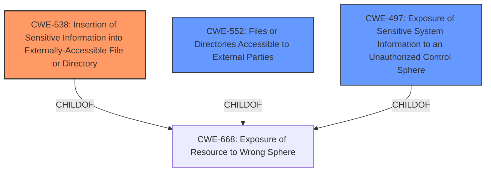

# Analysis Report for CVE-2021-39327

# Vulnerability Analysis Report: CVE-2021-39327

## Description


## Analysis (with Relationship Data)

# Summary
| CWE ID  | CWE Name                                                       | Confidence | CWE Abstraction Level | CWE Vulnerability Mapping Label | CWE-Vulnerability Mapping Notes |
| :-------- | :------------------------------------------------------------- | :--------- | :---------------------- | :------------------------------ | :------------------------------ |
| CWE-538   | Insertion of Sensitive Information into Externally-Accessible File or Directory | 0.9      | Base                    | Allowed                       | Primary CWE                     |
| CWE-552   | Files or Directories Accessible to External Parties            | 0.7      | Base                    | Allowed                       | Secondary Candidate             |
| CWE-497   | Exposure of Sensitive System Information to an Unauthorized Control Sphere | 0.7      | Base                    | Allowed                       | Secondary Candidate             |

## Evidence and Confidence

*   **Confidence Score:** 0.8
*   **Evidence Strength:** HIGH

## Relationship Analysis
The primary CWE, CWE-538, focuses on the specific act of inserting sensitive information into an externally accessible file, which is the root cause in this case. CWE-552 is a broader classification about files or directories being accessible to external parties. CWE-497 relates to the exposure of sensitive system information. CWE-538 is chosen due to its direct relevance to the vulnerability details.



## Vulnerability Chain
The vulnerability chain starts with the **insertion of sensitive information** into the `db_backup_log.txt` file (CWE-538). This file is then made **publicly accessible** (CWE-552), leading to **exposure of sensitive system information** (CWE-497) to unauthorized actors.

## Summary of Analysis
The initial analysis focused on the **sensitive information disclosure** due to a file path disclosure in the publicly accessible `db_backup_log.txt` file. The evidence clearly points to the root cause being the **insertion of sensitive information** into a file that is accessible to external parties.

Based on the provided evidence: "The vulnerability stems from a file path disclosure within the `~/db_backup_log.txt` file, which is publicly accessible. This file contains the full path of the website and the database backup files."

CWE-538 best represents the weakness. The graph relationships confirm that CWE-538, CWE-552, and CWE-497 are all related to the broader category of CWE-668, but CWE-538 is the most specific and appropriate for this case.

The selected CWEs are at the optimal level of specificity because they accurately reflect the root cause and the direct consequences of the vulnerability.

Relevant CWE Information:

# Enhanced Context (25 CWEs)

## CWE-538: Insertion of Sensitive Information into Externally-Accessible File or Directory
**Abstraction Level**: Base
**Similarity Score**: 0.79
**Source**: dense

**Description**:
The product places sensitive information into files or directories that are accessible to actors who are allowed to have access to the files, but not to the sensitive information.

**Mapping Guidance**:
- Usage: Allowed
- Rationale: This CWE entry is at the Base level of abstraction, which is a preferred level of abstraction for mapping to the root causes of vulnerabilities.

**Technical Explanation**: The vulnerability involves the BulletProof Security WordPress plugin writing sensitive file paths (site path and database backup paths) into the `db_backup_log.txt` file. This file is then made publicly accessible, allowing unauthorized actors to read the sensitive information.
**Security Implications**: Attackers can gain knowledge of the precise file system structure, which can be used for targeted exploitation of other vulnerabilities or unauthorized access to database backup files.
**Relationship**: CWE-538 is a child of CWE-668 (Exposure of Resource to Wrong Sphere), indicating that it is a specific type of resource exposure.
**Primary/Secondary**: This is the primary weakness because it directly describes the root cause.
**MITRE Mapping Guidance**: The usage is "Allowed" and the rationale supports its selection as a base-level abstraction.

## CWE-552: Files or Directories Accessible to External Parties
**Abstraction Level**: Base
**Similarity Score**: 0.77
**Source**: dense

**Description**:
The product makes files or directories accessible to unauthorized actors, even though they should not be.

**Mapping Guidance**:
- Usage: Allowed
- Rationale: This CWE entry is at the Base level of abstraction, which is a preferred level of abstraction for mapping to the root causes of vulnerabilities.

**Technical Explanation**: The `db_backup_log.txt` file, containing sensitive file paths, is made publicly accessible without proper access controls.
**Security Implications**: Unauthorized actors can directly access the file and read the sensitive information.
**Relationship**: CWE-552 is a child of CWE-668, indicating that it is a specific type of resource exposure.
**Primary/Secondary**: This is a secondary weakness that contributes to the vulnerability, as the file containing sensitive information should not have been accessible.
**MITRE Mapping Guidance**: The usage is "Allowed" and the rationale supports its selection as a base-level abstraction.

## CWE-497: Exposure of Sensitive System Information to an Unauthorized Control Sphere
**Abstraction Level**: Base
**Similarity Score**: 0.76
**Source**: dense

**Description**:
The product does not properly prevent sensitive system-level information from being accessed by unauthorized actors who do not have the same level of access to the underlying system as the product does.

**Mapping Guidance**:
- Usage: Allowed
- Rationale: This CWE entry is at the Base level of abstraction, which is a preferred level of abstraction for mapping to the root causes of vulnerabilities.

**Technical Explanation**: The `db_backup_log.txt` file contains sensitive system information (file paths) that is exposed to unauthorized actors.
**Security Implications**: Unauthorized actors can gain knowledge of the system's internal structure, which can be used for further attacks.
**Relationship**: CWE-497 is a child of CWE-668.
**Primary/Secondary**: This is a secondary weakness that represents the impact of the primary weakness.
**MITRE Mapping Guidance**: The usage is "Allowed" and the rationale supports its selection as a base-level abstraction.

**CWEs Considered but Not Used:**

*   CWE-200 (Exposure of Sensitive Information to an Unauthorized Actor): This is a class-level CWE and is too general. The more specific CWE-538 is a better fit. Additionally, the mapping guidance discourages its usage.
*   CWE-425 (Direct Request ('Forced Browsing')): While the file is accessed via a direct request, this CWE does not capture the root cause of the vulnerability, which is the **insertion of sensitive information** into the accessible file.
*   CWE-306 (Missing Authentication for Critical Function): Authentication is not the primary issue; the file is intentionally made accessible, but it contains sensitive information that should not be there.
*   CWE-862 (Missing Authorization): Similar to CWE-306, authorization is not the core problem. The file is accessible, but it contains **sensitive information**.
*   CWE-352 (Cross-Site Request Forgery (CSRF)): This is not relevant to the vulnerability.
*   CWE-732 (Incorrect Permission Assignment for Critical Resource): While permissions are involved, the more precise issue is that sensitive information is inserted into a publicly accessible file.
*   CWE-434 (Unrestricted Upload of File with Dangerous Type): This is not an upload vulnerability.
*   CWE-522 (Insufficiently Protected Credentials): No credentials are being exposed in this vulnerability.


## CWE Relationship Analysis

Current CWEs represent these abstraction levels: .


### Vulnerability Chain Analysis

**Chain starting from CWE-732:**
- 732 (Incorrect Permission Assignment for Critical Resource) - ROOT


**Chain starting from CWE-306:**
- 306 (Missing Authentication for Critical Function) - ROOT


### CWE Relationship Diagram

```mermaid
graph TD
    classDef primary fill:#f96,stroke:#333,stroke-width:2px
    classDef secondary fill:#69f,stroke:#333
    classDef tertiary fill:#9e9,stroke:#333
```


*Report generated on 2025-04-02 13:36:25*
