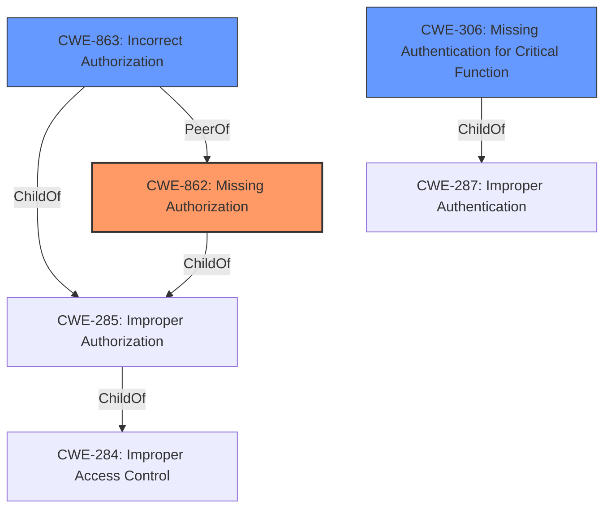

# Enhanced Analysis for CVE-2021-39341

# Summary
| CWE ID  | CWE Name | Confidence | CWE Abstraction Level | CWE Vulnerability Mapping Label | CWE-Vulnerability Mapping Notes |
|-----------------|-----------------------------------------------------|----------------|-----------------------|-----------------------------------|------------------------------------|
| **CWE-862** | **Missing Authorization** | 0.9 | Class | Primary | Allowed-with-Review |
| CWE-863 | Incorrect Authorization | 0.7 | Class | Secondary | Allowed-with-Review |
| CWE-306 | Missing Authentication for Critical Function | 0.6 | Base | Secondary | Allowed |

## Evidence and Confidence

*   **Confidence Score:** 0.8
*   **Evidence Strength:** HIGH

## Relationship Analysis
The primary CWE is CWE-862, Missing Authorization. This is a child of CWE-285 (Improper Authorization) and CWE-284 (Improper Access Control). CWE-863, Incorrect Authorization is a peer of CWE-862, and a child of CWE-285 and CWE-284. CWE-306 (Missing Authentication for Critical Function) is a child of CWE-287 (Improper Authentication). All these CWEs are related to access control issues. Since the vulnerability description and the CVE summary explicitly mention **insufficient authorization validation**, CWE-862 is the most appropriate choice, but CWE-863 and CWE-306 are also relevant.



## Vulnerability Chain
The vulnerability chain starts with the **insufficient authorization validation** in the `logged_in_or_has_api_key` function. This leads to sensitive information disclosure and unauthorized setting updates. An unauthenticated attacker can then inject malicious web scripts, potentially leading to complete site takeover or the creation of backdoors.

## Summary of Analysis
The primary weakness is **CWE-862: Missing Authorization**. The evidence strongly supports this, as the vulnerability description and CVE summary explicitly state **insufficient authorization validation** as the root cause.
The function `logged_in_or_has_api_key` incorrectly allows access based on a `Referer` header check, effectively missing an authorization check for certain requests.

Supporting Evidence:
- Vulnerability Description Key Phrases: "**rootcause:** **insufficient authorization validation**"
- CVE Reference Links Content Summary: "The OptinMonster WordPress plugin is vulnerable to sensitive information disclosure and unauthorized setting updates due to **insufficient authorization validation** via the `logged_in_or_has_api_key` function"
- CVE Reference Links Content Summary: "The plugin's REST API endpoints lacked proper authorization checks."

While CWE-863 (Incorrect Authorization) and CWE-306 (Missing Authentication for Critical Function) were considered, CWE-862 is a more precise fit because the described scenario involves a complete lack of authorization checks for certain requests, rather than an incorrectly implemented check.

CWE-284 (Improper Access Control) was deemed too high-level, as it is a Pillar CWE and more specific child CWEs are available.

The selected CWE is at the optimal level of specificity. CWE-862 is a Class-level CWE, providing a good balance between generality and detail. While more specific Base or Variant CWEs might exist, the available information does not provide sufficient evidence to justify selecting them.


## CWE Relationship Analysis

Current CWEs represent these abstraction levels: .


### Vulnerability Chain Analysis

**Chain starting from CWE-306:**
- 306 (Missing Authentication for Critical Function) - ROOT


**Chain starting from CWE-862:**
- 862 (Missing Authorization) - ROOT


### CWE Relationship Diagram

```mermaid
graph TD
    classDef primary fill:#f96,stroke:#333,stroke-width:2px
    classDef secondary fill:#69f,stroke:#333
    classDef tertiary fill:#9e9,stroke:#333
```