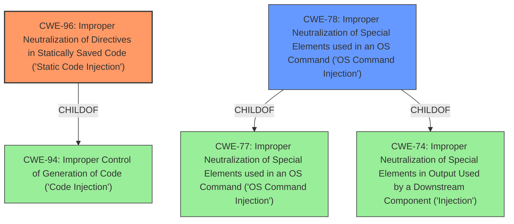

# Enhanced Analysis for CVE-2021-39383

# Summary
| CWE ID | CWE Name | Confidence | CWE Abstraction Level | CWE Vulnerability Mapping Label | CWE-Vulnerability Mapping Notes |
|---|---|---|---|---|---|
| CWE-96 | Improper Neutralization of Directives in Statically Saved Code ('Static Code Injection') | 0.9 | Base | Allowed | Primary CWE |
| CWE-78 | Improper Neutralization of Special Elements used in an OS Command ('OS Command Injection') | 0.6 | Base | Allowed | Secondary Candidate |

## Evidence and Confidence

*   **Confidence Score:** 0.8
*   **Evidence Strength:** HIGH

## Relationship Analysis
The primary relationship influencing the decision is the ChildOf relationship where CWE-96 is a child of CWE-94, but is a more specific fit for the vulnerability description. Also, CWE-78 is a child of CWE-77 and CWE-74.



## Vulnerability Chain
The vulnerability chain starts with the **improper neutralization** of user input, which is then written to a static file. This file is then included in a login page, leading to code execution.
  - User input is not sanitized
  - Input is written to a static file
  - The static file is included by the application which leads to code execution

## Summary of Analysis
The initial assessment identified several potential CWEs, including CWE-94, CWE-78, and CWE-96. However, after a thorough review of the vulnerability description and the provided CWE specifications, CWE-96 was determined to be the most appropriate primary CWE.

The vulnerability description states that the `save` method in `com/key/dwsurvey/action/sysuser/SysPropertyAction.java` directly accepts parameters from the client and writes them into a configuration file (`admin-info.jsp`), which is then included in `login.jsp`. This aligns perfectly with the description of CWE-96: "The product receives input from an upstream component, but it does not neutralize or incorrectly neutralizes code syntax before inserting the input into an executable resource, such as a library, configuration file, or template."

The evidence supporting this decision is explicit: "The `save` method in `com/key/dwsurvey/action/sysuser/SysPropertyAction.java` directly accepts parameters from the client and writes them into a configuration file (`admin-info.jsp`), which is then included in `login.jsp`."

CWE-78 was considered because the vulnerability leads to remote command execution. However, CWE-78 is more specific to OS command injection, where the product constructs an OS command. In this case, the vulnerability involves writing code to a file that is later executed, making CWE-96 a more accurate fit.

The selection of CWE-96 is at the Base level of abstraction, which is the preferred level for root cause analysis. This provides a more specific classification than its parent, CWE-94, which is a more general "Code Injection" weakness.

Relevant CWE Information:

# Enhanced Context (25 CWEs)

## CWE-96: Improper Neutralization of Directives in Statically Saved Code ('Static Code Injection')

**Technical Explanation:**
CWE-96 (Improper Neutralization of Directives in Statically Saved Code ('Static Code Injection')) describes a scenario where a product receives input and inserts it into a static resource without proper neutralization. In this case, the DWSurvey application takes user-supplied input and writes it to a configuration file (`admin-info.jsp`). This file is then included in `login.jsp`, leading to code execution.
The vulnerability's details directly match the CWE's characteristics: User-controlled input is written to a static file without sanitization, resulting in the potential for arbitrary code execution when the file is included.

**Security Implications and Potential Impact:**
The security implication is that an attacker can inject malicious code into the `admin-info.jsp` file, which is then executed when `login.jsp` is accessed. This can lead to remote command execution and complete system compromise.

**Parent-Child Relationships and Chain Patterns:**
CWE-96 is a child of CWE-94 (Improper Control of Generation of Code ('Code Injection')). This hierarchical relationship indicates that CWE-96 is a more specific type of code injection where the code is injected into a statically saved resource.

**Whether Weakness is Primary or Secondary:**
This is the primary weakness, as it directly leads to the code injection vulnerability.

**Official MITRE Mapping Guidance Influence:**
The MITRE mapping guidance for CWE-96 states that it is at the Base level of abstraction, which is a preferred level for mapping to root causes. The guidance also advises carefully reading the name and description to ensure an appropriate fit, which has been done in this analysis.

## CWE-78: Improper Neutralization of Special Elements used in an OS Command ('OS Command Injection')

**Technical Explanation:**
CWE-78 (Improper Neutralization of Special Elements used in an OS Command ('OS Command Injection')) refers to the construction of OS commands using externally-influenced input without proper neutralization. While the DWSurvey vulnerability results in remote command execution, it does not directly involve the construction of OS commands. Instead, it involves writing code to a file that is later executed.

**Security Implications and Potential Impact:**
The security implication is that an attacker can inject and execute arbitrary commands on the server.

**Parent-Child Relationships and Chain Patterns:**
CWE-78 is a child of CWE-77 and CWE-74.

**Whether Weakness is Primary or Secondary:**
CWE-78 is a secondary candidate. The primary weakness is the **improper neutralization** of input leading to static code injection (CWE-96).

**Official MITRE Mapping Guidance Influence:**
The MITRE mapping guidance for CWE-78 states that it is at the Base level of abstraction. While the vulnerability leads to command execution, the root cause is the **improper neutralization** of input before writing to a static file, making CWE-96 a more accurate fit.

## Other CWEs Considered But Not Used:
- CWE-94: Improper Control of Generation of Code ('Code Injection') - While this is a parent of CWE-96, CWE-96 provides a more specific description of the vulnerability involving static code injection.
- CWE-74: Improper Neutralization of Special Elements in Output Used by a Downstream Component ('Injection') - This is a high-level class, and the specific weakness is better captured by CWE-96.
- CWE-79: Improper Neutralization of Input During Web Page Generation ('Cross-site Scripting') - While XSS could potentially be a consequence, the root cause is the static code injection via the configuration file.
- CWE-1336: Improper Neutralization of Special Elements Used in a Template Engine - This CWE is relevant to template engines. While the application uses a JSP page, the injection is not directly into a template engine but rather into a static file included by the JSP page.


## CWE Relationship Analysis

Current CWEs represent these abstraction levels: .


### Vulnerability Chain Analysis

**Chain starting from CWE-79:**
- 79 (Improper Neutralization of Input During Web Page Generation ('Cross-site Scripting')) - ROOT


**Chain starting from CWE-1336:**
- 1336 (Improper Neutralization of Special Elements Used in a Template Engine) - ROOT


### CWE Relationship Diagram

```mermaid
graph TD
    classDef primary fill:#f96,stroke:#333,stroke-width:2px
    classDef secondary fill:#69f,stroke:#333
    classDef tertiary fill:#9e9,stroke:#333
```