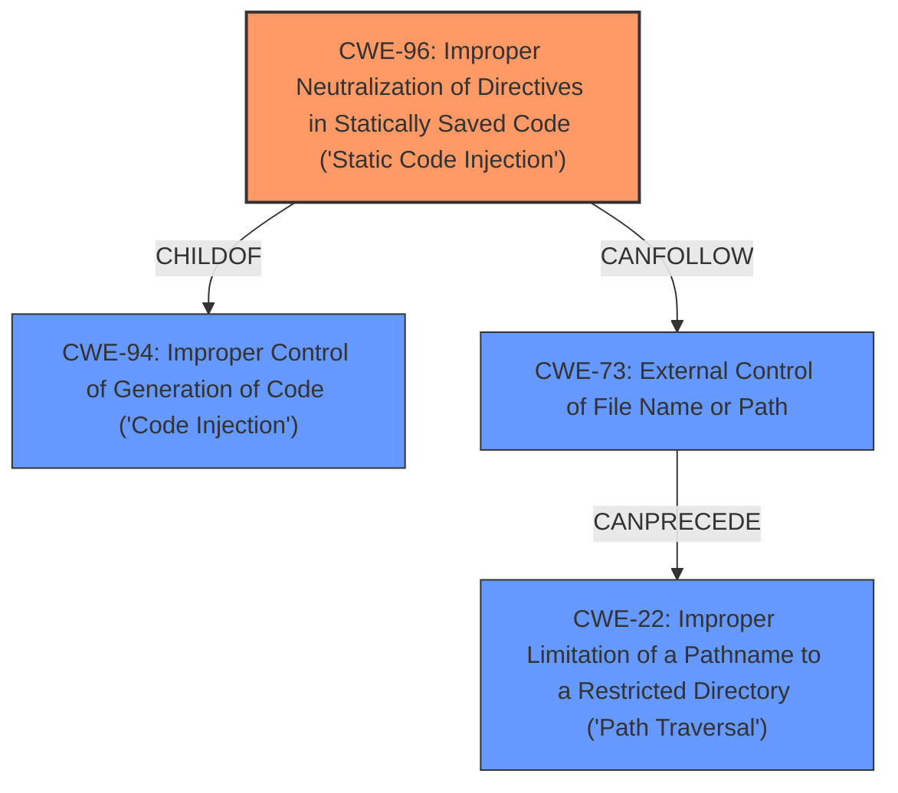

# Raw Analyzer Response for CVE-2021-39503

# Summary
| CWE ID | CWE Name | Confidence | CWE Abstraction Level | CWE Vulnerability Mapping Label | CWE-Vulnerability Mapping Notes |
|---|---|---|---|---|---|
| CWE-96 | Improper Neutralization of Directives in Statically Saved Code ('Static Code Injection') | 0.9 | Base | Allowed | Primary CWE |
| CWE-94 | Improper Control of Generation of Code ('Code Injection') | 0.6 | Base | Allowed-with-Review | Secondary Candidate |
| CWE-73 | External Control of File Name or Path | 0.5 | Base | Allowed | Secondary Candidate |
| CWE-22 | Improper Limitation of a Pathname to a Restricted Directory ('Path Traversal') | 0.3 | Base | Allowed | Secondary Candidate |

## Evidence and Confidence

*   **Confidence Score:** 0.9
*   **Evidence Strength:** HIGH

## Relationship Analysis
The primary CWE is CWE-96, which is a child of CWE-94. CWE-94 represents a broader category of code injection vulnerabilities, whereas CWE-96 specifically focuses on the injection of code into statically saved files, aligning precisely with the vulnerability's description. While CWE-73 and CWE-22 were considered because the injection occurs within a file path, they were deemed less relevant as they describe the means of access and path manipulation rather than the core issue of code injection itself.

## Vulnerability Chain
The vulnerability chain starts with **insufficient input sanitization** in the `WriteConfig()` function, leading to the ability to inject PHP code into the `/include/config.cache.php` file, ultimately resulting in Remote Code Execution. The chain can be described as:
1.  **Insufficient Input Sanitization** (implicit, not explicitly CWE-mapped due to lack of direct CWE match)
2.  **CWE-96: Improper Neutralization of Directives in Statically Saved Code ('Static Code Injection')** (Code injected into a static file).
3.  **Remote Code Execution** (Impact).

## Summary of Analysis
The analysis indicates that the vulnerability is primarily due to **improper neutralization** of input when writing to the `config.cache.php` file, allowing for the injection of arbitrary PHP code. The key phrase from the vulnerability description is: "an attacker can inject php code to /include/config.cache.php file." The CVE Reference Links Content Summary states: "The lack of proper input filtering allows an attacker to inject arbitrary PHP code into the `/include/config.cache.php` file via the `WriteConfig()` function."

Based on the evidence, CWE-96, "Improper Neutralization of Directives in Statically Saved Code ('Static Code Injection')", is the most appropriate CWE. It accurately describes the **weakness** where code is injected into a static file due to **improper neutralization**. The abstraction level is Base, which is the preferred level. The usage is "Allowed" according to MITRE mapping guidance.

CWE-94, "Improper Control of Generation of Code ('Code Injection')", was considered due to the code injection aspect but is a broader category. Given that the code is injected into a statically saved file, CWE-96 is more specific. CWE-73, "External Control of File Name or Path", and CWE-22, "Improper Limitation of a Pathname to a Restricted Directory ('Path Traversal')", are less relevant because they focus on file path manipulation rather than the core issue of code injection into a static file.

The final decision is based on the specific details of the vulnerability, the CWE descriptions, and the MITRE mapping guidance. The selected CWE is at the optimal level of specificity, as it accurately reflects the root cause of the vulnerability.

Relevant CWE Information:

# Enhanced Context (25 CWEs)
The following CWEs were identified as potentially relevant to this vulnerability:

## CWE-23: Relative Path Traversal
**Abstraction Level**: Base
**Similarity Score**: 0.79
**Source**: dense

**Description**:
The product uses external input to construct a pathname that should be within a restricted directory, but it does not properly neutralize sequences such as ".." that can resolve to a location that is outside of that directory.

**Mapping Guidance**:
- Usage: Allowed
- Rationale: This CWE entry is at the Base level of abstraction, which is a preferred level of abstraction for mapping to the root causes of vulnerabilities.

## CWE-41: Improper Resolution of Path Equivalence
**Abstraction Level**: Base
**Similarity Score**: 0.78
**Source**: dense

**Description**:
The product is vulnerable to file system contents disclosure through path equivalence. Path equivalence involves the use of special characters in file and directory names. The associated manipulations are intended to generate multiple names for the same object.

**Mapping Guidance**:
- Usage: Allowed
- Rationale: This CWE entry is at the Base level of abstraction, which is a preferred level of abstraction for mapping to the root causes of vulnerabilities.

## CWE-36: Absolute Path Traversal
**Abstraction Level**: Base
**Similarity Score**: 0.78
**Source**: dense

**Description**:
The product uses external input to construct a pathname that should be within a restricted directory, but it does not properly neutralize absolute path sequences such as "/abs/path" that can resolve to a location that is outside of that directory.

**Mapping Guidance**:
- Usage: Allowed
- Rationale: This CWE entry is at the Base level of abstraction, which is a preferred level of abstraction for mapping to the root causes of vulnerabilities.

## CWE-73: External Control of File Name or Path
**Abstraction Level**: Base
**Similarity Score**: 0.78
**Source**: dense

**Description**:
The product allows user input to control or influence paths or file names that are used in filesystem operations.

**Mapping Guidance**:
- Usage: Allowed
- Rationale: This CWE entry is at the Base level of abstraction, which is a preferred level of abstraction for mapping to the root causes of vulnerabilities.

## CWE-74: Improper Neutralization of Special Elements in Output Used by a Downstream Component ('Injection')
**Abstraction Level**: Class
**Similarity Score**: 0.77
**Source**: dense

**Description**:
The product constructs all or part of a command, data structure, or record using externally-influenced input from an upstream component, but it does not neutralize or incorrectly neutralizes special elements that could modify how it is parsed or interpreted when it is sent to a downstream component.

**Mapping Guidance**:
- Usage: Discouraged
- Rationale: CWE-74 is high-level and often misused when lower-level weaknesses are more appropriate.

## CWE-24: Path Traversal: '../filedir'
**Abstraction Level**: Variant
**Similarity Score**: 0.77
**Source**: dense

**Description**:
The product uses external input to construct a pathname that should be within a restricted directory, but it does not properly neutralize "../" sequences that can resolve to a location that is outside of that directory.

**Mapping Guidance**:
- Usage: Allowed
- Rationale: This CWE entry is at the Variant level of abstraction, which is a preferred level of abstraction for mapping to the root causes of vulnerabilities.

## CWE-184: Incomplete List of Disallowed Inputs
**Abstraction Level**: Base
**Similarity Score**: 0.76
**Source**: dense

**Description**:
The product implements a protection mechanism that relies on a list of inputs (or properties of inputs) that are not allowed by policy or otherwise require other action to neutralize before additional processing takes place, but the list is incomplete.

**Mapping Guidance**:
- Usage: Allowed
- Rationale: This CWE entry is at the Base level of abstraction, which is a preferred level of abstraction for mapping to the root causes of vulnerabilities.

## CWE-138: Improper Neutralization of Special Elements
**Abstraction Level**: Class
**Similarity Score**: 0.75
**Source**: dense

**Description**:
The product receives input from an upstream component, but it does not neutralize or incorrectly neutralizes special elements that could be interpreted as control elements or syntactic markers when they are sent to a downstream component.

**Mapping Guidance**:
- Usage: Discouraged
- Rationale: This CWE entry is a level-1 Class (i.e., a child of a Pillar). It might have lower-level