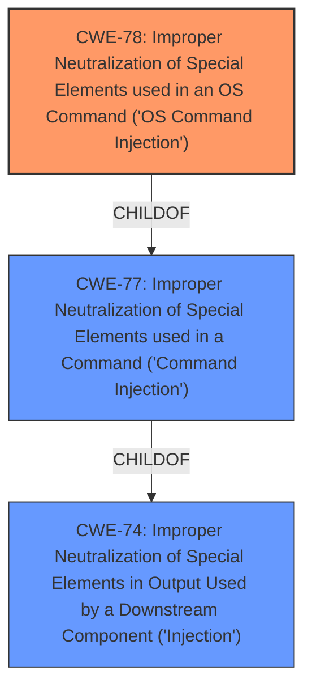

# Enhanced Analysis for CVE-2021-39509

# Summary
| CWE ID | CWE Name | Confidence | CWE Abstraction Level | CWE Vulnerability Mapping Label | CWE-Vulnerability Mapping Notes |
|---|---|---|---|---|---|
| CWE-78 | Improper Neutralization of Special Elements used in an OS Command ('OS Command Injection') | 1.0 | Base | Allowed | Primary CWE |

## Evidence and Confidence

*   **Confidence Score:** 1.0
*   **Evidence Strength:** HIGH

## Relationship Analysis
The primary relationship that influenced the selection of CWE-78 is its hierarchical relationship as a child of CWE-77, which is a more general class. CWE-78 is a base level weakness which is the preferred level of abstraction.


## Vulnerability Chain
The vulnerability chain starts with the **improper input sanitization** of the `username` parameter. This leads to **command injection** because shell metacharacters are not neutralized. The final impact is the ability to execute arbitrary commands on the router's operating system.

## Summary of Analysis
The initial assessment identified **command injection** due to **improper input sanitization**, which aligns with CWE-78. This assessment is strongly supported by the vulnerability description and the CVE Reference Links Content Summary. The vulnerability description key phrases clearly indicate the root cause, weakness, and impact. The CVE Reference Links Content Summary confirms that the `username` parameter is not properly sanitized, allowing for shell metacharacters to be injected, leading to arbitrary command execution.

The graph relationships support the choice of CWE-78 as the more specific base CWE, which is more appropriate than its parent class CWE-77. The evidence is sufficient and directly supports the selection of CWE-78.

Relevant CWE Information:

# Enhanced Context (25 CWEs)
The following CWEs were identified as potentially relevant to this vulnerability:

## CWE-80: Improper Neutralization of Script-Related HTML Tags in a Web Page (Basic XSS)
**Abstraction Level**: Variant
**Similarity Score**: 0.80
**Source**: dense
This CWE is not relevant because the vulnerability is related to command injection, not XSS.

## CWE-74: Improper Neutralization of Special Elements in Output Used by a Downstream Component ('Injection')
**Abstraction Level**: Class
**Similarity Score**: 0.79
**Source**: dense
This is a high-level class and is too general to describe the vulnerability. The children of this CWE are better matches.

## CWE-116: Improper Encoding or Escaping of Output
**Abstraction Level**: Class
**Similarity Score**: 0.77
**Source**: dense
This CWE is not relevant because the vulnerability is related to command injection, not output encoding issues.

## CWE-138: Improper Neutralization of Special Elements
**Abstraction Level**: Class
**Similarity Score**: 0.77
**Source**: dense
This is a class level CWE and is too general.

## CWE-184: Incomplete List of Disallowed Inputs
**Abstraction Level**: Base
**Similarity Score**: 0.76
**Source**: dense
This CWE is not the best fit, as the primary issue is not the incompleteness of the list of disallowed inputs, but the lack of proper sanitization of input.

## CWE-113: Improper Neutralization of CRLF Sequences in HTTP Headers ('HTTP Request/Response Splitting')
**Abstraction Level**: Variant
**Similarity Score**: 0.76
**Source**: dense
This CWE is not relevant because the vulnerability is related to command injection, not HTTP request/response splitting.

## CWE-1289: Improper Validation of Unsafe Equivalence in Input
**Abstraction Level**: Base
**Similarity Score**: 0.75
**Source**: dense
This CWE is not the best fit, as the issue is not related to validation of equivalence, but sanitization of input.

## CWE-88: Improper Neutralization of Argument Delimiters in a Command ('Argument Injection')
**Abstraction Level**: Base
**Similarity Score**: 0.75
**Source**: dense
While argument injection could be a contributing factor, the primary issue is that command injection is possible because shell metacharacters are not neutralized.

## CWE-917: Improper Neutralization of Special Elements used in an Expression Language Statement ('Expression Language Injection')
**Abstraction Level**: Base
**Similarity Score**: 0.75
**Source**: dense
This CWE is not relevant because the vulnerability is related to command injection, not expression language injection.

## CWE-41: Improper Resolution of Path Equivalence
**Abstraction Level**: Base
**Similarity Score**: 0.74
**Source**: dense
This CWE is not relevant because the vulnerability is related to command injection, not path equivalence.

## CWE-116: Improper Encoding or Escaping of Output
**Abstraction Level**: Class
**Similarity Score**: 9193.44
**Source**: sparse
This CWE is not relevant because the vulnerability is related to command injection, not output encoding issues.

## CWE-88: Improper Neutralization of Argument Delimiters in a Command ('Argument Injection')
**Abstraction Level**: Base
**Similarity Score**: 8830.98
**Source**: sparse
While argument injection could be a contributing factor, the primary issue is that command injection is possible because shell metacharacters are not neutralized.

## CWE-79: Improper Neutralization of Input During Web Page Generation ('Cross-site Scripting')
**Abstraction Level**: Base
**Similarity Score**: 8819.36
**Source**: sparse
This CWE is not relevant because the vulnerability is related to command injection, not XSS.

## CWE-138: Improper Neutralization of Special Elements
**Abstraction Level**: Class
**Similarity Score**: 8785.96
**Source**: sparse
This is a class level CWE and is too general.

## CWE-78: Improper Neutralization of Special Elements used in an OS Command ('OS Command Injection')
**Abstraction Level**: Base
**Similarity Score**: 8486.89
**Source**: sparse
This is the best match for the vulnerability.

## CWE-78: Improper Neutralization of Special Elements used in an OS Command ('OS Command Injection')
**Abstraction Level**: base
**Similarity Score**: 5.03
**Source**: graph
This is the best match for the vulnerability.

## CWE-494: Download of Code Without Integrity Check
**Abstraction Level**: base
**Similarity Score**: 4.33
**Source**: graph
This CWE is not relevant because the vulnerability is related to command injection, not downloading code without integrity checks.

## CWE-190: Integer Overflow or Wraparound
**Abstraction Level**: base
**Similarity Score**: 4.33
**Source**: graph
This CWE is not relevant because the vulnerability is related to command injection, not integer overflows.

## CWE-1284: Improper Validation of Specified Quantity in Input
**Abstraction Level**: base
**Similarity Score**: 4.33
**Source**: graph
This CWE is not the best fit, as the issue is not related to validating the quantity of input but sanitizing the input.

## CWE-79: Improper Neutralization of Input During Web Page Generation ('Cross-site Scripting')
**Abstraction Level**: Base
**Similarity Score**: 3.32
**Source**: graph
This CWE is not relevant because the vulnerability is related to command injection, not XSS.

## CWE-789: Memory Allocation with Excessive Size Value
**Abstraction Level**: variant
**Similarity Score**: 3.24
**Source**: graph
This CWE is not relevant because the vulnerability is related to command injection, not memory allocation issues.

## CWE-89: Improper Neutralization of Special Elements used in an SQL Command ('SQL Injection')
**Abstraction Level**: base
**Similarity Score**: 3.14
**Source**: graph
This CWE is not relevant because the vulnerability is related to command injection, not SQL injection.

## CWE-123: Write-what-where Condition
**Abstraction Level**: base
**Similarity Score**: 3.14
**Source**: graph
This CWE is not relevant because the vulnerability is related to command injection, not a write-what-where condition.

## CWE-787: Out-of-bounds Write
**Abstraction Level**: base
**Similarity Score**: 3.14
**Source**: graph
This CWE is not relevant because the vulnerability is related to command injection,


## CWE Relationship Analysis

Current CWEs represent these abstraction levels: .


### Vulnerability Chain Analysis

**Chain starting from CWE-787:**
- 787 (Out-of-bounds Write) - ROOT


**Chain starting from CWE-123:**
- 123 (Write-what-where Condition) - ROOT


### CWE Relationship Diagram

```mermaid
graph TD
    classDef primary fill:#f96,stroke:#333,stroke-width:2px
    classDef secondary fill:#69f,stroke:#333
    classDef tertiary fill:#9e9,stroke:#333
```