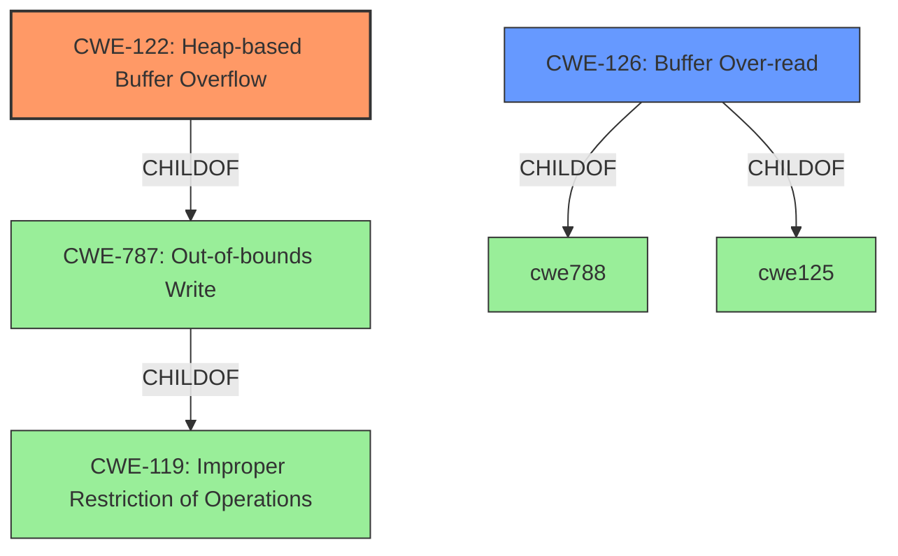

# Analysis for CVE-2021-39518

# Summary
| CWE ID | CWE Name | Confidence | CWE Abstraction Level | CWE Vulnerability Mapping Label | CWE-Vulnerability Mapping Notes |
|---|---|---|---|---|---|
| CWE-122 | Heap-based Buffer Overflow | 1.0 | Variant | Allowed | Primary CWE |
| CWE-126 | Buffer Over-read | 0.7 | Variant | Allowed | Secondary Candidate |

## Evidence and Confidence

*   **Confidence Score:** 0.9
*   **Evidence Strength:** HIGH

## Relationship Analysis
The primary relationship impacting my decision is that CWE-122 is a variant of CWE-787 (Out-of-bounds Write) and CWE-119 (Improper Restriction of Operations within the Bounds of a Memory Buffer). While CWE-119 is a broader class, the description specifically mentions a **heap-based buffer overflow**, making CWE-122 the most specific and appropriate choice. CWE-126 (Buffer Over-read) is a possible secondary weakness since the CVE Reference Links Content Summary mentions an out-of-bounds read in `LineBuffer::FetchRegion`.

## Vulnerability Chain
The vulnerability chain starts with the processing of a specially crafted JPEG image. This leads to an out-of-bounds write in the heap, resulting in a **heap-based buffer overflow** (CWE-122). The impact is a segmentation fault and program termination. An out-of-bounds read in `LineBuffer::FetchRegion` (CWE-126) may also be present.

## Summary of Analysis
The initial analysis, based on the vulnerability description's key phrase "**heap-based buffer overflow**," strongly suggests CWE-122. The CVE Reference Links Content Summary section also strengthens this assessment, stating that "A heap buffer overflow occurs in `LineBuffer::FetchRegion` due to an out-of-bounds read."

The graph relationships confirm that CWE-122 is a specific type of buffer overflow, being a child of CWE-787 (Out-of-bounds Write). The description's explicit mention of "heap-based" makes CWE-122 a more precise match than its parent CWE-787 or the more generic CWE-119.

The choice of CWE-122 is at the optimal level of specificity because it accurately reflects the **heap-based** nature of the buffer overflow, as opposed to a more general out-of-bounds write. The evidence provided supports this specific classification, and the retriever results also list CWE-122 as a strong candidate. The CVE Reference Links Content Summary indicates an out-of-bounds read which may be represented by CWE-126.

Relevant CWE Information:

# Enhanced Context (25 CWEs)

## CWE-122: Heap-based Buffer Overflow
**Abstraction:** Variant
**Status:** Draft

### Description
A heap overflow condition is a buffer overflow, where the buffer that can be overwritten is allocated in the heap portion of memory, generally meaning that the buffer was allocated using a routine such as malloc().

## CWE-126: Buffer Over-read
**Abstraction:** Variant
**Status:** Draft

### Description
The product reads from a buffer using buffer access mechanisms such as indexes or pointers that reference memory locations after the targeted buffer.