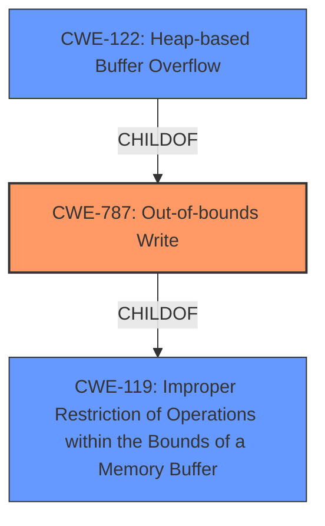

# Raw Analyzer Response for CVE-2021-39522

# Summary
| CWE ID  | CWE Name  | Confidence | CWE Abstraction Level | CWE Vulnerability Mapping Label | CWE-Vulnerability Mapping Notes |
|-----------------|-----------------------------------------------------------------|------------|-------------------------|-----------------------------------|-----------------------------------|
| CWE-787 | Out-of-bounds Write | 1.00 | Base | Allowed | Primary CWE |
| CWE-122 | Heap-based Buffer Overflow | 0.75 | Variant | Allowed | Secondary Candidate |
| CWE-119 | Improper Restriction of Operations within the Bounds of a Memory Buffer | 0.50 | Class | Discouraged | Secondary Candidate |

## Evidence and Confidence

*   **Confidence Score:** 0.90
*   **Evidence Strength:** HIGH

## Relationship Analysis
The primary relationship influencing the selection is that CWE-787 (Out-of-bounds Write) is a child of CWE-119 (Improper Restriction of Operations within the Bounds of a Memory Buffer). Additionally, CWE-122 (Heap-based Buffer Overflow) is a variant of CWE-787. The abstraction levels guided the selection of CWE-787 as the most specific and relevant base CWE, with CWE-122 considered as a more specific variant, but less clearly supported than CWE-787.

## Vulnerability Chain
The vulnerability chain begins with a **heap-based buffer overflow** in the `bit_wcs2len` function (CWE-787). This occurs due to the function's **improper handling** of LTYPE data within DWG files when parsing it. The lack of proper bounds checking allows the function to read past the allocated buffer. The result is a program crash, and the potential for arbitrary code execution.

## Summary of Analysis
The initial analysis, supported by the vulnerability description and the CVE Reference Links Content Summary, pointed towards a **heap-based buffer overflow** in the `bit_wcs2len` function of libredwg. The key phrase "heap-based buffer overflow" strongly suggests CWE-787 (Out-of-bounds Write), as it directly describes the **weakness**. The CVE Reference Links Content Summary confirms this by stating: "A heap buffer overflow vulnerability exists in the `bit_wcs2len` function... This occurs when parsing DWG files, specifically when handling LTYPE (linetype) data". The analysis also notes that "The `bit_wcs2len` function reads data from a buffer in a way that does not properly validate or limit the read size based on the allocated buffer, which leads to reading past the buffer's allocated bounds."

The Retriever Results also list CWE-787, along with other related CWEs like CWE-119 and CWE-122. Given that the vulnerability involves writing past the end of a buffer, CWE-787 is more appropriate than CWE-125 (Out-of-bounds Read).

CWE-787 is chosen as the primary CWE because it accurately represents the core **weakness**: writing data beyond the allocated buffer's boundaries. CWE-122 (Heap-based Buffer Overflow) is considered as a secondary candidate because the overflow occurs specifically in the heap, but CWE-787 is more descriptive of the root cause. CWE-119 (Improper Restriction of Operations within the Bounds of a Memory Buffer) is a more general class, and while applicable, CWE-787 provides more specific information about the nature of the vulnerability.

The final selection is based on the evidence provided, the relationships between CWEs, and the desire to be as specific as possible while maintaining accuracy.

Relevant CWE Information:

# Enhanced Context (25 CWEs)
The following CWEs were identified as potentially relevant to this vulnerability:

## CWE-197: Numeric Truncation Error
**Abstraction Level**: Base
**Similarity Score**: 0.80
**Source**: dense

**Description**:
Truncation errors occur when a primitive is cast to a primitive of a smaller size and data is lost in the conversion.

**Mapping Guidance**:
- Usage: Allowed
- Rationale: This CWE entry is at the Base level of abstraction, which is a preferred level of abstraction for mapping to the root causes of vulnerabilities.

## CWE-681: Incorrect Conversion between Numeric Types
**Abstraction Level**: Base
**Similarity Score**: 0.79
**Source**: dense

**Description**:
When converting from one data type to another, such as long to integer, data can be omitted or translated in a way that produces unexpected values. If the resulting values are used in a sensitive context, then dangerous behaviors may occur.

**Mapping Guidance**:
- Usage: Allowed
- Rationale: This CWE entry is at the Base level of abstraction, which is a preferred level of abstraction for mapping to the root causes of vulnerabilities.

## CWE-191: Integer Underflow (Wrap or Wraparound)
**Abstraction Level**: Base
**Similarity Score**: 0.79
**Source**: dense

**Description**:
The product subtracts one value from another, such that the result is less than the minimum allowable integer value, which produces a value that is not equal to the correct result.

**Mapping Guidance**:
- Usage: Allowed
- Rationale: This CWE entry is at the Base level of abstraction, which is a preferred level of abstraction for mapping to the root causes of vulnerabilities.

## CWE-131: Incorrect Calculation of Buffer Size
**Abstraction Level**: Base
**Similarity Score**: 0.77
**Source**: dense

**Description**:
The product does not correctly calculate the size to be used when allocating a buffer, which could lead to a buffer overflow.

**Mapping Guidance**:
- Usage: Allowed
- Rationale: This CWE entry is at the Base level of abstraction, which is a preferred level of abstraction for mapping to the root causes of vulnerabilities.

## CWE-805: Buffer Access with Incorrect Length Value
**Abstraction Level**: Base
**Similarity Score**: 0.76
**Source**: dense

**Description**:
The product uses a sequential operation to read or write a buffer, but it uses an incorrect length value that causes it to access memory that is outside of the bounds of the buffer.

**Mapping Guidance**:
- Usage: Allowed
- Rationale: This CWE entry is at the Base level of abstraction, which is a preferred level of abstraction for mapping to the root causes of vulnerabilities.

## CWE-680: Integer Overflow to Buffer Overflow
**Abstraction Level**: Compound
**Similarity Score**: 0.76
**Source**: dense

**Description**:
The product performs a calculation to determine how much memory to allocate, but an integer overflow can occur that causes less memory to be allocated than expected, leading to a buffer overflow.

**Mapping Guidance**:
- Usage: Discouraged
- Rationale: This CWE entry is a named chain, which combines multiple weaknesses.

## CWE-190: Integer Overflow or Wraparound
**Abstraction Level**: Base
**Similarity Score**: 0.75
**Source**: dense

**Description**:
The product performs a calculation that can
         produce an integer overflow or wraparound when the logic
         assumes that the resulting value will always be larger than
         the original value. This occurs when an integer value is
         incremented to a value that is too large to store in the
         associated representation. When this occurs, the value may
         become a very small or negative number.

**Mapping Guidance**:
- Usage: Allowed
- Rationale: This CWE entry is at the Base level of abstraction, which is a preferred level of abstraction for mapping to the root causes of vulnerabilities.

## CWE-124: Buffer Underwrite ('Buffer Underflow')
**Abstraction Level**: Base
**Similarity Score**: 0.75
**Source**: dense

**Description**:
The product writes to a buffer using an index or pointer that references a memory location prior to the beginning of the buffer.

**Mapping Guidance**:
- Usage: Allowed
- Rationale: This CWE entry is at the Base level of abstraction, which is a preferred level of abstraction for mapping to the root causes of vulnerabilities.

## CWE-125: Out-of-bounds Read
**Abstraction Level**: Base
**Similarity Score**: 0.74
**Source**: dense

**Description**:
The product reads data past the end, or before the beginning, of the intended buffer.

**Mapping Guidance**:
- Usage: Allowed
- Rationale: This CWE entry is at the Base level of abstraction, which is a preferred level of abstraction for