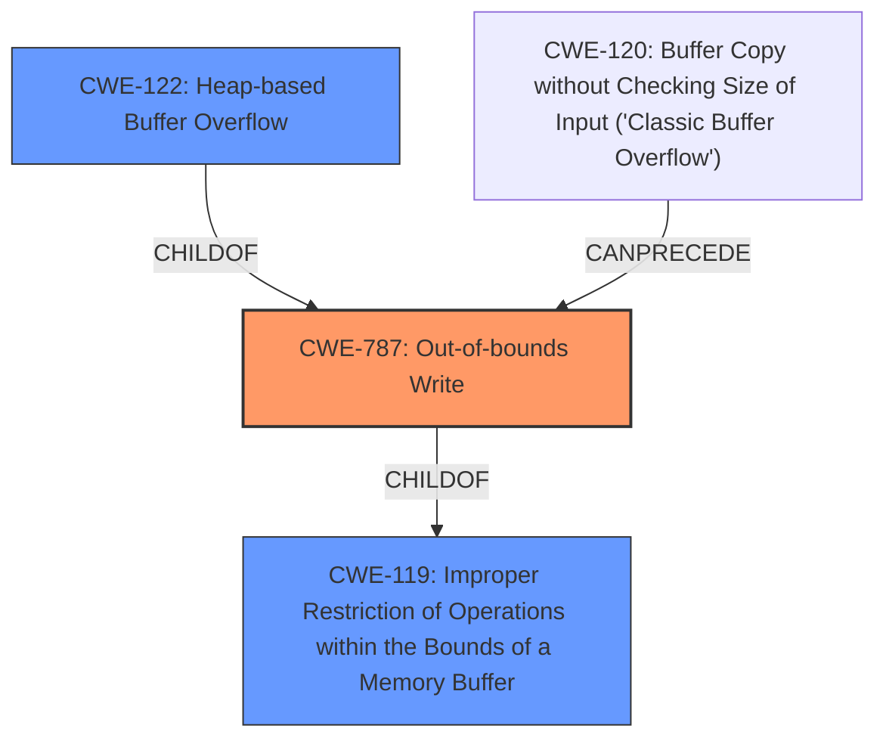

# Analysis for CVE-2021-39544

# Summary
| CWE ID | CWE Name | Confidence | CWE Abstraction Level | CWE Vulnerability Mapping Label | CWE-Vulnerability Mapping Notes |
|---|---|---|---|---|---|
| CWE-787 | Out-of-bounds Write | 1.0 | Base | Allowed | Primary CWE |
| CWE-122 | Heap-based Buffer Overflow | 0.8 | Variant | Allowed | Secondary Candidate |
| CWE-119 | Improper Restriction of Operations within the Bounds of a Memory Buffer | 0.6 | Class | Discouraged | Secondary Candidate |

## Evidence and Confidence

*   **Confidence Score:** 0.9
*   **Evidence Strength:** HIGH

## Relationship Analysis
The primary CWE is CWE-787 **Out-of-bounds Write**, which is a base level CWE. CWE-787 is a parent of CWE-124 **Buffer Underwrite ('Buffer Underflow')**.
CWE-787 is a child of CWE-119 **Improper Restriction of Operations within the Bounds of a Memory Buffer**.
CWE-122 **Heap-based Buffer Overflow** is a variant of CWE-787 **Out-of-bounds Write**.
CWE-120 **Buffer Copy without Checking Size of Input ('Classic Buffer Overflow')** can precede CWE-787 **Out-of-bounds Write**.

## Vulnerability Chain
The vulnerability chain starts with a **heap-based buffer overflow** due to writing data beyond the allocated buffer on the heap, leading to a program crash or potential arbitrary code execution.

## Summary of Analysis
The initial assessment strongly points to CWE-787 **Out-of-bounds Write**, which is further supported by the vulnerability description indicating a **heap-based buffer overflow** at `wav_file.cpp:262:32` during a `memcpy` operation. The key phrase "**heap-based buffer overflow**" from the "Vulnerability Description Key Phrases" directly aligns with this classification. The "CVE Reference Links Content Summary" confirms a **heap-buffer-overflow** occurring during a `memcpy` operation, providing evidence of writing data beyond the allocated buffer. This also supports the potential for arbitrary code execution due to the ability to overwrite heap memory.

CWE-122 **Heap-based Buffer Overflow** was considered as a more specific variant of CWE-787 **Out-of-bounds Write**. The description explicitly mentions a **heap-based buffer overflow**, making CWE-122 a relevant candidate. However, since the root cause is writing beyond buffer bounds, CWE-787 **Out-of-bounds Write** is the more fundamental issue.

CWE-119 **Improper Restriction of Operations within the Bounds of a Memory Buffer** was also considered, as it is a parent of CWE-787 **Out-of-bounds Write**. However, CWE-119 is a more general class of weakness, and the specific issue is an out-of-bounds write, making CWE-787 **Out-of-bounds Write** a more appropriate choice. Also, CWE-119 is discouraged.

The decision to use CWE-787 **Out-of-bounds Write** as the primary CWE is based on the clear evidence of an out-of-bounds write condition, which is directly supported by the vulnerability description and the CVE reference summary. This aligns with the CWE's description and its relationship to other relevant CWEs, ensuring that the classification is accurate and at the appropriate level of specificity.

Relevant CWE Information:

# Enhanced Context (25 CWEs)
The following CWEs were identified as potentially relevant to this vulnerability:

## CWE-191: Integer Underflow (Wrap or Wraparound)
**Abstraction Level**: Base
**Similarity Score**: 0.77
**Source**: dense

**Description**:
The product subtracts one value from another, such that the result is less than the minimum allowable integer value, which produces a value that is not equal to the correct result.

**Mapping Guidance**:
- Usage: Allowed
- Rationale: This CWE entry is at the Base level of abstraction, which is a preferred level of abstraction for mapping to the root causes of vulnerabilities.

## CWE-681: Incorrect Conversion between Numeric Types
**Abstraction Level**: Base
**Similarity Score**: 0.77
**Source**: dense

**Description**:
When converting from one data type to another, such as long to integer, data can be omitted or translated in a way that produces unexpected values. If the resulting values are used in a sensitive context, then dangerous behaviors may occur.

**Mapping Guidance**:
- Usage: Allowed
- Rationale: This CWE entry is at the Base level of abstraction, which is a preferred level of abstraction for mapping to the root causes of vulnerabilities.

## CWE-197: Numeric Truncation Error
**Abstraction Level**: Base
**Similarity Score**: 0.77
**Source**: dense

**Description**:
Truncation errors occur when a primitive is cast to a primitive of a smaller size and data is lost in the conversion.

**Mapping Guidance**:
- Usage: Allowed
- Rationale: This CWE entry is at the Base level of abstraction, which is a preferred level of abstraction for mapping to the root causes of vulnerabilities.

## CWE-131: Incorrect Calculation of Buffer Size
**Abstraction Level**: Base
**Similarity Score**: 0.76
**Source**: dense

**Description**:
The product does not correctly calculate the size to be used when allocating a buffer, which could lead to a buffer overflow.

**Mapping Guidance**:
- Usage: Allowed
- Rationale: This CWE entry is at the Base level of abstraction, which is a preferred level of abstraction for mapping to the root causes of vulnerabilities.

## CWE-805: Buffer Access with Incorrect Length Value
**Abstraction Level**: Base
**Similarity Score**: 0.74
**Source**: dense

**Description**:
The product uses a sequential operation to read or write a buffer, but it uses an incorrect length value that causes it to access memory that is outside of the bounds of the buffer.

**Mapping Guidance**:
- Usage: Allowed
- Rationale: This CWE entry is at the Base level of abstraction, which is a preferred level of abstraction for mapping to the root causes of vulnerabilities.

## CWE-195: Signed to Unsigned Conversion Error
**Abstraction Level**: Variant
**Similarity Score**: 0.74
**Source**: dense

**Description**:
The product uses a signed primitive and performs a cast to an unsigned primitive, which can produce an unexpected value if the value of the signed primitive can not be represented using an unsigned primitive.

**Mapping Guidance**:
- Usage: Allowed
- Rationale: This CWE entry is at the Variant level of abstraction, which is a preferred level of abstraction for mapping to the root causes of vulnerabilities.

## CWE-680: Integer Overflow to Buffer Overflow
**Abstraction Level**: Compound
**Similarity Score**: 0.74
**Source**: dense

**Description**:
The product performs a calculation to determine how much memory to allocate, but an integer overflow can occur that causes less memory to be allocated than expected, leading to a buffer overflow.

**Mapping Guidance**:
- Usage: Discouraged
- Rationale: This CWE entry is a named chain, which combines multiple weaknesses.

## CWE-124: Buffer Underwrite ('Buffer Underflow')
**Abstraction Level**: Base
**Similarity Score**: 0.74
**Source**: dense

**Description**:
The product writes to a buffer using an index or pointer that references a memory location prior to the beginning of the buffer.

**Mapping Guidance**:
- Usage: Allowed
- Rationale: This CWE entry is at the Base level of abstraction, which is a preferred level of abstraction for mapping to the root causes of vulnerabilities.

## CWE-194: Unexpected Sign Extension
**Abstraction Level**: Variant
**Similarity Score**: 0.73
**Source**: dense

**Description**:
The product performs an operation on a number that causes it to be sign extended when it is transformed into a larger data type. When the original number is negative, this can produce unexpected values that lead to resultant weaknesses.

**Mapping Guidance**:
- Usage: Allowed
- Rationale: This CWE entry is at the Variant level of abstraction, which is a preferred level of abstraction for