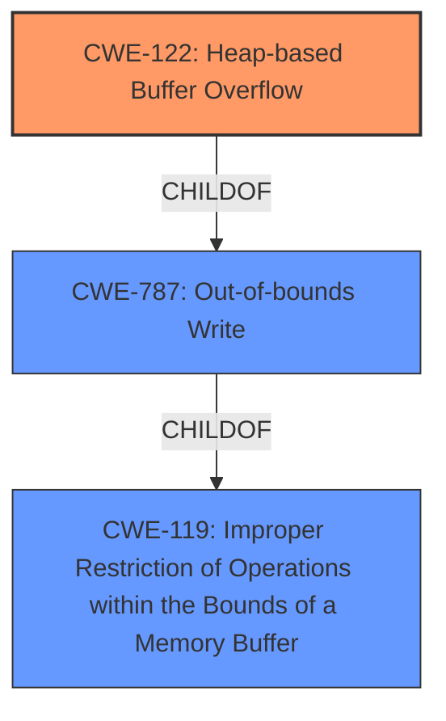

# Raw Analyzer Response for CVE-2021-39546

# Summary
| CWE ID | CWE Name | Confidence | CWE Abstraction Level | CWE Vulnerability Mapping Label | CWE-Vulnerability Mapping Notes |
|---|---|---|---|---|---|
| CWE-122 | Heap-based Buffer Overflow | 1.0 | Variant | Allowed | Primary CWE |
| CWE-787 | Out-of-bounds Write | 0.7 | Base | Allowed | Secondary Candidate |
| CWE-119 | Improper Restriction of Operations within the Bounds of a Memory Buffer | 0.6 | Class | Discouraged | Secondary Candidate |

## Evidence and Confidence

*   **Confidence Score:** 0.9
*   **Evidence Strength:** HIGH

## Relationship Analysis
The primary CWE is CWE-122, which is a variant of CWE-787 (Out-of-bounds Write), indicating a more specific type of out-of-bounds write that occurs on the heap. CWE-787 is a child of CWE-119 (Improper Restriction of Operations within the Bounds of a Memory Buffer), which is a more general class of weakness. The vulnerability description clearly states a "heap-based buffer overflow," making CWE-122 the most appropriate choice. The hierarchical relationships guided the selection towards the most specific CWE.

## Vulnerability Chain
The vulnerability chain is straightforward: a **heap-based buffer overflow** (CWE-122) occurs due to **improper** memory management, leading to an out-of-bounds write.
  - Root Cause: **Heap-based Buffer Overflow** (CWE-122).
  - Weakness: **Out-of-bounds Write** (CWE-787).
  - Impact: potential crash, arbitrary code execution, or data corruption.

## Summary of Analysis
The analysis is primarily based on the explicit statement in the vulnerability description: "riceRiceDecoderprocess() in rice_decoder.cpp has a **heap-based buffer overflow**." The "CVE Reference Links Content Summary" section further confirms that the **root cause** is a **heap-buffer-overflow** in the `rice_decoder.cpp` file, specifically within the `rice::RiceDecoder::generateDecodedUnsignedInts()` function, where the code attempts to write data beyond the allocated buffer on the heap.

The graph relationships helped narrow down the selection to CWE-122, which is a specific type of CWE-787, which is itself a type of CWE-119. Given the explicit mention of "heap-based," CWE-122 is the most specific and appropriate choice.

The selected CWEs are at the optimal level of specificity because CWE-122 directly reflects the vulnerability described, and it is a variant, which is a preferred level of abstraction.

Relevant CWE Information:

# Enhanced Context (25 CWEs)

## CWE-191: Integer Underflow (Wrap or Wraparound)
**Abstraction Level**: Base
The vulnerability description does not mention an integer underflow, so this CWE is not applicable.

## CWE-131: Incorrect Calculation of Buffer Size
**Abstraction Level**: Base
The vulnerability description does not explicitly mention an incorrect calculation of buffer size as the root cause, although it might be an underlying factor. Insufficient evidence to support this.

## CWE-805: Buffer Access with Incorrect Length Value
**Abstraction Level**: Base
While the vulnerability involves writing beyond the buffer, the description doesn't emphasize an incorrect length value as the primary cause.

## CWE-681: Incorrect Conversion between Numeric Types
**Abstraction Level**: Base
The vulnerability description does not mention incorrect conversion between numeric types.

## CWE-680: Integer Overflow to Buffer Overflow
**Abstraction Level**: Compound
The vulnerability description doesn't explicitly mention integer overflow, making this CWE not directly applicable.

## CWE-124: Buffer Underwrite ('Buffer Underflow')
**Abstraction Level**: Base
The vulnerability involves an overflow, not an underflow, so this CWE is not applicable.

## CWE-197: Numeric Truncation Error
**Abstraction Level**: Base
The vulnerability description does not mention numeric truncation.

## CWE-190: Integer Overflow or Wraparound
**Abstraction Level**: Base
The vulnerability description does not mention integer overflow or wraparound.

## CWE-193: Off-by-one Error
**Abstraction Level**: Base
The vulnerability description doesn't highlight an off-by-one error.

## CWE-126: Buffer Over-read
**Abstraction Level**: Variant
The vulnerability primarily focuses on writing beyond the buffer, not reading.

## CWE-190: Integer Overflow or Wraparound
**Abstraction Level**: Base
The vulnerability description does not mention integer overflow or wraparound.

## CWE-681: Incorrect Conversion between Numeric Types
**Abstraction Level**: Base
The vulnerability description does not mention incorrect conversion between numeric types.

## CWE-197: Numeric Truncation Error
**Abstraction Level**: Base
The vulnerability description does not mention numeric truncation.

## CWE-193: Off-by-one Error
**Abstraction Level**: Base
The vulnerability description doesn't highlight an off-by-one error.

## CWE-125: Out-of-bounds Read
**Abstraction Level**: Base
The vulnerability primarily focuses on writing beyond the buffer, not reading.

## CWE-128: Wrap-around Error
**Abstraction Level**: base
The vulnerability description does not mention wrap-around error.

## CWE-170: Improper Null Termination
**Abstraction Level**: base
The vulnerability description does not mention improper null termination.

## CWE-1284: Improper Validation of Specified Quantity in Input
**Abstraction Level**: base
The vulnerability description does not mention improper validation of input quantity.

## CWE-617: Reachable Assertion
**Abstraction Level**: base
The vulnerability description does not mention reachable assertion.

## CWE-123: Write-what-where Condition
**Abstraction Level**: base
While out-of-bounds write is a factor, the specific "write-what-where" condition is not explicitly detailed.

## CWE-463: Deletion of Data Structure Sentinel
**Abstraction Level**: base
The vulnerability description does not mention deletion of data structure sentinel.

## CWE-1339: Insufficient Precision or Accuracy of a Real Number
**Abstraction Level**: base
The vulnerability description does not mention real number precision issues.

## CWE-120: Buffer Copy without Checking Size of Input ('Classic Buffer Overflow')
**Abstraction Level**: base
The vulnerability description does not focus on a buffer copy operation.

## CWE-190: Integer Overflow or Wraparound
**Abstraction Level**: Base
The vulnerability description does not mention integer overflow or wraparound.

## CWE-787: Out-of-bounds Write
**Abstraction Level**: base
The vulnerability involves out-of-bounds write, but the description specifies it's a heap-based overflow, making CWE-122 a better fit.

CWE-122 **Heap-based Buffer Overflow** is the primary CWE.
CWE-787 **Out-of-bounds Write** and CWE-119 **Improper Restriction of Operations within the Bounds of a Memory Buffer** are secondary candidates.