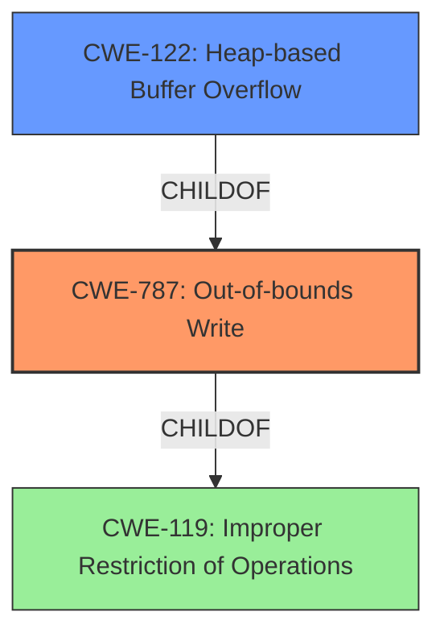

# Analysis Report for CVE-2021-39552

# Vulnerability Analysis Report: CVE-2021-39552

## Description


## Analysis (with Relationship Data)

# Summary
| CWE ID | CWE Name | Confidence | CWE Abstraction Level | CWE Vulnerability Mapping Label | CWE-Vulnerability Mapping Notes |
|---|---|---|---|---|---|
| CWE-787 | Out-of-bounds Write | 1.0 | Base | Allowed | Primary CWE. The vulnerability is a heap-based buffer overflow, which is a type of out-of-bounds write. |
| CWE-122 | Heap-based Buffer Overflow | 0.7 | Variant | Allowed | Secondary CWE. This is a more specific type of out-of-bounds write that occurs on the heap. |
| CWE-119 | Improper Restriction of Operations within the Bounds of a Memory Buffer | 0.5 | Class | Discouraged | Secondary CWE. This is a more general CWE that encompasses out-of-bounds writes, but CWE-787 is more specific. |

## Evidence and Confidence

*   **Confidence Score:** 0.9
*   **Evidence Strength:** HIGH

## Relationship Analysis
The primary CWE is CWE-787 (**CWE-787: Out-of-bounds Write**), which is a Base level CWE. CWE-122 (**CWE-122: Heap-based Buffer Overflow**) is a Variant of CWE-787, providing more specific information about the location of the buffer. CWE-119 (**CWE-119: Improper Restriction of Operations within the Bounds of a Memory Buffer**) is a Class level CWE and a parent of both CWE-787 and CWE-122. The relationships guided the selection of CWE-787 as the primary because it directly addresses the **out-of-bounds write**. The selection of CWE-122 is secondary because it highlights the heap location.



## Vulnerability Chain
The vulnerability chain starts with the **heap-based buffer overflow** (CWE-787), potentially leading to a crash/denial of service. In more complex scenarios, this can potentially be exploited to achieve arbitrary code execution. The root cause is the **improper handling of the size of the input buffer**, which leads to writing data past the end of the allocated memory block in the heap.

## Summary of Analysis
The analysis is primarily based on the vulnerability description, which clearly states that the issue is a **heap-based buffer overflow** in `fileWavFilereadFromFile()` in `wav_file.c`. The CVE Reference Links Content Summary provides supporting evidence that the root cause is an attempt to read data beyond the allocated buffer size, resulting in a heap-buffer-overflow.

The relationship graph highlights that CWE-787 is a more specific type of CWE-119, and CWE-122 provides further specificity about the location of the overflow (heap).

The selection of CWE-787 is justified by its direct match to the vulnerability description and the supporting evidence from the CVE Reference Links Content Summary. CWE-122 is included as a secondary CWE because it further specifies the location of the buffer overflow.

CWE-190, CWE-197, CWE-681, CWE-125, CWE-193, CWE-805, and CWE-128 were considered but not used as they are related to integer handling, conversions, or general buffer access issues, which are not the primary focus of this vulnerability. The core issue is writing data past the allocated buffer, not how the buffer size was calculated or handled numerically.


## CWE Relationship Analysis

Current CWEs represent these abstraction levels: .


### Vulnerability Chain Analysis

**Chain starting from CWE-787:**
- 787 (Out-of-bounds Write) - ROOT


**Chain starting from CWE-805:**
- 805 (Buffer Access with Incorrect Length Value) - ROOT


### CWE Relationship Diagram

```mermaid
graph TD
    classDef primary fill:#f96,stroke:#333,stroke-width:2px
    classDef secondary fill:#69f,stroke:#333
    classDef tertiary fill:#9e9,stroke:#333
```


*Report generated on 2025-04-01 19:28:03*
