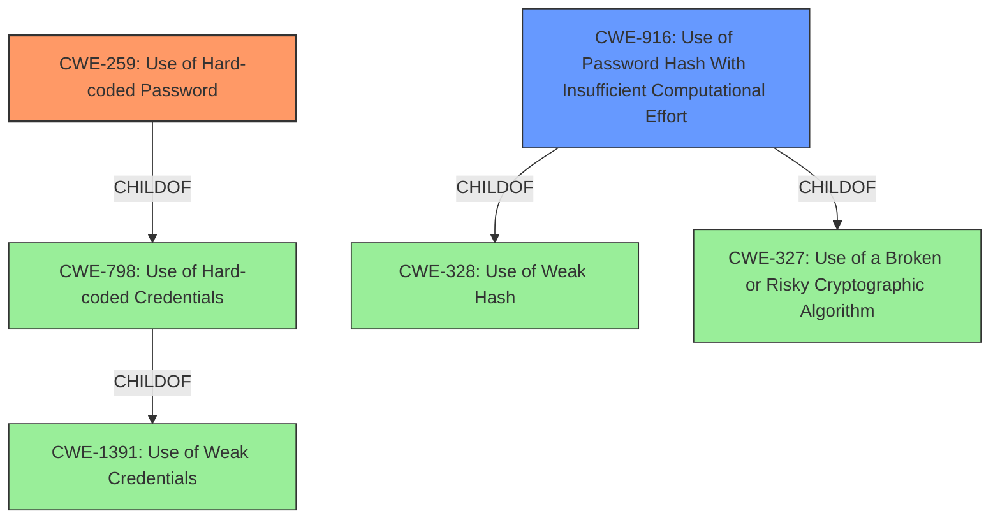

# Enhanced Analysis for CVE-2021-39614

# Summary
| CWE ID  | CWE Name                                                        | Confidence | CWE Abstraction Level | CWE Vulnerability Mapping Label | CWE-Vulnerability Mapping Notes |
| :-------- | :-------------------------------------------------------------- | :--------- | :---------------------- | :------------------------------ | :------------------------------ |
| CWE-259 | Use of Hard-coded Password                                      | 1.0        | Variant               | Allowed                         | Primary CWE                     |
| CWE-916 | Use of Password Hash With Insufficient Computational Effort | 0.75        | Base                  | Allowed                         | Secondary Candidate             |

## Evidence and Confidence

*   **Confidence Score:** 0.875
*   **Evidence Strength:** HIGH

## Relationship Analysis
The primary CWE is CWE-259, which is a variant of CWE-798 (Use of Hard-coded Credentials). CWE-798 is a child of CWE-1391 (Use of Weak Credentials). Also, CWE-259 is a peer of CWE-321 (Use of Hard-coded Cryptographic Key) and CWE-257 (Storing Passwords in a Recoverable Format). The secondary CWE is CWE-916 (Use of Password Hash With Insufficient Computational Effort), which is a child of CWE-328 (Use of Weak Hash) and CWE-327 (Use of a Broken or Risky Cryptographic Algorithm). The hardcoded password was then hashed with insufficient computational effort making it easier to crack. This chain of weaknesses leads to unauthorized access.



## Vulnerability Chain
The vulnerability chain starts with the **hard-coded credentials** (CWE-259). These credentials are then stored as password hashes, but the hashing algorithm used has **insufficient computational effort** (CWE-916). The insufficient computational effort makes it easier to crack the passwords, which leads to unauthorized access to undocumented user accounts.

## Summary of Analysis
The initial assessment identified CWE-259 as the primary weakness due to the presence of **hard-coded credentials**. This assessment is strongly supported by the "Vulnerability Description Key Phrases" and the "CVE Reference Links Content Summary", both of which mention **hard-coded credentials**. The "CVE Reference Links Content Summary" also explicitly lists CWE-259 as a weakness.

The retriever results further reinforce this assessment, with CWE-259 and CWE-798 (Use of Hard-coded Credentials) being among the top matches. Given that the vulnerability description specifies **hard-coded credentials** in the `/etc/passwd` file, CWE-259, which is a variant of CWE-798, is the more specific and appropriate choice.

Additionally, the description mentions that weak passwords were used, and the plaintext passwords can be recovered from the hash values. This indicates that the hashing algorithm used was not strong enough, leading to CWE-916 (Use of Password Hash With Insufficient Computational Effort) as a secondary weakness.

The final selection of CWEs is based on the provided evidence, the retriever results, and the relationship analysis. The chosen CWEs are at the optimal level of specificity, with CWE-259 being a variant and CWE-916 being a base.

Relevant CWE Information:
- CWE-259: Use of Hard-coded Password - The product contains a **hard-coded password**, which it uses for its own inbound authentication or for outbound communication to external components.
- CWE-916: Use of Password Hash With Insufficient Computational Effort - The product generates a hash for a password, but it uses a scheme that does not provide a sufficient level of computational effort that would make password cracking attacks infeasible or expensive.


## CWE Relationship Analysis

Current CWEs represent these abstraction levels: .


### Vulnerability Chain Analysis

**Chain starting from CWE-916:**
- 916 (Use of Password Hash With Insufficient Computational Effort) - ROOT


**Chain starting from CWE-257:**
- 257 (Storing Passwords in a Recoverable Format) - ROOT


### CWE Relationship Diagram

```mermaid
graph TD
    classDef primary fill:#f96,stroke:#333,stroke-width:2px
    classDef secondary fill:#69f,stroke:#333
    classDef tertiary fill:#9e9,stroke:#333
```