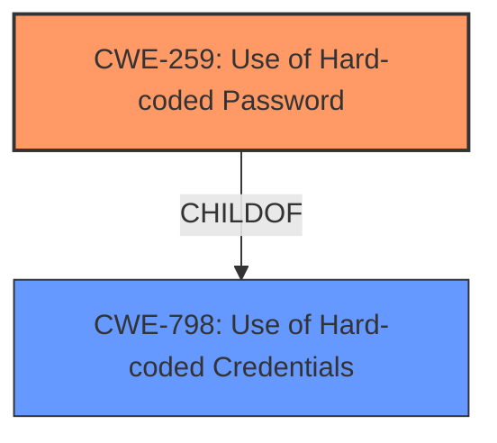

# Analysis for CVE-2021-39615

# Summary
| CWE ID | CWE Name | Confidence | CWE Abstraction Level | CWE Vulnerability Mapping Label | CWE-Vulnerability Mapping Notes |
|---|---|---|---|---|---|
| CWE-259 | Use of Hard-coded Password | 1.0 | Variant | Allowed | Primary CWE |
| CWE-798 | Use of Hard-coded Credentials | 0.9 | Base | Allowed | Secondary Candidate |

## Evidence and Confidence

*   **Confidence Score:** 1.0
*   **Evidence Strength:** HIGH

## Relationship Analysis
The primary CWE is CWE-259, which is a Variant of CWE-798. This indicates a parent-child relationship where CWE-259 is a more specific case of CWE-798. The vulnerability involves a **hard-coded password**, making CWE-259 the more appropriate choice.

## Vulnerability Chain
The vulnerability chain starts with the **hard-coded password** (CWE-259), which allows an attacker to gain unauthorized access to the underlying Linux OS.

## Summary of Analysis
The analysis is based on the provided evidence, which clearly indicates the presence of **hard-coded credentials**. The "Vulnerability Description Key Phrases" section explicitly mentions "**rootcause:** **hard-coded credentials**". The "CVE Reference Links Content Summary" further supports this by stating "**CWE-259 (Use of Hard-coded Password):** The primary weakness is the inclusion of hard-coded credentials within the device's firmware."

The graph relationship between CWE-259 and CWE-798 influenced the selection by showing that CWE-259 is a more specific variant of CWE-798, making it the more appropriate choice.

CWE-259 is selected because it is at the optimal level of specificity, as it directly addresses the use of a **hard-coded password**.

Relevant CWE Information:

# Enhanced Context (25 CWEs)
The following CWEs were identified as potentially relevant to this vulnerability:

## CWE-916: Use of Password Hash With Insufficient Computational Effort
This CWE was considered because the description mentions recovering the cleartext password from a hash. However, the root cause is the **hard-coded password**, not the hashing algorithm. Therefore, this CWE is not the primary issue, although it may be a contributing factor.

## CWE-1391: Use of Weak Credentials
This CWE is a Class-level weakness and could be considered. However, the vulnerability is more specifically about **hard-coded credentials**, which is better captured by CWE-798 and its variant CWE-259.

## CWE-798: Use of Hard-coded Credentials
This CWE is a Base-level weakness and a parent of CWE-259. While relevant, CWE-259 is a more specific representation of the vulnerability as it focuses on the password aspect of the **hard-coded credentials**.

## CWE-328: Use of Weak Hash
Similar to CWE-916, this CWE relates to the hashing algorithm's strength. However, the primary issue is the **hard-coded password** itself, not the hash.

## CWE-1392: Use of Default Credentials
This CWE is not applicable because the credentials are not default but **hard-coded**.

## CWE-836: Use of Password Hash Instead of Password for Authentication
This CWE is not directly related to the root cause, which is the **hard-coded password**, not the authentication mechanism.

## CWE-330: Use of Insufficiently Random Values
This CWE is not relevant as the vulnerability does not involve random number generation.

## CWE-1240: Use of a Cryptographic Primitive with a Risky Implementation
This CWE is not relevant because the vulnerability is not about the implementation of cryptographic primitives.

## CWE-312: Cleartext Storage of Sensitive Information
This CWE is not directly applicable as the issue is the presence of **hard-coded credentials**, not necessarily their storage in cleartext.

## CWE-1390: Weak Authentication
This CWE is a Class-level weakness, but the vulnerability is more specifically about the **hard-coded password**, making CWE-259 a better fit.

## CWE-472: External Control of Assumed-Immutable Web Parameter
This CWE is not relevant to the vulnerability description.

## CWE-1282: Assumed-Immutable Data is Stored in Writable Memory
This CWE is not relevant to the vulnerability description.

## CWE-471: Modification of Assumed-Immutable Data (MAID)
This CWE is not relevant to the vulnerability description.

## CWE-425: Direct Request ('Forced Browsing')
This CWE is not relevant to the vulnerability description.

CWE-257: Storing Passwords in a Recoverable Format
This CWE is not relevant because the root cause is the **hard-coded password**, not how the password is stored.

CWE-344: Use of Invariant Value in Dynamically Changing Context
This CWE is not relevant to the vulnerability description.

CWE-306: Missing Authentication for Critical Function
This CWE is not relevant to the vulnerability description.