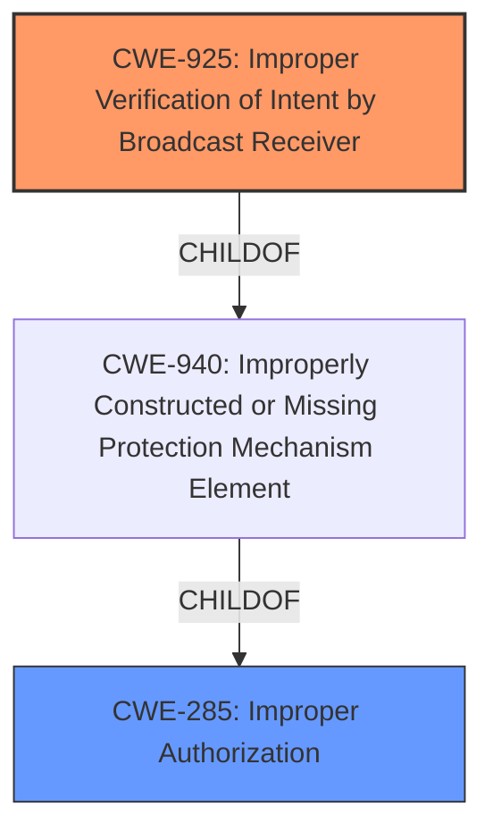

# Raw Analyzer Response for CVE-2021-39621

# Summary
| CWE ID | CWE Name | Confidence | CWE Abstraction Level | CWE Vulnerability Mapping Label | CWE-Vulnerability Mapping Notes |
|---|---|---|---|---|---|
| CWE-925 | Improper Verification of Intent by Broadcast Receiver | 0.8 | Variant | Allowed | Primary CWE |
| CWE-285 | Improper Authorization | 0.5 | Class | Allowed-with-Review | Secondary CWE |

## Evidence and Confidence

*   **Confidence Score:** 0.8
*   **Evidence Strength:** MEDIUM

## Relationship Analysis
The primary CWE, CWE-925, is a variant of CWE-940 (Improperly Constructed or Missing Protection Mechanism Element) and focuses on the specific scenario of broadcast receivers in Android applications. The secondary CWE, CWE-285, is a parent class that represents a broader category of authorization issues. The analysis considered these relationships to choose the most specific CWE that accurately reflects the vulnerability while also acknowledging the general authorization context.



## Vulnerability Chain
The vulnerability chain involves an unsafe PendingIntent (**rootcause**) leading to a possible permissions bypass, and ultimately resulting in local escalation of privilege (**impact**).
  - **Root Cause:** **unsafe PendingIntent**
  - **Weakness:** Improper Verification of Intent
  - **Impact:** Local escalation of privilege

## Summary of Analysis
The analysis is primarily based on the vulnerability description provided. The key phrase "**unsafe PendingIntent**" suggests a potential issue related to how intents are handled within the Android application.

The "CVE Reference Links Content Summary" states:
```
{
  "vulnerability_details": [
    {
      "CVE": "CVE-2021-39621",
      "root_cause": "The vulnerability is due to a flaw in the Parcel implementation.",
      "weaknesses": [
        "Avoid extra release of unknown objects in Parcel error paths"
        ],
      "impact": "A local attacker could potentially escalate privileges.",
      "attack_vector": "Local attack",
       "required_capabilities": "Local privileged access is required to exploit this vulnerability."
    }
  ]
}
```
This information is insufficient to make a decision about the root cause, so the selection is primarily based on the vulnerability description.

The Retriever Results provided a few potential CWEs to consider.
CWE-925 (Improper Verification of Intent by Broadcast Receiver) stood out as the best match because it directly relates to the improper handling of intents, which aligns with the "**unsafe PendingIntent**" description. The description of CWE-925, "The Android application uses a Broadcast Receiver that receives an Intent but does not properly verify that the Intent came from an authorized source," closely matches the vulnerability. This is a more specific case of authorization failure and thus a better fit than the broader CWE-862 (Missing Authorization).

CWE-732 (Incorrect Permission Assignment for Critical Resource) was considered but deemed less relevant because the primary issue is not with the assignment of permissions but with the verification of the intent's origin.

CWE-925 is chosen because it precisely describes the vulnerability's mechanism: the Android application's failure to properly verify the intent associated with the PendingIntent. This leads to a permissions bypass and potential local escalation of privilege.

Relevant CWE Information:

# Enhanced Context (25 CWEs)
The following CWEs were identified as potentially relevant to this vulnerability:

## CWE-667: Improper Locking
**Abstraction Level**: Class
**Similarity Score**: 0.80
**Source**: dense

**Description**:
The product does not properly acquire or release a lock on a resource, leading to unexpected resource state changes and behaviors.

**Mapping Guidance**:
- Usage: Allowed-with-Review
- Rationale: This CWE entry is a Class and might have Base-level children that would be more appropriate


## CWE-754: Improper Check for Unusual or Exceptional Conditions
**Abstraction Level**: Class
**Similarity Score**: 0.80
**Source**: dense

**Description**:
The product does not check or incorrectly checks for unusual or exceptional conditions that are not expected to occur frequently during day to day operation of the product.

**Mapping Guidance**:
- Usage: Allowed-with-Review
- Rationale: This CWE entry is a Class and might have Base-level children that would be more appropriate


## CWE-404: Improper Resource Shutdown or Release
**Abstraction Level**: Class
**Similarity Score**: 0.78
**Source**: dense

**Description**:
The product does not release or incorrectly releases a resource before it is made available for re-use.

**Mapping Guidance**:
- Usage: Allowed-with-Review
- Rationale: This CWE entry is a Class and might have Base-level children that would be more appropriate


## CWE-909: Missing Initialization of Resource
**Abstraction Level**: Class
**Similarity Score**: 0.78
**Source**: dense

**Description**:
The product does not initialize a critical resource.

**Mapping Guidance**:
- Usage: Allowed-with-Review
- Rationale: This CWE entry is a Class and might have Base-level children that would be more appropriate


## CWE-665: Improper Initialization
**Abstraction Level**: Class
**Similarity Score**: 0.77
**Source**: dense

**Description**:
The product does not initialize or incorrectly initializes a resource, which might leave the resource in an unexpected state when it is accessed or used.

**Mapping Guidance**:
- Usage: Discouraged
- Rationale: This CWE entry is a level-1 Class (i.e., a child of a Pillar). It might have lower-level children that would be more appropriate


## CWE-226: Sensitive Information in Resource Not Removed Before Reuse
**Abstraction Level**: Base
**Similarity Score**: 0.77
**Source**: dense

**Description**:
The product releases a resource such as memory or a file so that it can be made available for reuse, but it does not clear or "zeroize" the information contained in the resource before the product performs a critical state transition or makes the resource available for reuse by other entities.

**Mapping Guidance**:
- Usage: Allowed
- Rationale: This CWE entry is at the Base level of abstraction, which is a preferred level of abstraction for mapping to the root causes of vulnerabilities.


## CWE-203: Observable Discrepancy
**Abstraction Level**: Base
**Similarity Score**: 0.77
**Source**: dense

**Description**:
The product behaves differently or sends different responses under different circumstances in a way that is observable to an unauthorized actor, which exposes security-relevant information about the state of the product, such as whether a particular operation was successful or not.

**Mapping Guidance**:
- Usage: Allowed
- Rationale: This CWE entry is at the Base level of abstraction, which is a preferred level of abstraction for mapping to the root causes of vulnerabilities.


## CWE-908: Use of Uninitialized Resource
**Abstraction Level**: Base
**Similarity Score**: 0.77
**Source**: dense

**Description**:
The product uses or accesses a resource that has not been initialized.

**Mapping Guidance**:
- Usage: Allowed
- Rationale: This CWE entry is at the Base level of abstraction, which is a preferred level of abstraction for mapping to the root causes of vulnerabilities.


## CWE-345: Insufficient Verification of Data Authenticity
**Abstraction Level**: Class
**Similarity Score**: 0.77
**Source**: dense

**Description**:
The product does not sufficiently verify the origin or authenticity of data, in a way that causes it to accept invalid data.

**Mapping Guidance**:
- Usage: Discouraged
- Rationale: This CWE entry is a level-1 Class (i.e., a child of a Pillar). It might have lower-level children that would be more appropriate


## CWE-451: User Interface (UI) Misrepresentation of Critical Information
**Abstraction Level**: Class
**Similarity Score**: 0.77
**Source**: dense

**Description**:
The user interface (UI) does not properly represent critical information to the user, allowing the information - or its source - to be obscured or spoofed. This is often a component in phishing attacks.

**Mapping Guidance**:
- Usage: Allowed-with-Review
- Rationale: This CWE entry is a Class and might have Base-level children that would be more appropriate


## CWE-927: Use of Implicit Intent for Sensitive Communication
**Abstraction Level**: Variant
**Similarity Score**: 4732.80
**Source**: sparse

**Description**:
The Android application uses an implicit