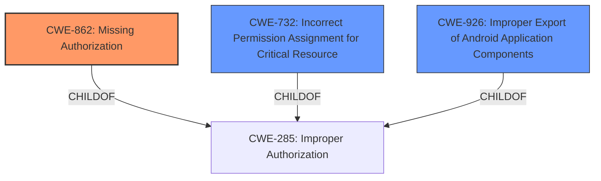

# Enhanced Analysis for CVE-2021-39630

# Summary

| CWE ID  | CWE Name                                                                                                 | Confidence | CWE Abstraction Level | CWE Vulnerability Mapping Label | CWE-Vulnerability Mapping Notes |
| :-------- | :--------------------------------------------------------------------------------------------------------- | :---------- | :---------------------- | :------------------------------ | :------------------------------ |
| CWE-862   | Missing Authorization                                                                                      | 0.9         | Class                   | Primary                         | Allowed-with-Review             |
| CWE-926   | Improper Export of Android Application Components                                                        | 0.7         | Variant                 | Secondary                       | Allowed                         |
| CWE-732   | Incorrect Permission Assignment for Critical Resource                                                      | 0.5         | Class                   | Secondary                       | Allowed-with-Review             |

## Evidence and Confidence

*   **Confidence Score:** 0.8
*   **Evidence Strength:** HIGH

## Relationship Analysis

The primary relationship influencing the CWE selection is the hierarchical parent-child relationship, particularly with CWE-862 **Missing Authorization**, which is a child of CWE-285 **Improper Authorization**. While CWE-285 is a higher-level class, the specificity of CWE-862 aligns better with the vulnerability description, focusing on the **missing authorization** check. CWE-732 **Incorrect Permission Assignment for Critical Resource** was considered due to the mention of permissions, but it was deemed less suitable as it often indicates cases where permissions are not checked at all, aligning more closely with authorization issues.



## Vulnerability Chain

The vulnerability chain starts with a **missing authorization** check (CWE-862), leading to a **permissions bypass**. This then enables the ability to control fabricated overlays from the adb shell, ultimately resulting in a local escalation of privilege.

## Summary of Analysis

The initial analysis focused on the **permissions bypass** mentioned in the vulnerability description. The Retriever results highlighted CWE-862 **Missing Authorization** as a strong candidate, supported by the root cause identified in the CVE Reference Links Content Summary, stating that the vulnerability stems from an issue in how Android handles shell overlays, specifically the unrestricted fabrication by non-root users.

CWE-862 is selected as the primary CWE because the vulnerability lies in the fact that the authorization check is **missing** when non-root shells fabricate overlays. This **missing** check allows for the **permissions bypass**. The official MITRE mapping guidance for CWE-862 suggests examining child entries for a better fit, but none of the children provide a more precise description of the vulnerability than CWE-862 itself.

CWE-926 **Improper Export of Android Application Components** is also considered as a secondary CWE. The vulnerability allows unauthorized access to application components, which is closely related to improper export.

CWE-732 **Incorrect Permission Assignment for Critical Resource** was also considered, but it was deemed less appropriate. The issue isn't so much that the permissions were incorrectly assigned, but that there's a **missing** authorization check that allows the action in the first place. This is further supported by the root cause description of the vulnerability.

The selected CWEs are at the optimal level of specificity, providing a clear and accurate representation of the vulnerability. This assessment is based on the provided evidence and the relationship analysis within the CWE framework.

Relevant CWE Information:

# Enhanced Context (25 CWEs)

## CWE-667: Improper Locking
**Abstraction Level**: Class
**Similarity Score**: 0.79
**Source**: dense

**Description**:
The product does not properly acquire or release a lock on a resource, leading to unexpected resource state changes and behaviors.

**Mapping Guidance**:
- Usage: Allowed-with-Review
- Rationale: This CWE entry is a Class and might have Base-level children that would be more appropriate

*Not selected*: This CWE is not relevant to the described vulnerability as it focuses on locking mechanisms, which are not part of the vulnerability.

## CWE-662: Improper Synchronization
**Abstraction Level**: Class
**Similarity Score**: 0.79
**Source**: dense

**Description**:
The product utilizes multiple threads or processes to allow temporary access to a shared resource that can only be exclusive to one process at a time, but it does not properly synchronize these actions, which might cause simultaneous accesses of this resource by multiple threads or processes.

**Mapping Guidance**:
- Usage: Discouraged
- Rationale: This CWE entry is a level-1 Class (i.e., a child of a Pillar). It might have lower-level children that would be more appropriate

*Not selected*: This CWE is not relevant as the vulnerability does not involve synchronization issues between threads or processes.

## CWE-366: Race Condition within a Thread
**Abstraction Level**: Base
**Similarity Score**: 0.78
**Source**: dense

**Description**:
If two threads of execution use a resource simultaneously, there exists the possibility that resources may be used while invalid, in turn making the state of execution undefined.

**Mapping Guidance**:
- Usage: Allowed
- Rationale: This CWE entry is at the Base level of abstraction, which is a preferred level of abstraction for mapping to the root causes of vulnerabilities.

*Not selected*: This CWE is not applicable because the vulnerability does not involve race conditions within threads.

## CWE-362: Concurrent Execution using Shared Resource with Improper Synchronization ('Race Condition')
**Abstraction Level**: Class
**Similarity Score**: 0.78
**Source**: dense

**Description**:
The product contains a concurrent code sequence that requires temporary, exclusive access to a shared resource, but a timing window exists in which the shared resource can be modified by another code sequence operating concurrently.

**Mapping Guidance**:
- Usage: Allowed-with-Review
- Rationale: This CWE entry is a Class and might have Base-level children that would be more appropriate

*Not selected*: This CWE is not relevant as the vulnerability does not involve a race condition due to concurrent execution.

## CWE-367: Time-of-check Time-of-use (TOCTOU) Race Condition
**Abstraction Level**: Base
**Similarity Score**: 0.77
**Source**: dense

**Description**:
The product checks the state of a resource before using that resource, but the resource's state can change between the check and the use in a way that invalidates the results of the check. This can cause the product to perform invalid actions when the resource is in an unexpected state.

**Mapping Guidance**:
- Usage: Allowed
- Rationale: This CWE entry is at the Base level of abstraction, which is a preferred level of abstraction for mapping to the root causes of vulnerabilities.

*Not selected*: This CWE is not relevant because the vulnerability doesn't involve a time-of-check time-of-use race condition. The issue is **missing authorization**, not a check that becomes invalid.

## CWE-404: Improper Resource Shutdown or Release
**Abstraction Level**: Class
**Similarity Score**: 0.77
**Source**: dense

**Description**:
The product does not release or incorrectly releases a resource before it is made available for re-use.

**Mapping Guidance**:
- Usage: Allowed-with-Review
- Rationale: This CWE entry is a Class and might have Base-level children that would be more appropriate

*Not selected*: This CWE is not relevant because the vulnerability isn't related to resource shutdown or release.

## CWE-754: Improper Check for Unusual or Exceptional Conditions
**Abstraction Level**: Class
**Similarity Score**: 0.75
**Source**: dense

**Description**:
The product does not check or incorrectly checks for unusual or exceptional conditions that are not expected to occur frequently during day to day operation of the product.

**Mapping Guidance**:
- Usage: Allowed-with-Review
- Rationale: This CWE entry is a Class and might have Base-level children that would be more appropriate

*Not selected*: This CWE is not the best fit. It is more about unusual conditions.

## CWE-653: Improper Isolation or Compartmentalization
**Abstraction Level**: Class
**Similarity Score**: 0.74
**Source**: dense

**Description**:
The product does not properly compartmentalize or isolate functionality, processes, or resources that require different privilege levels, rights, or permissions.

**Mapping Guidance**:
- Usage: Allowed
- Rationale: This CWE entry is at the Base level of abstraction, which is a preferred level of abstraction for mapping to the root causes of vulnerabilities.

*Not selected*: Although privilege levels are relevant, this CWE does not get


## CWE Relationship Analysis

Current CWEs represent these abstraction levels: .


### Vulnerability Chain Analysis

**Chain starting from CWE-732:**
- 732 (Incorrect Permission Assignment for Critical Resource) - ROOT


**Chain starting from CWE-667:**
- 667 (Improper Locking) - ROOT


### CWE Relationship Diagram

```mermaid
graph TD
    classDef primary fill:#f96,stroke:#333,stroke-width:2px
    classDef secondary fill:#69f,stroke:#333
    classDef tertiary fill:#9e9,stroke:#333
```