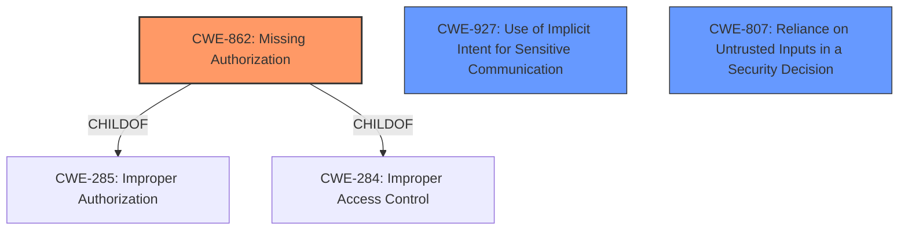

# Raw Analyzer Response for CVE-2021-39651

# Summary
| CWE ID | CWE Name | Confidence | CWE Abstraction Level | CWE Vulnerability Mapping Label | CWE-Vulnerability Mapping Notes |
|---|---|---|---|---|---|
| CWE-862 | Missing Authorization | 1 | Class | Allowed-with-Review | Primary CWE |
| CWE-927 | Use of Implicit Intent for Sensitive Communication | 0.5 | Variant | Allowed | Secondary Candidate |
| CWE-807 | Reliance on Untrusted Inputs in a Security Decision | 0.5 | Base | Allowed | Secondary Candidate |

## Evidence and Confidence

*   **Confidence Score:** 0.8
*   **Evidence Strength:** HIGH

## Relationship Analysis
The primary CWE, CWE-862 (Missing Authorization), is a class-level CWE. It is a child of CWE-285 (Improper Authorization) and CWE-284 (Improper Access Control). The vulnerability description clearly states a **missing permission check**, indicating an authorization failure. While CWE-862 is a class-level CWE and suggests examining its children, none of the children CWEs appears to be a more precise fit based on the provided information. CWE-927 (Use of Implicit Intent for Sensitive Communication) and CWE-807 (Reliance on Untrusted Inputs in a Security Decision) were considered as they are related to security decisions and data handling, but they are less directly applicable than CWE-862.

## Vulnerability Chain
The vulnerability chain consists of a **missing permission check** (CWE-862) which allows bypassing PIN confirmation, leading to local escalation of privilege. The root cause is the **missing permission check**, and the impact is unauthorized access to PIN-protected settings.

## Summary of Analysis
The primary assessment is based on the vulnerability description stating "**missing permission check**". This directly aligns with the definition of CWE-862 (Missing Authorization): "The product does not perform an authorization check when an actor attempts to access a resource or perform an action." The evidence is strong, as the description explicitly mentions the **missing permission check**, and the impact aligns with the CWE's implications.

The retriever results also support this by listing CWE-862 (Missing Authorization) as the top candidate. While CWE-862 is a class-level CWE, no child CWE provides a more specific fit.

CWE-927 (Use of Implicit Intent for Sensitive Communication) was considered because the vulnerability involves accessing sensitive settings, but there is no indication that implicit intents are involved. CWE-807 (Reliance on Untrusted Inputs in a Security Decision) was also considered because the permission check might rely on some input, but the core issue is the **missing check** itself, not the reliance on untrusted input.

Therefore, CWE-862 (Missing Authorization) is the most appropriate and specific CWE for this vulnerability. It is at the class level because the provided information does not give specifics on the authorization scheme or resource being accessed.

Relevant CWE Information:

# Enhanced Context (25 CWEs)

## CWE-1289: Improper Validation of Unsafe Equivalence in Input
**Abstraction Level**: Base
**Similarity Score**: 0.77
**Source**: dense

**Description**:
The product receives an input value that is used as a resource identifier or other type of reference, but it does not validate or incorrectly validates that the input is equivalent to a potentially-unsafe value.

**Mapping Guidance**:
- Usage: Allowed
- Rationale: This CWE entry is at the Base level of abstraction, which is a preferred level of abstraction for mapping to the root causes of vulnerabilities.

*Not Selected:* This is not directly related to the **missing permission check**, but rather to the validation of input equivalence.

## CWE-665: Improper Initialization
**Abstraction Level**: Class
**Similarity Score**: 0.77
**Source**: dense

**Description**:
The product does not initialize or incorrectly initializes a resource, which might leave the resource in an unexpected state when it is accessed or used.

**Mapping Guidance**:
- Usage: Discouraged
- Rationale: This CWE entry is a level-1 Class (i.e., a child of a Pillar). It might have lower-level children that would be more appropriate

*Not Selected:* The root cause is a **missing permission check** (CWE-862) and not a problem with initialization.

## CWE-226: Sensitive Information in Resource Not Removed Before Reuse
**Abstraction Level**: Base
**Similarity Score**: 0.77
**Source**: dense

**Description**:
The product releases a resource such as memory or a file so that it can be made available for reuse, but it does not clear or "zeroize" the information contained in the resource before the product performs a critical state transition or makes the resource available for reuse by other entities.

**Mapping Guidance**:
- Usage: Allowed
- Rationale: This CWE entry is at the Base level of abstraction, which is a preferred level of abstraction for mapping to the root causes of vulnerabilities.

*Not Selected:* This is not related to the **missing permission check**

## CWE-667: Improper Locking
**Abstraction Level**: Class
**Similarity Score**: 0.77
**Source**: dense

**Description**:
The product does not properly acquire or release a lock on a resource, leading to unexpected resource state changes and behaviors.

**Mapping Guidance**:
- Usage: Allowed-with-Review
- Rationale: This CWE entry is a Class and might have Base-level children that would be more appropriate

*Not Selected:* This is not related to the **missing permission check**.

## CWE-404: Improper Resource Shutdown or Release
**Abstraction Level**: Class
**Similarity Score**: 0.77
**Source**: dense

**Description**:
The product does not release or incorrectly releases a resource before it is made available for re-use.

**Mapping Guidance**:
- Usage: Allowed-with-Review
- Rationale: This CWE entry is a Class and might have Base-level children that would be more appropriate

*Not Selected:* The root cause is a **missing permission check** and not related to resource shutdown or release.

## CWE-807: Reliance on Untrusted Inputs in a Security Decision
**Abstraction Level**: Base
**Similarity Score**: 0.76
**Source**: dense

**Description**:
The product uses a protection mechanism that relies on the existence or values of an input, but the input can be modified by an untrusted actor in a way that bypasses the protection mechanism.

**Mapping Guidance**:
- Usage: Allowed
- Rationale: This CWE entry is at the Base level of abstraction, which is a preferred level of abstraction for mapping to the root causes of vulnerabilities.

*Not Selected:* Considered as a secondary weakness because a missing check could imply an improper reliance on some input, but it's less direct than the **missing permission check** itself (CWE-862). Confidence is 0.5.

## CWE-909: Missing Initialization of Resource
**Abstraction Level**: Class
**Similarity Score**: 0.76
**Source**: dense

**Description**:
The product does not initialize a critical resource.

**Mapping Guidance**:
- Usage: Allowed-with-Review
- Rationale: This CWE entry is a Class and might have Base-level children that would be more appropriate

*Not Selected:* This is not related to the **missing permission check** (CWE-862).

## CWE-754: Improper Check for Unusual or Exceptional Conditions
**Abstraction Level**: Class
**Similarity Score**: 0.76
**Source**: dense

**Description**:
The product does not check or incorrectly checks for unusual or exceptional conditions that are not expected to occur frequently during day to day operation of the product.

**Mapping Guidance**:
- Usage: Allowed-with-Review
- Rationale: This CWE entry is a Class and might have Base-level children that would be more appropriate

*Not Selected:* The root cause is a **missing permission check** (CWE-862), not an improper check for unusual conditions.

## CWE-664: Improper Control of a Resource Through its Lifetime
**Abstraction Level**: Pillar
**Similarity Score**: 0.75
**Source**: dense

**Description**:
The product does not maintain or incorrectly maintains control over a resource throughout its lifetime of creation, use, and release.

**Mapping Guidance**:
-