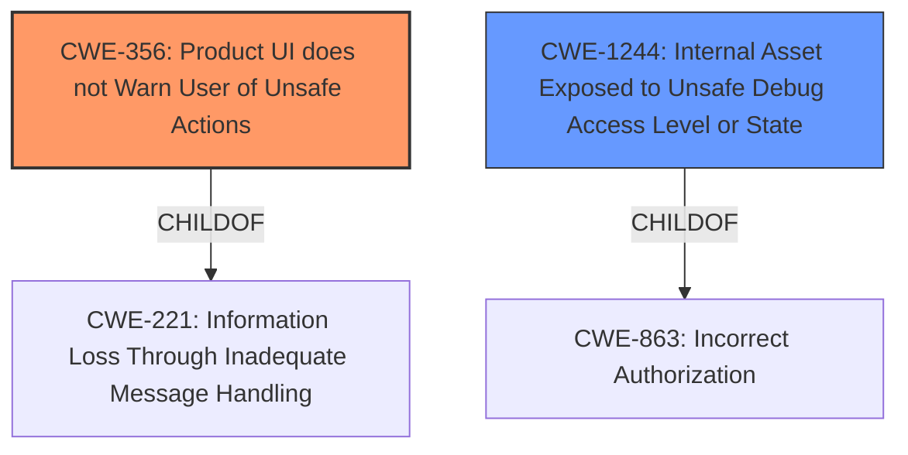

# Analysis Report for CVE-2021-39653

# Vulnerability Analysis Report: CVE-2021-39653

## Description


## Analysis (with Relationship Data)

# Summary
| CWE ID | CWE Name | Confidence | CWE Abstraction Level | CWE Vulnerability Mapping Label | CWE-Vulnerability Mapping Notes |
|---|---|---|---|---|---|
| CWE-356 | Product UI does not Warn User of Unsafe Actions | 0.9 | Base | Allowed | Primary CWE |
| CWE-1244 | Internal Asset Exposed to Unsafe Debug Access Level or State | 0.6 | Base | Allowed | Secondary Candidate |

## Evidence and Confidence

*   **Confidence Score:** 0.75
*   **Evidence Strength:** MEDIUM

## Relationship Analysis
The primary CWE, CWE-356, is a Base level CWE which is the preferred level of abstraction. CWE-356 is a child of CWE-221 which is not as specific. CWE-1244 is also a Base level CWE and a child of CWE-863.



## Vulnerability Chain
The chain of weaknesses begins with the **missing warning to the user** (CWE-356), which allows an attacker to prepare the device, hide the warning, and pass the phone to a new user, ultimately leading to local escalation of privilege.

## Summary of Analysis
The initial analysis focused on the **missing warning to the user** as the primary **rootcause** of the vulnerability, leading to a local escalation of privilege. The evidence for this assessment is drawn directly from the "Vulnerability Description Key Phrases" section, which states "**rootcause:** **missing warning to the user**" and "**impact:** escalation of privilege".

The retriever results strongly suggest CWE-356 "Product UI does not Warn User of Unsafe Actions" as the most relevant CWE, with a similarity score of 0.717. Given the **rootcause** of a **missing warning to the user**, this aligns well with the CWE description.

CWE-1244 "Internal Asset Exposed to Unsafe Debug Access Level or State" was considered as a secondary candidate because the vulnerability involves booting with a hidden debug policy. The relationship graph shows that it is a child of CWE-863.

I am overriding the Primary CWE Match of CWE-NVD-noinfo from similar CVE Descriptions because there is sufficient information to map it to a more specific CWE.

CWE-356 is at the optimal level of specificity because it directly addresses the identified **rootcause** of the vulnerability.

Relevant CWE Information:

# Enhanced Context (25 CWEs)

## CWE-356: Product UI does not Warn User of Unsafe Actions
**Abstraction:** Base
**Similarity Score**: 0.717
**Source**: sparse

**Description**:
The product's user interface does not warn the user before undertaking an unsafe action on behalf of that user. This makes it easier for attackers to trick users into inflicting damage to their system.

### Rationale
The primary weakness is a **missing warning to the user**. This is a classic case of a UI failing to inform the user about potentially unsafe actions.
### Mapping Guidance
**Usage:** Allowed
**Rationale:** This CWE entry is at the Base level of abstraction, which is a preferred level of abstraction for mapping to the root causes of vulnerabilities.

## CWE-1244: Internal Asset Exposed to Unsafe Debug Access Level or State
**Abstraction:** Base
**Similarity Score**: 0.578
**Source**: dense

**Description**:
The product uses physical debug or test interfaces with support for multiple access levels, but it assigns the wrong debug access level to an internal asset, providing unintended access to the asset from untrusted debug agents.

### Rationale
The vulnerability description mentions "booting with a hidden debug policy". This suggests that the issue could involve debug access levels. However, the **missing warning** is the more direct **rootcause**.
### Mapping Guidance
**Usage:** Allowed
**Rationale:** This CWE entry is at the Base level of abstraction, which is a preferred level of abstraction for mapping to the root causes of vulnerabilities.


## CWE Relationship Analysis

Current CWEs represent these abstraction levels: .


### Vulnerability Chain Analysis

**Chain starting from CWE-1244:**
- 1244 (Internal Asset Exposed to Unsafe Debug Access Level or State) - ROOT


**Chain starting from CWE-221:**
- 221 (Information Loss or Omission) - ROOT


### CWE Relationship Diagram

```mermaid
graph TD
    classDef primary fill:#f96,stroke:#333,stroke-width:2px
    classDef secondary fill:#69f,stroke:#333
    classDef tertiary fill:#9e9,stroke:#333
```


*Report generated on 2025-04-02 01:14:12*
