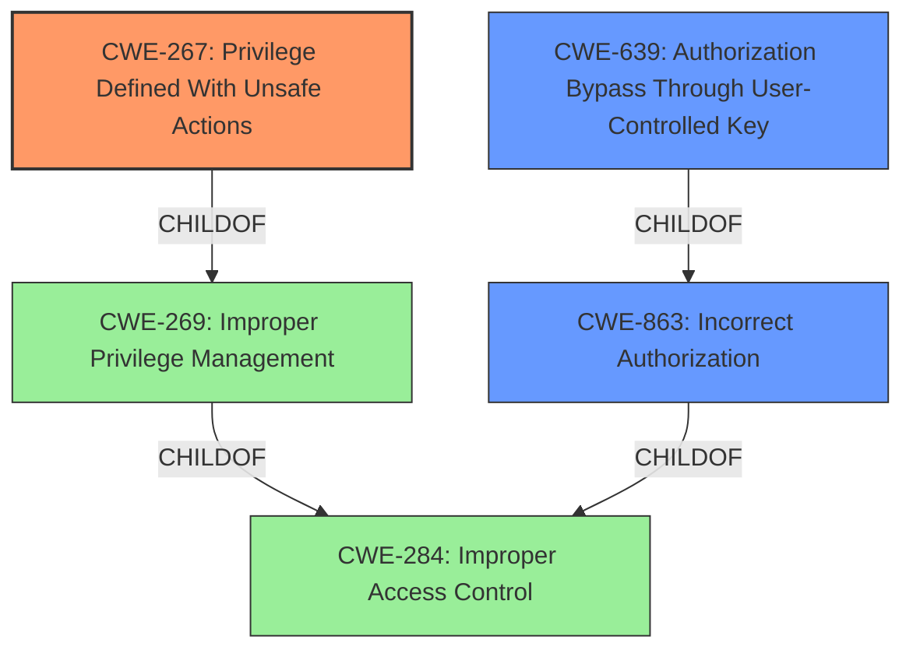

# Analysis Report for CVE-2021-3967

# Vulnerability Analysis Report: CVE-2021-3967

## Description


## Analysis (with Relationship Data)

# Summary
| CWE ID | CWE Name | Confidence | CWE Abstraction Level | CWE Vulnerability Mapping Label | CWE-Vulnerability Mapping Notes |
|---|---|---|---|---|---|
| CWE-267 | Privilege Defined With Unsafe Actions | 0.9 | Base | Primary CWE | Allowed |
| CWE-639 | Authorization Bypass Through User-Controlled Key | 0.7 | Base | Secondary Candidate | Allowed |
| CWE-863 | Incorrect Authorization | 0.6 | Class | Secondary Candidate | Allowed-with-Review |

## Evidence and Confidence

*   **Confidence Score:** 0.8
*   **Evidence Strength:** HIGH

## Relationship Analysis
The primary CWE is CWE-267, which is a Base level CWE. CWE-267 is a child of CWE-269 (Improper Privilege Management). CWE-639 (Authorization Bypass Through User-Controlled Key) and CWE-863 (Incorrect Authorization) are also related to access control issues but are not as precise as CWE-267 in this context. They represent different facets of the same underlying problem.



## Vulnerability Chain
The vulnerability chain starts with **improper access control** leading to an attacker being able to regenerate an API key without proper authentication, ultimately resulting in complete account takeover. The chain can be represented as:

**Improper Access Control** (CWE-267) -> **Insufficient Authentication** -> **Account Takeover**.

## Summary of Analysis
Initially, I considered CWE-287 (Improper Authentication) as indicated in the CVE details, but after reviewing the evidence, the root cause is more accurately described as a privilege being defined with unsafe actions (CWE-267). The core issue is that a logged-in user, a privilege, could regenerate the API key without the previous key, which constitutes an unsafe action.

The vulnerability description states, "**Improper Access Control** in GitHub repository zulip/zulip prior to 4.10." The "CVE Reference Links Content Summary" elaborates on this, noting that the API key regeneration endpoint `/api/v1/users/me/api_key/regenerate` was accessible using only a logged-in user session. This **insufficient authentication** allowed an attacker to regenerate the API key and effectively take over the account. The fix involved making the endpoint only accessible by authenticating with the current API key.

The retriever results also pointed to several access control related CWEs, with CWE-267 (Privilege Defined With Unsafe Actions) having a high score.

I am selecting CWE-267 as the primary CWE because it most accurately captures the root cause of the vulnerability, where a user with logged in access (a privilege) was able to perform the unsafe action of regenerating an API key.

I considered CWE-639 (Authorization Bypass Through User-Controlled Key), but it is not as precise as CWE-267 because the key (API key) is not directly user-controlled.

I also considered CWE-863 (Incorrect Authorization), however it is too high-level.

I am confident in selecting CWE-267 because it is a base-level CWE that accurately describes the unsafe action that the vulnerability allows.

Relevant CWE Information:

# Enhanced Context (25 CWEs)

## CWE-73: External Control of File Name or Path
**Abstraction Level**: Base
**Similarity Score**: 0.81

**Description**:
The product allows user input to control or influence paths or file names that are used in filesystem operations.

**Why it was not selected:** This CWE does not apply because the vulnerability does not involve file names or paths.

## CWE-23: Relative Path Traversal
**Abstraction Level**: Base
**Similarity Score**: 0.79

**Description**:
The product uses external input to construct a pathname that should be within a restricted directory, but it does not properly neutralize sequences such as ".." that can resolve to a location that is outside of that directory.

**Why it was not selected:** This CWE does not apply because the vulnerability does not involve path traversal.

## CWE-41: Improper Resolution of Path Equivalence
**Abstraction Level**: Base
**Similarity Score**: 0.78

**Description**:
The product is vulnerable to file system contents disclosure through path equivalence. Path equivalence involves the use of special characters in file and directory names. The associated manipulations are intended to generate multiple names for the same object.

**Why it was not selected:** This CWE does not apply because the vulnerability does not involve path equivalence or file system contents disclosure.

## CWE-59: Improper Link Resolution Before File Access ('Link Following')
**Abstraction Level**: Base
**Similarity Score**: 0.78

**Description**:
The product attempts to access a file based on the filename, but it does not properly prevent that filename from identifying a link or shortcut that resolves to an unintended resource.

**Why it was not selected:** This CWE does not apply because the vulnerability does not involve link resolution or file access.

## CWE-552: Files or Directories Accessible to External Parties
**Abstraction Level**: Base
**Similarity Score**: 0.77

**Description**:
The product makes files or directories accessible to unauthorized actors, even though they should not be.

**Why it was not selected:** This CWE does not apply because the vulnerability does not involve unauthorized access to files or directories.

## CWE-36: Absolute Path Traversal
**Abstraction Level**: Base
**Similarity Score**: 0.77

**Description**:
The product uses external input to construct a pathname that should be within a restricted directory, but it does not properly neutralize absolute path sequences such as "/abs/path" that can resolve to a location that is outside of that directory.

**Why it was not selected:** This CWE does not apply because the vulnerability does not involve path traversal.

## CWE-668: Exposure of Resource to Wrong Sphere
**Abstraction Level**: Class
**Similarity Score**: 0.77

**Description**:
The product exposes a resource to the wrong control sphere, providing unintended actors with inappropriate access to the resource.

**Why it was not selected:** This CWE is too high-level and there are more specific CWEs available.

## CWE-639: Authorization Bypass Through User-Controlled Key
**Abstraction Level**: Base
**Similarity Score**: 0.76

**Description**:
The system's authorization functionality does not prevent one user from gaining access to another user's data or record by modifying the key value identifying the data.

**Why it was selected:** While tempting, the key is not directly user controlled. It is an artifact of the user session.

## CWE-267: Privilege Defined With Unsafe Actions
**Abstraction Level**: Base
**Similarity Score**: 0.76

**Description**:
A particular privilege, role, capability, or right can be used to perform unsafe actions that were not intended, even when it is assigned to the correct entity.

**Why it was selected:** The user session with logged in privileges has the ability to regenerate the API key without the previous key.

## CWE-610: Externally Controlled Reference to a Resource in Another Sphere
**Abstraction Level**: Class
**Similarity Score**: 0.76

**Description**:
The product uses an externally controlled name or reference that resolves to a resource that is outside of the intended control sphere.

**Why it was not selected:** The API key regeneration does not involve an externally controlled reference.

## CWE-639: Authorization Bypass Through User-Controlled Key
**Abstraction Level**: Base
**Similarity Score**: 6394.81

**Description**:
The system's authorization functionality does not prevent one user from gaining access to another user's data or record by modifying the key value identifying the data.

**Why it was selected:** This is a secondary candidate. While tempting, the key is not directly user controlled. It is an artifact of the user session.

## CWE-863: Incorrect Authorization
**Abstraction Level**: Class
**Similarity Score**: 6084.34

**Description**:
The product performs an authorization check when an actor attempts to access a resource or perform an action, but it does not correctly perform the check.


## CWE Relationship Analysis

Current CWEs represent these abstraction levels: .


### Vulnerability Chain Analysis

**Chain starting from CWE-36:**
- 36 (Absolute Path Traversal) - ROOT


**Chain starting from CWE-284:**
- 284 (Improper Access Control) - ROOT


### CWE Relationship Diagram

```mermaid
graph TD
    classDef primary fill:#f96,stroke:#333,stroke-width:2px
    classDef secondary fill:#69f,stroke:#333
    classDef tertiary fill:#9e9,stroke:#333
```


*Report generated on 2025-04-02 04:01:01*
