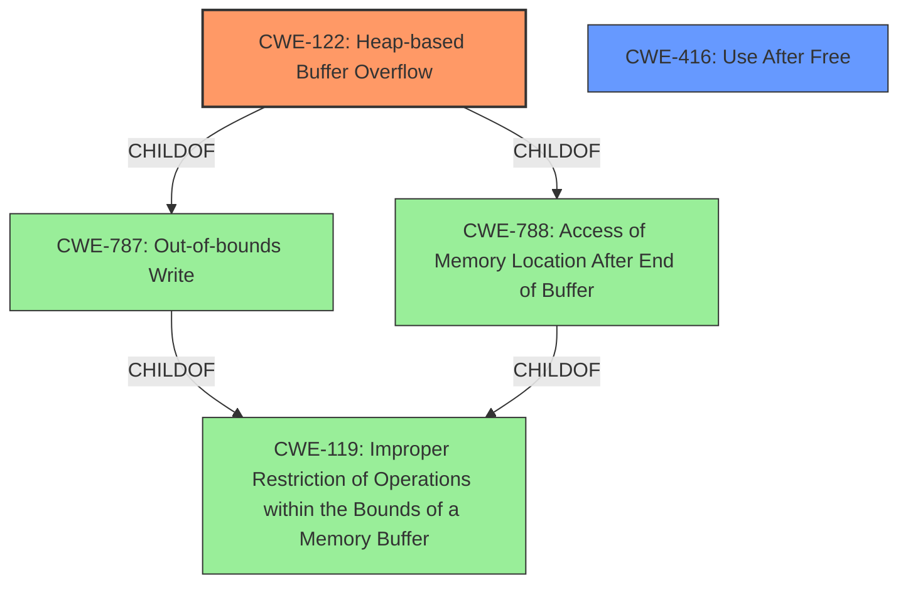

# Analysis Report for CVE-2021-3968

# Vulnerability Analysis Report: CVE-2021-3968

## Description


## Analysis (with Relationship Data)

# Summary
| CWE ID | CWE Name | Confidence | CWE Abstraction Level | CWE Vulnerability Mapping Label | CWE-Vulnerability Mapping Notes |
|---|---|---|---|---|---|
| CWE-122 | Heap-based Buffer Overflow | 0.9 | Variant | Allowed | Primary CWE |
| CWE-416 | Use After Free | 0.7 | Variant | Allowed | Secondary CWE |

## Evidence and Confidence

*   **Confidence Score:** 0.8
*   **Evidence Strength:** MEDIUM

## Relationship Analysis
The primary CWE is CWE-122, a Variant of CWE-787 (Out-of-bounds Write) and CWE-788 (Access of Memory Location After End of Buffer). CWE-416, Use After Free, is included as a secondary issue, due to the reference link indicating this vulnerability exists. CWE-119, Improper Restriction of Operations within the Bounds of a Memory Buffer, a Class-level CWE, was considered but not selected as CWE-122 provides a more specific description of the vulnerability.



## Vulnerability Chain
The vulnerability chain starts with a **Heap-based Buffer Overflow** (CWE-122), potentially caused by **improper** memory management, and can lead to a **Use-After-Free** (CWE-416) condition, resulting in a denial of service.

## Summary of Analysis
The initial analysis identified a **Heap-based Buffer Overflow**, which is the primary weakness. The "CVE Reference Links Content Summary" section confirms this by detailing a heap use-after-free error in the `ml_append_int` function. The vulnerability occurs "when ModeChanged triggered too early," resulting in the code attempting to access freed memory. This confirms the presence of both **Heap-based Buffer Overflow** (CWE-122) and **Use-After-Free** (CWE-416) vulnerabilities.

The selection of CWE-122 is supported by the "CWE for similar CVE Descriptions" section, which lists it as the Primary CWE Match and the most frequent CWE in similar vulnerabilities. The "Retriever Results" also list CWE-122 as a candidate, although with a lower score than CWE-119 and CWE-190. However, CWE-119 is a Class-level CWE and is discouraged when more specific CWEs are available, and CWE-190 does not align with the nature of the vulnerability.

CWE-416 is included because the "CVE Reference Links Content Summary" section specifically mentions a "heap use-after-free error."

The relationships between the CWEs influenced the final selection by providing a hierarchical context. CWE-122 is a Variant of CWE-787, indicating that it is a more specific type of out-of-bounds write.

The selected CWEs are at the optimal level of specificity because they accurately represent the weaknesses described in the vulnerability description and the supporting evidence.
Relevant CWE Information:


## CWE Relationship Analysis

Current CWEs represent these abstraction levels: .


### Vulnerability Chain Analysis

**Chain starting from CWE-787:**
- 787 (Out-of-bounds Write) - ROOT


**Chain starting from CWE-416:**
- 416 (Use After Free) - ROOT


### CWE Relationship Diagram

```mermaid
graph TD
    classDef primary fill:#f96,stroke:#333,stroke-width:2px
    classDef secondary fill:#69f,stroke:#333
    classDef tertiary fill:#9e9,stroke:#333
```


*Report generated on 2025-04-02 01:44:25*
