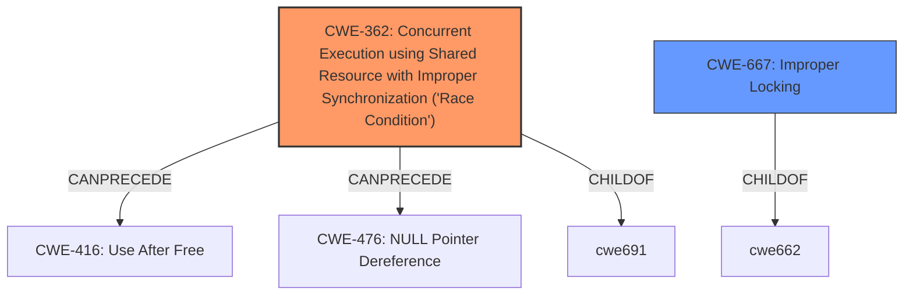

# Enhanced Analysis for CVE-2021-39686

# Summary
| CWE ID | CWE Name | Confidence | CWE Abstraction Level | CWE Vulnerability Mapping Label | CWE-Vulnerability Mapping Notes |
|---|---|---|---|---|---|
| CWE-362 | Concurrent Execution using Shared Resource with Improper Synchronization ('**Race Condition**') | 1.0 | Class | Allowed-with-Review | Primary CWE |
| CWE-667 | Improper Locking | 0.7 | Class | Allowed-with-Review | Secondary Candidate |

## Evidence and Confidence

*   **Confidence Score:** 1.0
*   **Evidence Strength:** HIGH

## Relationship Analysis
The primary CWE, CWE-362, is a class-level CWE that describes concurrent execution issues arising from **improper synchronization**. Its children might offer more specific insights but weren't applicable here. It can precede CWE-416 (Use After Free) and CWE-476 (NULL Pointer Dereference), hinting at potential exploitation paths. The secondary CWE, CWE-667, is related as improper locking is a common cause of **race conditions**.



## Vulnerability Chain
The vulnerability chain begins with a **race condition** due to **improper synchronization** (CWE-362). This **race condition** allows the wrong domain to be represented to SELinux, leading to a local escalation of privilege. The final impact is privilege escalation.

## Summary of Analysis
The initial analysis focused on identifying the root cause of the vulnerability based on the provided description and CVE details. The description explicitly mentions a **"race condition"** as the primary issue, leading to the selection of CWE-362. The CVE reference summary reinforces this by detailing the **race condition** in the binder driver's handling of security contexts.

> **Vulnerability Description Key Phrases**:
> - **rootcause:** **race condition**
>
> **CVE Reference Links Content Summary**:
> *   **Root Cause:** A **race condition** in the binder driver when converting a task to a security ID (SID).

The retriever results also strongly suggested CWE-362, with a score of 1.0 based on alternate terms. CWE-667 (Improper Locking) was considered as a secondary factor, as locking issues can contribute to **race conditions**, but the primary issue is the concurrency problem itself.

The selection of CWE-362 is at the Class level, but given the available information, a more specific Base or Variant CWE cannot be determined. Therefore, CWE-362 is the most appropriate choice.

Other CWEs considered but not used:

*   CWE-366 (**Race Condition within a Thread**): While the vulnerability involves a **race condition**, the description doesn't explicitly limit it to within a single thread. Thus, the broader CWE-362 is more applicable.
*   CWE-415 (Double Free), CWE-476 (NULL Pointer Dereference): These are potential consequences of a **race condition** but not the root cause itself.
*   CWE-665 (Improper Initialization), CWE-909 (Missing Initialization of Resource): These relate to initialization issues, which are not explicitly mentioned as part of the **race condition** in the provided descriptions.
*   CWE-862 (Missing Authorization): While the vulnerability leads to privilege escalation, the root cause is not a missing authorization check but a **race condition** that bypasses security mechanisms.
*   CWE-413 (Improper Resource Locking): Although improper locking can lead to **race conditions**, the provided information focuses more on the concurrency issue rather than a specific locking failure.
Relevant CWE Information:
* CWE-362 **Concurrent Execution using Shared Resource with Improper Synchronization ('Race Condition')**:
    - The vulnerability description and CVE reference summary explicitly mention a **race condition** as the root cause.
    - The impact of the **race condition** is a privilege escalation, as the wrong domain is represented to SELinux.
* CWE-667 **Improper Locking**:
    - Improper locking can lead to **race conditions**, but this is not the primary weakness described in the vulnerability.


## CWE Relationship Analysis

Current CWEs represent these abstraction levels: .


### Vulnerability Chain Analysis

**Chain starting from CWE-667:**
- 667 (Improper Locking) - ROOT


**Chain starting from CWE-476:**
- 476 (NULL Pointer Dereference) - ROOT


### CWE Relationship Diagram

```mermaid
graph TD
    classDef primary fill:#f96,stroke:#333,stroke-width:2px
    classDef secondary fill:#69f,stroke:#333
    classDef tertiary fill:#9e9,stroke:#333
```