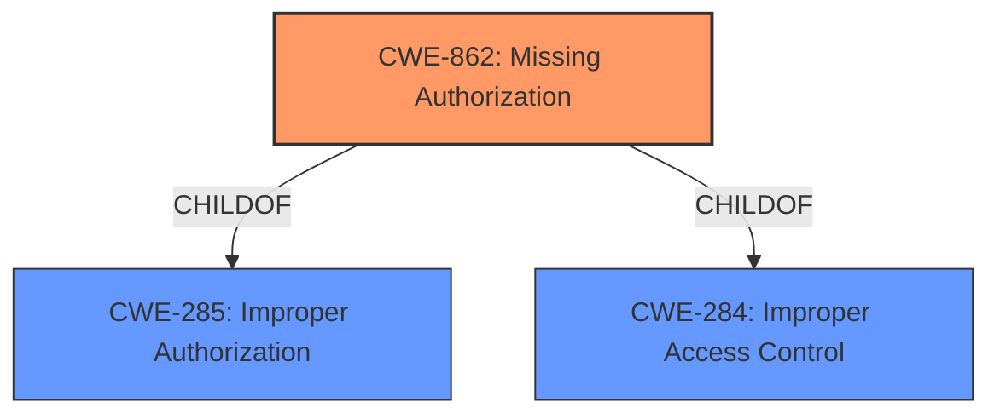

# Analysis for CVE-2021-39706

# Summary
| CWE ID | CWE Name | Confidence | CWE Abstraction Level | CWE Vulnerability Mapping Label | CWE-Vulnerability Mapping Notes |
|---|---|---|---|---|---|
| CWE-862 | Missing Authorization | 1.0 | Class | Allowed-with-Review | Primary CWE. The product **does not perform an authorization check** when an actor attempts to access a resource or perform an action. |

## Evidence and Confidence

*   **Confidence Score:** 1.0
*   **Evidence Strength:** HIGH

## Relationship Analysis
The primary relationship influencing the decision is the ChildOf relationship between CWE-862 and its parents, CWE-285 (Improper Authorization) and CWE-284 (Improper Access Control). While CWE-285 and CWE-284 are higher-level classes, CWE-862 provides a more specific description of the **missing authorization** issue.

## Vulnerability Chain
The vulnerability chain starts with the **missing permission check**, leading to the ability to cleanup credentials storage, ultimately resulting in a local escalation of privilege.

Root Cause: **Missing Authorization** (CWE-862)
Impact: Local Escalation of Privilege

## Summary of Analysis
The analysis is based on the provided evidence, particularly the "Vulnerability Description Key Phrases" and "CVE Reference Links Content Summary" sections. The key phrase "**missing permission check**" directly aligns with the concept of **missing authorization**. The "CVE Reference Links Content Summary" further reinforces this by stating that the vulnerability stems from a lack of proper caller checks.

The evidence from the Vulnerability Description Key Phrases:
- **rootcause:** **missing permission check**

The evidence from the CVE Reference Links Content Summary:
- The vulnerability stems from a lack of proper caller checks within the `com.android.credentials.RESET` functionality.

The choice of CWE-862 is based on its direct applicability to the **missing authorization** issue and its position as a class-level CWE. While other CWEs were considered, such as CWE-285 (Improper Authorization) and CWE-732 (Incorrect Permission Assignment for Critical Resource), CWE-862 was selected as the most accurate and specific representation of the vulnerability.

**CWEs Considered But Not Used**

*   **CWE-285: Improper Authorization:** This CWE is a parent of CWE-862, making CWE-862 a more specific and appropriate choice.
*   **CWE-732: Incorrect Permission Assignment for Critical Resource:** While permissions are related, the core issue is the **absence of a permission check**, not an incorrect assignment.