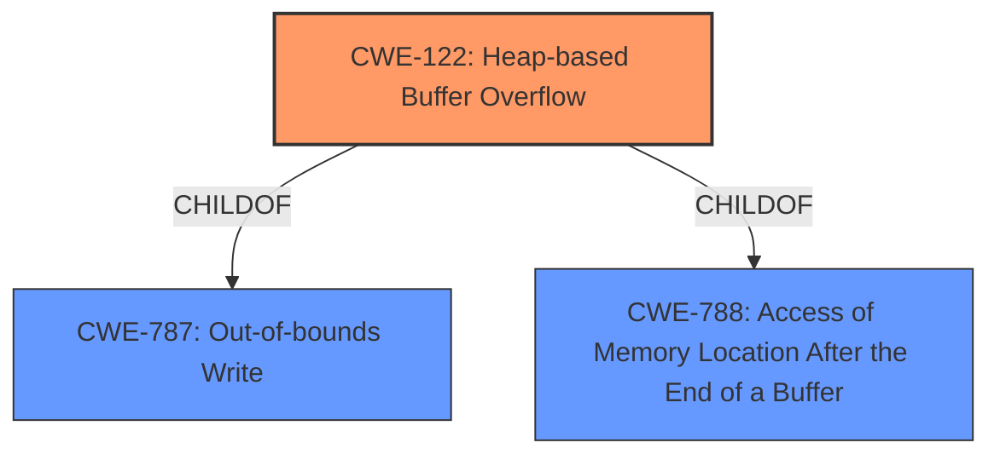

# Raw Analyzer Response for CVE-2021-3973

# Summary
| CWE ID  | CWE Name                                                        | Confidence | CWE Abstraction Level | CWE Vulnerability Mapping Label | CWE-Vulnerability Mapping Notes |
| :------- | :-------------------------------------------------------------- | :--------- | :---------------------- | :------------------------------ | :------------------------------ |
| CWE-122  | Heap-based Buffer Overflow                                      | 1.0        | Variant               | Primary                         | Allowed                       |

## Evidence and Confidence

*   **Confidence Score:** 1.0
*   **Evidence Strength:** HIGH

## Relationship Analysis
The primary relationship influencing the decision is the ChildOf relationship: CWE-122 is a child of CWE-787 (Out-of-bounds Write) and CWE-788 (Access of Memory Location After the End of a Buffer). While CWE-787 could be considered, the description explicitly mentions "Heap-based Buffer Overflow," making CWE-122 the more specific and accurate choice.

## Vulnerability Chain
The vulnerability chain involves a **missing** length check, leading to a **heap-based buffer overflow**, ultimately resulting in a denial of service.

Missing Length Check -> Heap-based Buffer Overflow -> Denial of Service

## Summary of Analysis
The analysis is based on the clear and direct evidence provided in the vulnerability description and CVE reference summary. The vulnerability is explicitly described as a "**Heap-based Buffer Overflow**" and the root cause identified as a **missing** length check.

The CVE Reference Links Content Summary provides further supporting evidence:

"The vulnerability is a heap-based buffer overflow that occurs in `findfile.c`. Specifically, when the filename length is zero, the function does not handle this case properly."

The retriever results also lists CWE-122 as a possible match, but it's selected based on the explicit evidence instead of just the similarity score.

CWE-122 is the optimal level of specificity because it accurately reflects the vulnerability type (heap-based) and the mechanism (buffer overflow).

Relevant CWE Information:

# Enhanced Context (25 CWEs)

## CWE-191: Integer Underflow (Wrap or Wraparound)
**Abstraction Level**: Base
**Similarity Score**: 0.76
**Source**: dense

**Description**:
The product subtracts one value from another, such that the result is less than the minimum allowable integer value, which produces a value that is not equal to the correct result.

**Mapping Guidance**:
- Usage: Allowed
- Rationale: This CWE entry is at the Base level of abstraction, which is a preferred level of abstraction for mapping to the root causes of vulnerabilities.

This CWE was not selected because there is no evidence of integer underflow in the provided description. The description focuses on a heap-based buffer overflow due to a missing length check.

## CWE-131: Incorrect Calculation of Buffer Size
**Abstraction Level**: Base
**Similarity Score**: 0.76
**Source**: dense

**Description**:
The product does not correctly calculate the size to be used when allocating a buffer, which could lead to a buffer overflow.

**Mapping Guidance**:
- Usage: Allowed
- Rationale: This CWE entry is at the Base level of abstraction, which is a preferred level of abstraction for mapping to the root causes of vulnerabilities.

This CWE was not selected because the root cause is a missing length check, not an incorrect calculation of buffer size.

## CWE-124: Buffer Underwrite ('Buffer Underflow')
**Abstraction Level**: Base
**Similarity Score**: 0.76
**Source**: dense

**Description**:
The product writes to a buffer using an index or pointer that references a memory location prior to the beginning of the buffer.

**Mapping Guidance**:
- Usage: Allowed
- Rationale: This CWE entry is at the Base level of abstraction, which is a preferred level of abstraction for mapping to the root causes of vulnerabilities.

This CWE was not selected because the vulnerability is a buffer overflow (write past the end of the buffer), not a buffer underflow (write before the beginning of the buffer).

## CWE-805: Buffer Access with Incorrect Length Value
**Abstraction Level**: Base
**Similarity Score**: 0.75
**Source**: dense

**Description**:
The product uses a sequential operation to read or write a buffer, but it uses an incorrect length value that causes it to access memory that is outside of the bounds of the buffer.

**Mapping Guidance**:
- Usage: Allowed
- Rationale: This CWE entry is at the Base level of abstraction, which is a preferred level of abstraction for mapping to the root causes of vulnerabilities.

This CWE was not selected because the root cause is a missing length check when the filename length is zero.

## CWE-667: Improper Locking
**Abstraction Level**: Class
**Similarity Score**: 0.74
**Source**: dense

**Description**:
The product does not properly acquire or release a lock on a resource, leading to unexpected resource state changes and behaviors.

**Mapping Guidance**:
- Usage: Allowed-with-Review
- Rationale: This CWE entry is a Class and might have Base-level children that would be more appropriate

This CWE was not selected because the vulnerability is a buffer overflow, not a concurrency issue related to locking.

## CWE-126: Buffer Over-read
**Abstraction Level**: Variant
**Similarity Score**: 0.74
**Source**: dense

**Description**:
The product reads from a buffer using buffer access mechanisms such as indexes or pointers that reference memory locations after the targeted buffer.

**Mapping Guidance**:
- Usage: Allowed
- Rationale: This CWE entry is at the Variant level of abstraction, which is a preferred level of abstraction for mapping to the root causes of vulnerabilities.

This CWE was not selected because the vulnerability is a buffer overflow (writing past the end of the buffer), not a buffer over-read (reading past the end of the buffer).

## CWE-1222: Insufficient Granularity of Address Regions Protected by Register Locks
**Abstraction Level**: Variant
**Similarity Score**: 0.73
**Source**: dense

**Description**:
The product defines a large address region protected from modification by the same register lock control bit. This results in a conflict between the functional requirement that some addresses need to be writable by software during operation and the security requirement that the system configuration lock bit must be set during the boot process.

**Mapping Guidance**:
- Usage: Allowed
- Rationale: This CWE entry is at the Variant level of abstraction, which is a preferred level of abstraction for mapping to the root causes of vulnerabilities.

This CWE was not selected as this is not relevant.

## CWE-119: Improper Restriction of Operations within the Bounds of a Memory Buffer
**Abstraction Level**: Class
**Similarity Score**: 0.73
**Source**: dense

**Description**:
The product performs operations on a memory buffer, but it reads from or writes to a memory location outside the buffer's intended boundary. This may result in read or write operations on unexpected memory locations that could be linked to other variables, data structures, or internal program data.

**Mapping Guidance**:
- Usage: Discouraged
- Rationale: CWE-119 is commonly misused in low-information vulnerability reports when lower-level CWEs could be used instead, or when more details about the vulnerability are available.

This CWE was not selected because it is a high-level Class, and more specific Variant (CWE-122) is a better fit.

## CWE-125: Out-of-bounds Read
**Abstraction Level**: Base
**Similarity Score**: 0.73
**Source**: dense

**Description**:
The product reads data past the end, or before the beginning, of the intended buffer.

**Mapping Guidance**:
- Usage: Allowed
- Rationale: This CWE entry is at the Base level of abstraction, which is a preferred level of abstraction for mapping to the root causes of vulnerabilities.

This CWE was not selected because the vulnerability is about writing to the buffer, not reading the buffer.

## CWE-127: Buffer Under-read
**Abstraction Level**: Variant
**Similarity Score**: 0.73
**Source**: dense

**Description**:
The product reads from a buffer using buffer access mechanisms such as indexes or pointers that reference memory locations prior to the targeted buffer.

**Mapping Guidance**:
- Usage: Allowed
- Rationale: This CWE entry is at the Variant level of abstraction, which is a preferred level of abstraction for mapping to the root causes of vulnerabilities.

This CWE was not selected because the vulnerability is about writing to the buffer, not reading the buffer.

## CWE-190: Integer Overflow or