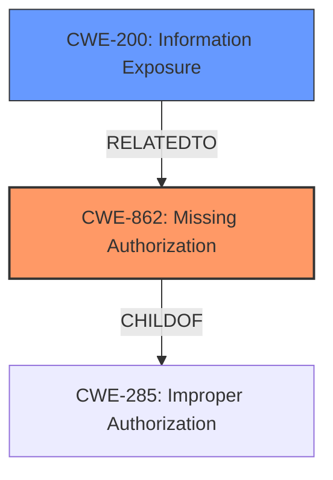

# Raw Analyzer Response for CVE-2021-39751

# Summary
| CWE ID | CWE Name | Confidence | CWE Abstraction Level | CWE Vulnerability Mapping Label | CWE-Vulnerability Mapping Notes |
|---|---|---|---|---|---|
| CWE-862 | Missing Authorization | 0.9 | Class | Allowed-with-Review | Primary CWE. The product does not perform an authorization check when an actor attempts to access a resource or perform an action. |
| CWE-200 | Information Exposure | 0.6 | Class | Allowed-with-Review | Secondary CWE. The product exposes sensitive information to an actor that is not explicitly authorized to have access to that information. |

## Evidence and Confidence

*   **Confidence Score:** 0.75
*   **Evidence Strength:** MEDIUM

## Relationship Analysis
The primary relationship that influenced the CWE selection is the parent-child relationship. CWE-862 (Missing Authorization) is a class-level CWE, and while ideally a base-level CWE is preferred, it accurately captures the root cause. Similarly, CWE-200 is a class-level CWE that describes the impact of the missing authorization. The graph structure doesn't directly influence the primary choice but reinforces the idea of a weakness leading to a specific consequence.

## Vulnerability Chain
The vulnerability chain starts with the **missing permission check** (CWE-862), which leads to the ability to read Bluetooth device names without proper permissions, resulting in local information disclosure (CWE-200).

## Summary of Analysis
The initial analysis identified CWE-862 as the primary weakness due to the "**missing permission check**" described in the vulnerability description. This aligns with the definition of CWE-862: "The product does not perform an authorization check when an actor attempts to access a resource or perform an action." The impact, reading Bluetooth device names, directly results from this missing check.

The analysis is based on the provided evidence: "In Settings, there is a possible way to read Bluetooth device names without proper permissions due to a **missing permission check**."

The retriever results also listed CWE-862 as the top candidate.

The selection of CWE-862 is at an appropriate level of specificity, as it directly addresses the **missing authorization** issue.

CWE-200 is included to capture the impact of the **missing authorization**, leading to information disclosure.

Other CWEs Considered but Not Used:

*   CWE-927 (Use of Implicit Intent for Sensitive Communication): This is Android specific, but the vulnerability is more general than just the use of implicit intents.
*   CWE-1289, CWE-807, CWE-183, CWE-1288, CWE-184, CWE-1173, CWE-451, CWE-179, CWE-138, CWE-606: These CWEs relate to input validation, but the core issue is the **missing permission check**, not the validation of input.
*   CWE-367 (Time-of-check Time-of-use (TOCTOU) Race Condition): This is not related to race conditions.
*   CWE-41, CWE-73, CWE-22: These CWEs relate to path traversal, which is not relevant to this vulnerability.
*   CWE-190, CWE-128, CWE-1339: These relate to arithmetic errors.
*   CWE-205 (Observable Behavioral Discrepancy): This is too abstract.
*   CWE-770 (Allocation of Resources Without Limits or Throttling): This is not relevant.
*    CWE-20 (Improper Input Validation): This is too general and the problem is not with validation, but with missing authorization.
*   CWE-514 (Covert Channel): Not related to covert channels.
*   CWE-1021 (Improper Restriction of Rendered UI Layers or Frames): UI redress attacks do not apply.
*   CWE-223 (Omission of Security-relevant Information): While this could be argued, the **missing permission check** is more direct.
*   CWE-908 (Use of Uninitialized Resource): Not related to uninitialized resources.
*   CWE-667 (Improper Locking): Not related to locking.

Relevant CWE Information: