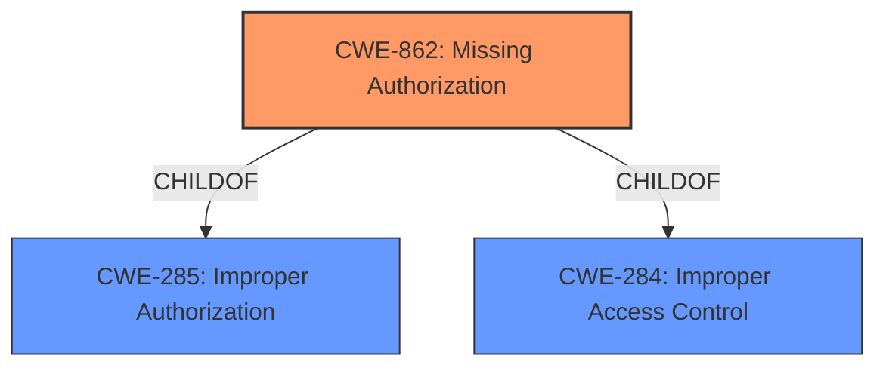

# Analysis for CVE-2021-39768

# Summary
| CWE ID | CWE Name | Confidence | CWE Abstraction Level | CWE Vulnerability Mapping Label | CWE-Vulnerability Mapping Notes |
|---|---|---|---|---|---|
| CWE-862 | Missing Authorization | 1.0 | Class | Allowed-with-Review | Primary CWE |

## Evidence and Confidence

*   **Confidence Score:** 1.0
*   **Evidence Strength:** HIGH

## Relationship Analysis
The primary relationship influencing the decision is the ChildOf relationship of CWE-862 to CWE-285 and CWE-284. While these parents provide a broader context, CWE-862 directly addresses the **missing authorization** aspect detailed in the vulnerability description. The other CWEs considered either represent different types of vulnerabilities or are too abstract to accurately reflect the specific weakness.

## Vulnerability Chain
The vulnerability chain starts with the **missing permission check** (CWE-862), leading to the ability to add an auto-connect WiFi network without user consent.

## Summary of Analysis
The primary vulnerability is a **missing permission check**, allowing unauthorized modification of WiFi settings.

The analysis is heavily based on the vulnerability description that explicitly states a **missing permission check**. The "Vulnerability Description Key Phrases" section lists "**missing permission check**" as the rootcause. The CVE Reference Links Content Summary section lacks specific root cause details, further emphasizing the reliance on the primary description.

The selection of CWE-862 is optimal because it directly addresses the core issue of **missing authorization**. While other CWEs like CWE-20 (Improper Input Validation) were considered, they don't accurately represent the specific **missing permission check**. The choice of CWE-862 aligns with the principle of selecting the most specific CWE that matches the vulnerability's root cause.

Relevant CWE Information:

# Enhanced Context (25 CWEs)

## CWE-862: Missing Authorization
**Abstraction:** Class
**Status:** Incomplete

### Description
The product does not perform an authorization check when an actor attempts to access a resource or perform an action.

### Extended Description
Not provided

### Alternative Terms
AuthZ: "AuthZ" is typically used as an abbreviation of "authorization" within the web application security community. It is distinct from "AuthN" (or, sometimes, "AuthC") which is an abbreviation of "authentication." The use of "Auth" as an abbreviation is discouraged, since it could be used for either authentication or authorization.

### Relationships
ChildOf -> CWE-285
ChildOf -> CWE-284

### Mapping Guidance
**Usage:** Allowed-with-Review
**Rationale:** This CWE entry is a Class and might have Base-level children that would be more appropriate
**Comments:** Examine children of this entry to see if there is a better fit
**Reasons:**
- Abstraction

### Additional Notes
**[Terminology]** Assuming a user with a given identity, authorization is the process of determining whether that user can access a given resource, based on the user's privileges and any permissions or other access-control specifications that apply to the resource.

### Observed Examples
- **CVE-2022-24730:** Go-based continuous deployment product does not check that a user has certain privileges to update or create an app, allowing adversaries to read sensitive repository information
- **CVE-2009-3168:** Web application does not restrict access to admin scripts, allowing authenticated users to reset administrative passwords.
- **CVE-2009-3597:** Web application stores database file under the web root with insufficient access control (CWE-219), allowing direct request.