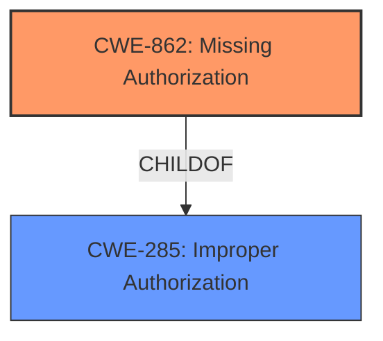

# Raw Analyzer Response for CVE-2021-39772

# Summary
| CWE ID | CWE Name | Confidence | CWE Abstraction Level | CWE Vulnerability Mapping Label | CWE-Vulnerability Mapping Notes |
|---|---|---|---|---|---|
| CWE-862 | Missing Authorization | 1.0 | Class | Primary | Allowed-with-Review |
| CWE-285 | Improper Authorization | 0.7 | Class | Secondary | Allowed-with-Review, Parent of CWE-862 |

## Evidence and Confidence

*   **Confidence Score:** 1.0
*   **Evidence Strength:** HIGH

## Relationship Analysis
The primary relationship is that CWE-862 (Missing Authorization) is a child of CWE-285 (Improper Authorization). This means CWE-862 is a more specific case of CWE-285. The evidence directly supports the "missing permission check," which falls squarely under the definition of missing authorization. Therefore, while CWE-285 is a valid higher-level classification, CWE-862 provides a more precise characterization of the vulnerability. The other relationships like chains or peer relationships are not as directly relevant to this specific vulnerability description.

## Vulnerability Chain
The vulnerability chain is straightforward:
1.  **Root Cause:** **Missing permission check** (CWE-862)
2.  **Impact:** Access to a2dp audio control switch, leading to local escalation of privilege.

## Summary of Analysis
The initial analysis, based on the vulnerability description and key phrases, clearly points to a **missing permission check** as the root cause. The CVE Reference Links Content Summary confirms that this is an Elevation of Privilege (EoP) issue.

The Retriever Results list CWE-862 (Missing Authorization) as the top candidate, which aligns perfectly with the **missing permission check** mentioned in the Vulnerability Description Key Phrases.

The decision to select CWE-862 is strongly supported by the evidence:
*   The vulnerability description explicitly states a **"missing permission check."**
*   CWE-862 directly addresses the scenario where a product "does not perform an authorization check."
*   The impact (access to a2dp audio control switch, local escalation of privilege) is a typical consequence of missing authorization.

The selection of CWE-862 as the primary CWE is at the optimal level of specificity because it directly reflects the **root cause** described in the vulnerability. While CWE-285 (Improper Authorization) is a parent CWE and could be considered, CWE-862 provides a more precise characterization of the weakness.

Relevant CWE Information:

# Enhanced Context (25 CWEs)

## CWE-862: Missing Authorization
**Abstraction Level**: Class
**Similarity Score**: 0.468 (sparse retriever)
**Description**:
The product does not perform an authorization check when an actor attempts to access a resource or perform an action.
**Mapping Guidance**:
- Usage: Allowed-with-Review

## CWE-285: Improper Authorization
**Abstraction Level**: Class
**Description**:The software performs an authorization check, but it does not correctly perform the check such that unauthorized actors may be able to bypass it.
**Relationships**: ParentOf -> CWE-862

CWE-862 is the best fit because the vulnerability description explicitly mentions a **missing permission check**. This perfectly aligns with the definition of CWE-862, where the product does not perform an authorization check at all.

CWE-285 was considered, but it describes scenarios where an authorization check is performed but is done incorrectly. Since the description states the permission check is missing, CWE-862 is more accurate.