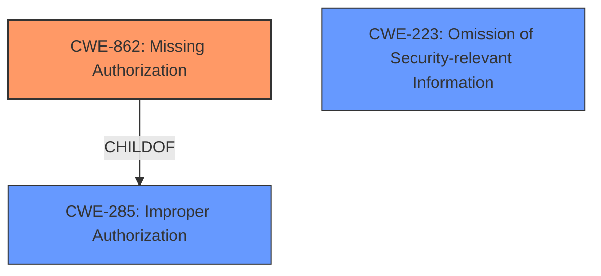

# Raw Analyzer Response for CVE-2021-39779

# Summary
| CWE ID  | CWE Name | Confidence | CWE Abstraction Level | CWE Vulnerability Mapping Label | CWE-Vulnerability Mapping Notes |
|-----------------|-----------------------------------------------------|------------|-----------------------|------------------------------------|-----------------------------------------------------------------|
| CWE-862 | Missing Authorization | 1.0 | Class | Allowed-with-Review | Primary CWE |
| CWE-285 | Improper Authorization | 0.5 | Class | Allowed | Secondary Candidate |
| CWE-223 | Omission of Security-relevant Information | 0.4 | Base | Allowed | Secondary Candidate |

## Evidence and Confidence

*   **Confidence Score:** 0.8
*   **Evidence Strength:** HIGH

## Relationship Analysis
The primary relationship that influenced the CWE selection was the hierarchical relationship between CWE-862 (Missing Authorization) and its parent CWE-285 (Improper Authorization). While CWE-862 is a Class, it directly reflects the **missing permission check** described in the vulnerability. CWE-285 is considered as a secondary candidate. The description also mentions information disclosure, which makes CWE-223 a potential candidate. However, the root cause is **missing permission check**, which is why CWE-862 is chosen as the primary CWE.

## Vulnerability Chain
The vulnerability chain starts with a **missing permission check** (CWE-862), which leads to local information disclosure of the call state. The complete chain is:

1.  **Root Cause:** CWE-862: Missing Authorization
2.  **Impact:** Information Disclosure

## Summary of Analysis
The primary focus of this analysis was to identify the root cause of the vulnerability based on the provided description. The description explicitly mentions "**missing permission check**" in the `getCallStateUsingPackage` function of Telecom Service. This directly aligns with CWE-862 (Missing Authorization), which describes a situation where the product does not perform an authorization check when an actor attempts to access a resource or perform an action.

The vulnerability description key phrases also highlights the root cause as "**missing permission check**" and the impact as "local information disclosure of the call state." This further reinforces the selection of CWE-862 as the primary CWE.

The retriever results also list CWE-862 as the top candidate. Although CWE-862 is a Class, the mapping guidance suggests examining children of this entry, but there aren't any children that would be a better fit. Therefore, it's more appropriate to use CWE-862 directly.

CWE-285 (Improper Authorization) is a parent of CWE-862 and represents a more general case of authorization failure. Since the description specifically mentions a **missing** check, CWE-862 is a more precise classification.

CWE-223 (Omission of Security-relevant Information) was also considered because the vulnerability leads to information disclosure. However, the root cause is the **missing authorization**, not the omission of information. The information disclosure is a consequence of the **missing permission check**, making CWE-862 the more appropriate primary CWE.

In conclusion, the selection of CWE-862 is based on the explicit mention of "**missing permission check**" in the vulnerability description, which aligns with the definition of CWE-862 and is supported by the retriever results. The other CWEs were considered but deemed less appropriate as they represent either a more general case (CWE-285) or a consequence rather than the root cause (CWE-223).

Relevant CWE Information:
* CWE-862: Missing Authorization
* CWE-285: Improper Authorization
* CWE-223: Omission of Security-relevant Information