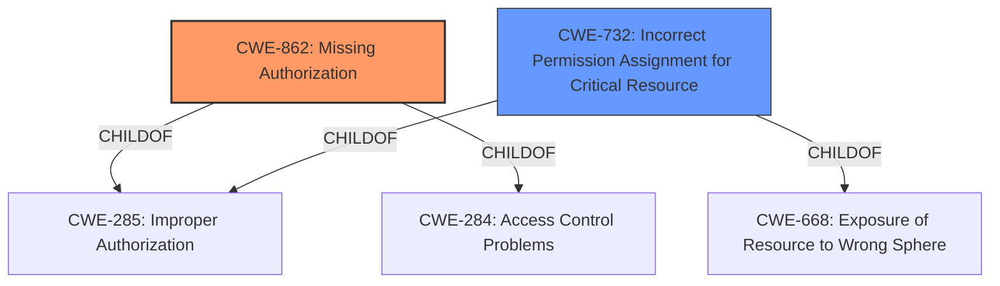

# Analysis Report for CVE-2021-39783

# Vulnerability Analysis Report: CVE-2021-39783

## Description


## Analysis (with Relationship Data)

# Summary
| CWE ID | CWE Name | Confidence | CWE Abstraction Level | CWE Vulnerability Mapping Label | CWE-Vulnerability Mapping Notes |
|---|---|---|---|---|---|
| CWE-862 | Missing Authorization | 0.9 | Class | Allowed-with-Review | Primary CWE |
| CWE-732 | Incorrect Permission Assignment for Critical Resource | 0.7 | Class | Allowed-with-Review | Secondary Candidate |

## Evidence and Confidence

*   **Confidence Score:** 0.9
*   **Evidence Strength:** HIGH

## Relationship Analysis
The primary CWE identified is CWE-862 (Missing Authorization), which is a Class-level CWE. It has hierarchical relationships with CWE-285 (Improper Authorization) and CWE-284 (Access Control Problems). CWE-732 (Incorrect Permission Assignment for Critical Resource) is a Class-level CWE that is related to CWE-285 and CWE-668 (Exposure of Resource to Wrong Sphere).



## Vulnerability Chain
The vulnerability chain starts with a **missing permission check** (CWE-862), leading to the ability to modify TTY mode, resulting in a local escalation of privilege.

## Summary of Analysis
The initial analysis identified that the **root cause** of the vulnerability is a **missing permission check**. The primary CWE selected is CWE-862 (Missing Authorization), which aligns with the **root cause**. The vulnerability description states there is a **"missing permission check"** which allows unauthorized modification of the TTY mode. The CVE Reference Links Content Summary confirms this, stating that the vulnerability is an "Elevation of Privilege" due to an unspecified weakness.

CWE-862 accurately describes the vulnerability: "The product does not perform an authorization check when an actor attempts to access a resource or perform an action." This aligns directly with the **missing permission check** described in the vulnerability.

CWE-732 (Incorrect Permission Assignment for Critical Resource) was considered because it also deals with permissions. However, the description emphasizes **"incorrect permission assignment"**, whereas the identified issue is a complete lack of permission checks. While CWE-732 could potentially apply, CWE-862 is a more direct and accurate representation of the **root cause**.

The selection of CWE-862 is at the appropriate level of specificity (Class). While children of CWE-862 may exist, the available information does not provide enough detail to determine if a more specific CWE would be appropriate. Therefore, selecting the Class-level CWE is the most appropriate choice based on the evidence. The MITRE mapping guidance for CWE-862 suggests reviewing children for a better fit, however, based on the available information, CWE-862 is the most accurate.


## CWE Relationship Analysis

Current CWEs represent these abstraction levels: .


### Vulnerability Chain Analysis

**Chain starting from CWE-732:**
- 732 (Incorrect Permission Assignment for Critical Resource) - ROOT


**Chain starting from CWE-862:**
- 862 (Missing Authorization) - ROOT


### CWE Relationship Diagram

```mermaid
graph TD
    classDef primary fill:#f96,stroke:#333,stroke-width:2px
    classDef secondary fill:#69f,stroke:#333
    classDef tertiary fill:#9e9,stroke:#333
```


*Report generated on 2025-04-02 11:15:28*
