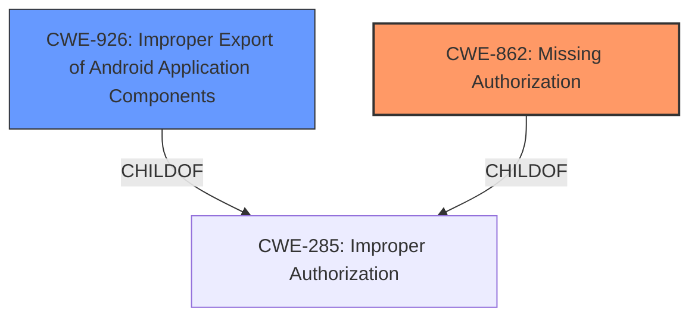

# Analysis Report for CVE-2021-39797

# Vulnerability Analysis Report: CVE-2021-39797

## Description


## Analysis (with Relationship Data)

# Summary
| CWE ID | CWE Name | Confidence | CWE Abstraction Level | CWE Vulnerability Mapping Label | CWE-Vulnerability Mapping Notes |
|---|---|---|---|---|---|
| CWE-862 | Missing Authorization | 0.8 | Class | Allowed-with-Review | Primary CWE |
| CWE-926 | Improper Export of Android Application Components | 0.6 | Variant | Allowed | Secondary Candidate |

## Evidence and Confidence

*   **Confidence Score:** 0.8
*   **Evidence Strength:** MEDIUM

## Relationship Analysis
The primary relationship that influenced the decision was the ChildOf relationship between CWE-939 (Improper Authorization in Handler for Custom URL Scheme) and CWE-862 (Missing Authorization), and CWE-926 (Improper Export of Android Application Components) and CWE-285 (Improper Authorization). While CWE-939 is more specific, the description doesn't provide enough detail to confirm that the authorization issue is specifically related to a custom URL scheme. However, the CVE description indicates that the vulnerability is related to the improper handling of `ActivityOptions` when creating `PendingIntent` objects, which are used for inter-application communication. This suggests that the exported components may not be properly restricted, leading to potential privilege escalation.



## Vulnerability Chain
The vulnerability chain starts with a **logic error** in LauncherApps.java, leading to the improper control of `ActivityOptions` when creating `PendingIntent` objects. This **missing authorization** allows a malicious application to exploit the affected APIs and escalate privileges.

## Summary of Analysis
The initial assessment identified a **logic error** as the root cause. The CVE reference link provides more details, highlighting that the vulnerability is related to the improper handling of `ActivityOptions` when creating `PendingIntent` objects. This ultimately results in a **missing authorization** issue. The evidence from the "CVE Reference Links Content Summary" stating "allowing arbitrary `ActivityOptions` during the creation of a `PendingIntent` in `LauncherApps` APIs" and "improper control of `ActivityOptions` when creating `PendingIntent`" strongly supports the selection of CWE-862.

The relationship graph influenced the decision by highlighting the hierarchical structure of authorization-related CWEs. While more specific CWEs like CWE-939 exist, the available evidence does not specifically point to a custom URL scheme. Therefore, CWE-862 provides a more accurate and general representation of the authorization issue. CWE-926 is considered because the vulnerability involves Android application components.

The selected CWEs are at the optimal level of specificity because they accurately represent the root cause of the vulnerability (missing authorization) and the affected component (Android application component). CWE-862 is a class-level CWE, but there isn't enough specific evidence to classify at a more specific base or variant level.

Relevant CWE Information:

*   **CWE-1021: Improper Restriction of Rendered UI Layers or Frames**: This was considered but deemed less relevant because the vulnerability does not appear to involve UI rendering or framing issues.
*   **CWE-908: Use of Uninitialized Resource**: While this might be a potential consequence of a logic error, the core issue is the **missing authorization** check, not the use of uninitialized resources.
*   **CWE-667: Improper Locking**: This is related to concurrency issues, which are not explicitly mentioned in the vulnerability description.
*   **CWE-267: Privilege Defined With Unsafe Actions**: This is related to how a privilege is defined rather than **missing authorization** checks.
*   **CWE-191: Integer Underflow (Wrap or Wraparound)**: This is related to incorrect integer calculations, and it's not related to authorization problems.


## CWE Relationship Analysis

Current CWEs represent these abstraction levels: .


### Vulnerability Chain Analysis

**Chain starting from CWE-667:**
- 667 (Improper Locking) - ROOT


**Chain starting from CWE-862:**
- 862 (Missing Authorization) - ROOT


### CWE Relationship Diagram

```mermaid
graph TD
    classDef primary fill:#f96,stroke:#333,stroke-width:2px
    classDef secondary fill:#69f,stroke:#333
    classDef tertiary fill:#9e9,stroke:#333
```


*Report generated on 2025-04-02 09:57:06*
