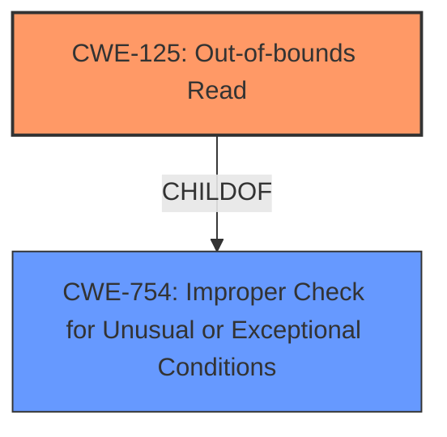

# Raw Analyzer Response for CVE-2021-39798

# Summary
| CWE ID | CWE Name | Confidence | CWE Abstraction Level | CWE Vulnerability Mapping Label | CWE-Vulnerability Mapping Notes |
|---|---|---|---|---|---|
| CWE-125 | Out-of-bounds Read | 0.8 | Base | Allowed | Primary CWE: The vulnerability description indicates a **missing bounds check** in `Bitmap_createFromParcel`, which directly aligns with the conditions described in CWE-125. |
| CWE-754 | Improper Check for Unusual or Exceptional Conditions | 0.6 | Class | Allowed-with-Review | Secondary CWE: The vulnerability description indicates a **missing bounds check**, which may be an instance of **improper check for unusual or exceptional conditions**. |

## Evidence and Confidence

*   **Confidence Score:** 0.8
*   **Evidence Strength:** MEDIUM

## Relationship Analysis
The primary relationship impacting my decision is the hierarchical structure, with CWE-125 as a `Base` level weakness, providing a specific description of an out-of-bounds read due to a **missing bounds check**. While CWE-754 is a `Class` level weakness, and may fit the **missing bounds check**, it's more general and less descriptive. Therefore, the more specific `Base` level CWE-125 is preferred.

## Vulnerability Chain
The chain of events is as follows:
1.  **Root Cause:** Missing Bounds Check (CWE-125)
2.  **Impact:** Arbitrary Code Execution

## Summary of Analysis
My analysis is primarily based on the provided vulnerability description, which explicitly mentions a **missing bounds check**. This aligns directly with the definition of CWE-125 (Out-of-bounds Read).

The evidence is quoted here: "In Bitmap_createFromParcel of Bitmap.cpp, there is a possible arbitrary code execution due to a **missing bounds check**."

The graph relationships influenced my selection by highlighting the hierarchical connection between specific (Base) and general (Class) weaknesses. Since the vulnerability description directly matches the specifics of CWE-125, it is the optimal choice.

CWE-125 is at the optimal level of specificity because it precisely describes the **missing bounds check**, which is the root cause described in the vulnerability. Other more general CWEs like CWE-754 are less descriptive.

Relevant CWE Information:

# Enhanced Context (25 CWEs)
The following CWEs were identified as potentially relevant to this vulnerability:

## CWE-404: Improper Resource Shutdown or Release
**Abstraction Level**: Class
**Similarity Score**: 0.79
**Source**: dense

**Description**:
The product does not release or incorrectly releases a resource before it is made available for re-use.

**Mapping Guidance**:
- Usage: Allowed-with-Review
- Rationale: This CWE entry is a Class and might have Base-level children that would be more appropriate

*Not Used:* This CWE does not apply as the vulnerability is not related to resource release but a **missing bounds check** during memory access.

## CWE-667: Improper Locking
**Abstraction Level**: Class
**Similarity Score**: 0.77
**Source**: dense

**Description**:
The product does not properly acquire or release a lock on a resource, leading to unexpected resource state changes and behaviors.

**Mapping Guidance**:
- Usage: Allowed-with-Review
- Rationale: This CWE entry is a Class and might have Base-level children that would be more appropriate

*Not Used:* This CWE is not related to the root cause of the vulnerability, which is a **missing bounds check**.

## CWE-226: Sensitive Information in Resource Not Removed Before Reuse
**Abstraction Level**: Base
**Similarity Score**: 0.77
**Source**: dense

**Description**:
The product releases a resource such as memory or a file so that it can be made available for reuse, but it does not clear or "zeroize" the information contained in the resource before the product performs a critical state transition or makes the resource available for reuse by other entities.

**Mapping Guidance**:
- Usage: Allowed
- Rationale: This CWE entry is at the Base level of abstraction, which is a preferred level of abstraction for mapping to the root causes of vulnerabilities.

*Not Used:* This CWE is not applicable as the issue isn't related to sensitive information but rather a **missing bounds check**.

## CWE-789: Memory Allocation with Excessive Size Value
**Abstraction Level**: Variant
**Similarity Score**: 0.77
**Source**: dense

**Description**:
The product allocates memory based on an untrusted, large size value, but it does not ensure that the size is within expected limits, allowing arbitrary amounts of memory to be allocated.

**Mapping Guidance**:
- Usage: Allowed
- Rationale: This CWE entry is at the Variant level of abstraction, which is a preferred level of abstraction for mapping to the root causes of vulnerabilities.

*Not Used:* While memory allocation could be related, the primary issue is the **missing bounds check**, not the allocation size itself.

## CWE-405: Asymmetric Resource Consumption (Amplification)
**Abstraction Level**: Class
**Similarity Score**: 0.76
**Source**: dense

**Description**:
The product does not properly control situations in which an adversary can cause the product to consume or produce excessive resources without requiring the adversary to invest equivalent work or otherwise prove authorization, i.e., the adversary's influence is "asymmetric."

**Mapping Guidance**:
- Usage: Allowed-with-Review
- Rationale: This CWE entry is a Class and might have Base-level children that would be more appropriate

*Not Used:* This CWE is not relevant as the vulnerability isn't about resource consumption asymmetry but a **missing bounds check**.

## CWE-1289: Improper Validation of Unsafe Equivalence in Input
**Abstraction Level**: Base
**Similarity Score**: 0.76
**Source**: dense

**Description**:
The product receives an input value that is used as a resource identifier or other type of reference, but it does not validate or incorrectly validates that the input is equivalent to a potentially-unsafe value.

**Mapping Guidance**:
- Usage: Allowed
- Rationale: This CWE entry is at the Base level of abstraction, which is a preferred level of abstraction for mapping to the root causes of vulnerabilities.

*Not Used:* The issue isn't about validating equivalence, but a **missing bounds check** when accessing memory.

## CWE-664: Improper Control of a Resource Through its Lifetime
**Abstraction Level**: Pillar
**Similarity Score**: 0.76
**Source**: dense

**Description**:
The product does not maintain or incorrectly maintains control over a resource throughout its lifetime of creation, use, and release.

**Mapping Guidance**:
- Usage: Discouraged
- Rationale: This CWE entry is high-level when lower-level children are available.

*Not Used:* This is too high-level and does not directly relate to the specific vulnerability.

## CWE-754: Improper Check for Unusual or Exceptional Conditions
**Abstraction Level**: Class
**Similarity Score**: 0.76
**Source**: dense

**Description**:
The product does not check or incorrectly checks for unusual or exceptional conditions that are not expected to occur frequently during day to day operation of the product.

**Mapping Guidance**:
- Usage: Allowed-with-Review
- Rationale: This CWE entry is a Class and might have Base-level children that would be more appropriate

*Considered:* A **missing bounds check** could be considered an instance of an **improper check for unusual or exceptional conditions**. While this CWE is a possible fit, it is less specific than CWE-125.

## CWE-909: Missing Initialization of Resource
**Abstraction Level**: Class
**Similarity Score**: 0.75
**Source**: dense

**Description**:
The product does not initialize a critical resource.

**Mapping Guidance**:
- Usage: Allowed-with-Review
- Rationale: This CWE entry is a Class and might have Base-level children that would be more appropriate

*Not Used:* This is not related to the identified root cause, a **missing bounds check**.

## CWE-665: Improper Initialization
**Abstraction Level**: Class
**Similarity Score**: 0.75
**Source**: dense

**Description**:
The product does not initialize or incorrectly initializes a resource, which might leave the resource in an unexpected state when it is accessed or used.

**Mapping Guidance**:
- Usage: Discouraged
- Rationale: This CWE entry is a level-1 Class (i.e., a child of a Pillar). It might have lower-level children that would be more appropriate

*Not Used:* Initialization issues are not the primary concern in this vulnerability.

## CWE-667: Improper Locking
**Abstraction Level**: Class
**Similarity