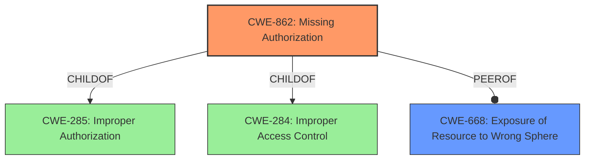

# Raw Analyzer Response for CVE-2021-39802

# Summary
| CWE ID | CWE Name | Confidence | CWE Abstraction Level | CWE Vulnerability Mapping Label | CWE-Vulnerability Mapping Notes |
|---|---|---|---|---|---|
| CWE-862 | Missing Authorization | 0.8 | Class | Primary | Allowed-with-Review |
| CWE-668 | Exposure of Resource to Wrong Sphere | 0.6 | Class | Secondary | Discouraged |

## Evidence and Confidence

*   **Confidence Score:** 0.7
*   **Evidence Strength:** MEDIUM

## Relationship Analysis
The primary relationship influencing the CWE selection is the ChildOf relationship, as CWE-862 is a child of CWE-285 (Improper Authorization) and CWE-284 (Improper Access Control). This indicates that CWE-862 is a more specific type of access control issue. The selection between CWE-862 and CWE-668 (Exposure of Resource to Wrong Sphere) was influenced by their peer relationship, where CWE-668 is a broader class of resource exposure. However, given the specific nature of the **permissions bypass** described, CWE-862 is deemed a better fit, even though it is a Class-level CWE.

## Vulnerability Chain
The vulnerability chain starts with the **permissions bypass** in `change_pte_range` which leads to making a shared mmap writable.

## Summary of Analysis
Initially, the description of the vulnerability pointed towards a **permissions bypass** which would indicate an authorization issue. The evidence in "Vulnerability Description Key Phrases" section states "**weakness:** **permissions bypass**". The "CVE Reference Links Content Summary" section describes the intention to use `mprotect` to protect memory regions, and the vulnerability allows shared memory mappings to be writable.

The primary CWE selected is CWE-862 (Missing Authorization). This is due to the explicit mention of a **permissions bypass**, indicating that authorization checks are either missing or insufficient.

CWE-668 (Exposure of Resource to Wrong Sphere) was considered but deemed less suitable as the primary CWE. Although the vulnerability results in a resource (shared mmap) being exposed to the wrong sphere (writable when it should not be), the root cause is more accurately described as a failure to properly authorize access, hence the stronger focus on authorization issues.

CWE-667 (Improper Locking), CWE-362 (Concurrent Execution using Shared Resource with Improper Synchronization ('Race Condition')), CWE-413 (Improper Resource Locking), CWE-665 (Improper Initialization), CWE-1260 (Improper Handling of Overlap Between Protected Memory Ranges), CWE-364 (Signal Handler Race Condition), CWE-1021 (Improper Restriction of Rendered UI Layers or Frames), CWE-514 (Covert Channel), CWE-732 (Incorrect Permission Assignment for Critical Resource) were considered based on the Retriever Results, but they were not selected as they did not directly address the **permissions bypass** aspect of the vulnerability.

The selected CWEs are at the optimal level of specificity because CWE-862 directly relates to the authorization aspect of the vulnerability. While it is a Class-level CWE, it accurately reflects the core issue of missing or insufficient authorization checks.