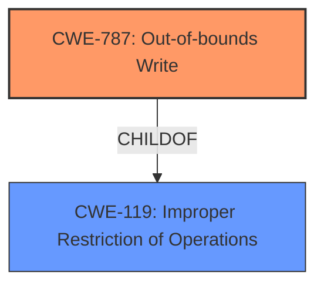

# Enhanced Analysis for CVE-2021-39830

# Summary
| CWE ID | CWE Name | Confidence | CWE Abstraction Level | CWE Vulnerability Mapping Label | CWE-Vulnerability Mapping Notes |
|---|---|---|---|---|---|
| CWE-787 | Out-of-bounds Write | 0.9 | Base | Allowed | Primary CWE. The vulnerability involves writing data past the end or before the beginning of the intended buffer due to **insecure handling** of a malicious PDF file. |
| CWE-119 | Improper Restriction of Operations within the Bounds of a Memory Buffer | 0.6 | Class | Discouraged | Secondary candidate. The vulnerability leads to memory corruption due to **insecure handling** of a malicious PDF file. |

## Evidence and Confidence

*   **Confidence Score:** 0.9
*   **Evidence Strength:** HIGH

## Relationship Analysis
The primary relationship influencing the decision is that CWE-787 is a child of CWE-119. While the initial description pointed to CWE-119, the CVE Reference Links Content Summary specifically mentioned "Access of Memory Location After End of Buffer," which aligns well with the nature of out-of-bounds write. Therefore, selecting the more specific child, CWE-787, is appropriate.



## Vulnerability Chain
The chain starts with the **insecure handling** of a malicious PDF file, leading to a **memory corruption** (out-of-bounds write), and culminating in arbitrary code execution.
  - Root Cause: Insecure handling of a malicious PDF file.
  - Weakness: CWE-787 (Out-of-bounds Write)
  - Impact: Arbitrary code execution.

## Summary of Analysis
The initial assessment leaned towards CWE-119 due to the general description of "memory corruption." However, the CVE Reference Links Content Summary provided more specific information, pointing to an "Access of Memory Location After End of Buffer," which aligns directly with CWE-787 (Out-of-bounds Write). The relationship between CWE-787 (Out-of-bounds Write) and CWE-119 (Improper Restriction of Operations within the Bounds of a Memory Buffer), where CWE-787 is a child of CWE-119, reinforces this decision.

The evidence from the "CVE Reference Links Content Summary" states: "The vulnerability is caused by accessing a memory location beyond the end of a buffer." This statement directly supports the selection of CWE-787, as it involves writing data past the end of the intended buffer.

CWE-787 is selected because it is the most specific and accurate representation of the vulnerability based on the provided evidence.

Relevant CWE Information:

# Enhanced Context (25 CWEs)
The following CWEs were identified as potentially relevant to this vulnerability:

## CWE-131: Incorrect Calculation of Buffer Size
**Abstraction Level**: Base
**Similarity Score**: 0.77

**Description**:
The product does not correctly calculate the size to be used when allocating a buffer, which could lead to a buffer overflow.

**Mapping Guidance**:
- Usage: Allowed
- Rationale: This CWE entry is at the Base level of abstraction, which is a preferred level of abstraction for mapping to the root causes of vulnerabilities.

*Not Used:* While this could be related, the description focuses more on **insecure handling** rather than a calculation error.

## CWE-125: Out-of-bounds Read
**Abstraction Level**: Base
**Similarity Score**: 0.77

**Description**:
The product reads data past the end, or before the beginning, of the intended buffer.

**Mapping Guidance**:
- Usage: Allowed
- Rationale: This CWE entry is at the Base level of abstraction, which is a preferred level of abstraction for mapping to the root causes of vulnerabilities.

*Not Used:* The description mentions a **memory corruption** due to **insecure handling** while writing to a file, which indicates that data is being written out of bounds.

## CWE-788: Access of Memory Location After End of Buffer
**Abstraction Level**: Base
**Similarity Score**: 0.77

**Description**:
The product reads or writes to a buffer using an index or pointer that references a memory location after the end of the buffer.

**Mapping Guidance**:
- Usage: Discouraged
- Rationale: The CWE entry might be misused when lower-level CWE entries might be available. It also overlaps existing CWE entries and might be deprecated in the future.

*Not Used:* While highly relevant, CWE-787 is a more specific child that describes writing out of bounds.

## CWE-129: Improper Validation of Array Index
**Abstraction Level**: Variant
**Similarity Score**: 0.76

**Description**:
The product uses untrusted input when calculating or using an array index, but the product does not validate or incorrectly validates the index to ensure the index references a valid position within the array.

**Mapping Guidance**:
- Usage: Allowed
- Rationale: This CWE entry is at the Variant level of abstraction, which is a preferred level of abstraction for mapping to the root causes of vulnerabilities.

*Not Used:* The description doesn't explicitly mention an array index issue.

## CWE-190: Integer Overflow or Wraparound
**Abstraction Level**: Base
**Similarity Score**: 5715.26

**Description**:
The product performs a calculation that can
         produce an integer overflow or wraparound when the logic
         assumes that the resulting value will always be larger than
         the original value. This occurs when an integer value is
         incremented to a value that is too large to store in the
         associated representation. When this occurs, the value may
         become a very small or negative number.

**Mapping Guidance**:
- Usage: Allowed
- Rationale: This CWE entry is at the Base level of abstraction, which is a preferred level of abstraction for mapping to the root causes of vulnerabilities.

*Not Used:* This is not directly related to the root cause.

## CWE-119: Improper Restriction of Operations within the Bounds of a Memory Buffer
**Abstraction Level**: Class
**Similarity Score**: 5407.88

**Description**:
The product performs operations on a memory buffer, but it reads from or writes to a memory location outside the buffer's intended boundary. This may result in read or write operations on unexpected memory locations that could be linked to other variables, data structures, or internal program data.

**Mapping Guidance**:
- Usage: Discouraged
- Rationale: CWE-119 is commonly misused in low-information vulnerability reports when lower-level CWEs could be used instead, or when more details about the vulnerability are available.

*Used as Secondary Candidate:* Because the source mentions **memory corruption** due to **insecure handling** and **Top CWEs** lists CWE-119, it is considered. But the child is preferred.

## CWE-787: Out-of-bounds Write
**Abstraction Level**: base
**Similarity Score**: 3.30

**Description**:
CWE-787: Out-of-bounds Write

**Mapping Guidance**:
- Usage: Allowed
- Rationale: This CWE entry is at the Base level of abstraction, which is a preferred level of abstraction for mapping to the root causes of vulnerabilities.

**Relationships**:
- CANFOLLOW -> CWE-825
- CANFOLLOW -> CWE-824
- CANFOLLOW -> CWE-823
- CANFOLLOW -> CWE-822
- PARENTOF -> CWE-124

*Primary Candidate*: This is the most specific and appropriate CWE based on the description.


## CWE Relationship Analysis

Current CWEs represent these abstraction levels: .


### Vulnerability Chain Analysis

**Chain starting from CWE-823:**
- 823 (Use of Out-of-range Pointer Offset) - ROOT


**Chain starting from CWE-787:**
- 787 (Out-of-bounds Write) - ROOT


### CWE Relationship Diagram

```mermaid
graph TD
    classDef primary fill:#f96,stroke:#333,stroke-width:2px
    classDef secondary fill:#69f,stroke:#333
    classDef tertiary fill:#9e9,stroke:#333
```