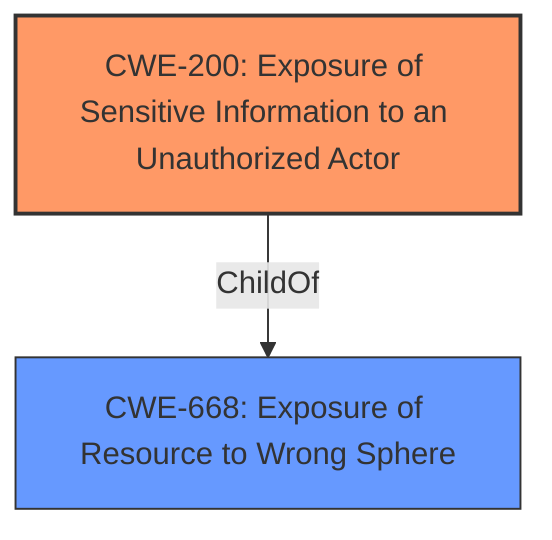

# Raw Analyzer Response for CVE-2021-39857

# Summary
| CWE ID | CWE Name | Confidence | CWE Abstraction Level | CWE Vulnerability Mapping Label | CWE-Vulnerability Mapping Notes |
|---|---|---|---|---|---|
| CWE-200 | Exposure of Sensitive Information to an Unauthorized Actor | 0.9 | Class | Primary | Discouraged |

## Evidence and Confidence

*   **Confidence Score:** 0.9
*   **Evidence Strength:** HIGH

## Relationship Analysis
The primary relationship influencing the decision is the ChildOf relationship between CWE-200 and CWE-668. CWE-200 is a Class-level CWE, while the retriever results provide a number of Base and Variant level CWEs.

## Vulnerability Chain
The vulnerability chain starts with the **weakness** in the Adobe Acrobat Reader DC add-on that allows for arbitrary file system reads. This leads to the **impact** of information disclosure, where an unauthenticated attacker can check for the existence of local files.

## Summary of Analysis
The initial analysis focused on identifying the root cause of the vulnerability. The vulnerability description indicates that an unauthenticated attacker can check for the existence of local files due to a **weakness** that allows arbitrary file system reads, leading to information disclosure.

The "**Root Cause:** Information Exposure" and "**Weakness:** Arbitrary file system read" found in the "CVE Reference Links Content Summary" section provides direct evidence for selecting CWE-200 [Exposure of Sensitive Information to an Unauthorized Actor].

The Retriever Results identify CWE-200 [Exposure of Sensitive Information to an Unauthorized Actor] as the top candidate. Although the Usage for CWE-200 is "Discouraged", the description of CWE-200 aligns with the vulnerability's impact: "The product exposes sensitive information to an actor that is not explicitly authorized to have access to that information." The content summary states "An attacker can read arbitrary files from the file system," which supports this mapping.

CWE-787 [Out-of-bounds Write] and CWE-788 [Access of Memory Location After End of Buffer] were considered but rejected as they relate to memory corruption issues, which are not directly indicated in the vulnerability description. The focus here is on reading arbitrary files, not memory access violations.

CWE-427 [Uncontrolled Search Path Element] was also considered, but it is more relevant to vulnerabilities involving the use of untrusted search paths, which is not the case here.

Based on the available evidence, CWE-200 [Exposure of Sensitive Information to an Unauthorized Actor] is the most appropriate CWE because the **weakness** allows the attacker to read arbitrary files from the file system. While CWE-200 is a Class-level CWE and its usage is Discouraged, the vulnerability description doesn't provide enough information to pinpoint a more specific Base-level CWE.