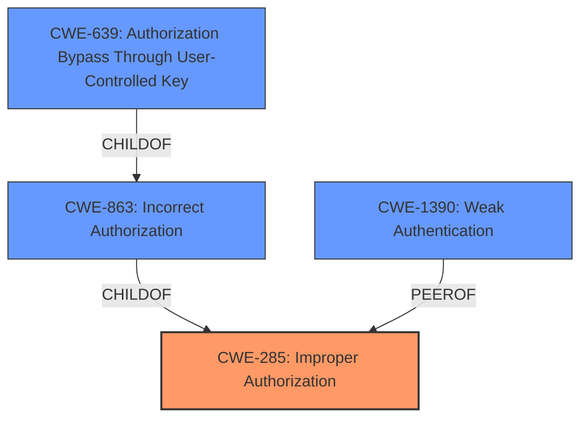

# Analysis Report for CVE-2021-39872

# Vulnerability Analysis Report: CVE-2021-39872

## Description


## Analysis (with Relationship Data)

# Summary
| CWE ID | CWE Name | Confidence | CWE Abstraction Level | CWE Vulnerability Mapping Label | CWE-Vulnerability Mapping Notes |
|---|---|---|---|---|---|
| **CWE-285** | **Improper Authorization** | 0.8 | Class | Primary | Allowed-with-Review |
| CWE-863 | Incorrect Authorization | 0.7 | Class | Secondary | Allowed-with-Review |
| CWE-1390 | Weak Authentication | 0.6 | Class | Secondary | Allowed-with-Review |
| CWE-639 | Authorization Bypass Through User-Controlled Key | 0.5 | Base | Secondary | Allowed |

## Evidence and Confidence

*   **Confidence Score:** 0.8
*   **Evidence Strength:** HIGH

## Relationship Analysis
The primary CWE, CWE-285 **(Improper Authorization)**, is a Class-level CWE. The analysis also considered its children CWE-863 **(Incorrect Authorization)** and CWE-639 **(Authorization Bypass Through User-Controlled Key)**. CWE-863 is a child of CWE-285, indicating a more specific form of authorization failure. CWE-639 is also a child of CWE-863, representing an even more specific scenario where the authorization bypass occurs through user-controlled keys. CWE-1390 **(Weak Authentication)** was considered as a peer since authentication issues can often lead to authorization problems. The final selection favored CWE-285 as the primary due to the description centering on expired passwords bypassing access controls, a broad failure in authorization.



## Vulnerability Chain
The vulnerability chain starts with **improper access control**, leading to users with expired passwords gaining unauthorized access.
  - **Root Cause:** **Improper access control** allows access through tokens.
  - **Weakness:** Failure to properly enforce password expiration.
  - **Impact:** Unauthorized access to GitLab through git and API, potential data exposure.

## Summary of Analysis
The initial assessment focused on the **improper access control** vulnerability, where users with expired passwords could still access GitLab. The retriever results pointed to CWE-285 **(Improper Authorization)**, CWE-863 **(Incorrect Authorization)**, and CWE-639 **(Authorization Bypass Through User-Controlled Key)** as potential matches.

The evidence from the vulnerability description and CVE reference links strongly supports the selection of CWE-285 as the primary CWE. The description explicitly mentions "**improper access control**" as the root cause, and the CVE details confirm that users with expired passwords were able to bypass intended restrictions, indicating a failure in the authorization process. The CVE reference states, "A fix for LDAP user authentication introduced a regression, allowing users with expired passwords to bypass the intended restrictions."

CWE-863 **(Incorrect Authorization)** was considered as a more specific alternative, but CWE-285 was chosen because the vulnerability represents a broader failure to perform an authorization check correctly, rather than an error in the check itself. However, CWE-863 is still a relevant secondary CWE because the authorization check is, in fact, performed incorrectly.

CWE-639 **(Authorization Bypass Through User-Controlled Key)** was also considered, as the bypass occurs through access tokens. However, the core issue is not the user-controlled key itself, but the failure to invalidate these tokens upon password expiration. Thus, CWE-639 is a less direct representation of the root cause.

CWE-1390 **(Weak Authentication)** was considered, but the issue isn't about weak authentication mechanisms initially. Rather, it's about the **improper** enforcement of authorization policies after authentication has occurred (but the password has expired).

The final decision prioritizes CWE-285 due to its accurate representation of the **improper authorization** and is at the optimal level of specificity. The retriever scores and relationship analysis support this decision, with the understanding that CWE-863, CWE-639 and CWE-1390 capture related aspects of the vulnerability.


## CWE Relationship Analysis

Current CWEs represent these abstraction levels: .


### Vulnerability Chain Analysis

**Chain starting from CWE-285:**
- 285 (Improper Authorization) - ROOT


**Chain starting from CWE-639:**
- 639 (Authorization Bypass Through User-Controlled Key) - ROOT


### CWE Relationship Diagram

```mermaid
graph TD
    classDef primary fill:#f96,stroke:#333,stroke-width:2px
    classDef secondary fill:#69f,stroke:#333
    classDef tertiary fill:#9e9,stroke:#333
```


*Report generated on 2025-04-01 21:22:51*
