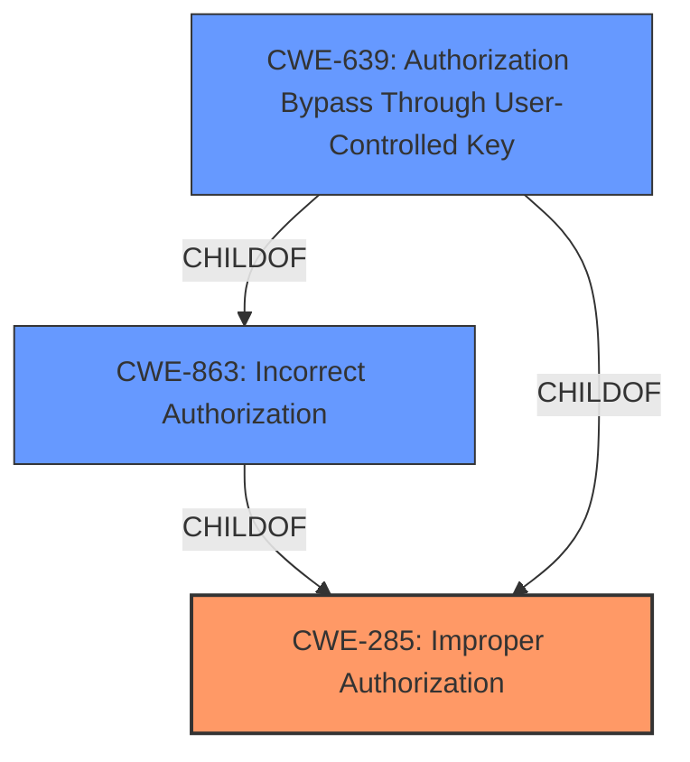

# Enhanced Analysis for CVE-2021-39875

# Summary
| CWE ID | CWE Name | Confidence | CWE Abstraction Level | CWE Vulnerability Mapping Label | CWE-Vulnerability Mapping Notes |
|---|---|---|---|---|---|
| **CWE-285** | **Improper Authorization** | 0.75 | Class | Primary | Discouraged: High-level, but applicable given the information. |
| CWE-863 | Incorrect Authorization | 0.60 | Class | Secondary | Allowed-with-Review: More specific than CWE-285, but still lacks sufficient detail for precise mapping. |
| CWE-639 | Authorization Bypass Through User-Controlled Key | 0.50 | Base | Secondary | Allowed: Matches the bypass aspect, but the user-controlled key isn't explicit. |

## Evidence and Confidence

*   **Confidence Score:** 0.70
*   **Evidence Strength:** MEDIUM

## Relationship Analysis
The primary relationship influencing the CWE selection is the hierarchical structure. CWE-285 (Improper Authorization) is a parent Class of CWE-863 (Incorrect Authorization) and CWE-639 (Authorization Bypass Through User-Controlled Key). While the vulnerability involves an authorization issue, the precise nature of the **incorrect authorization** isn't fully detailed. Therefore, the higher-level CWE-285 is initially selected, but CWE-863 and CWE-639 are considered as secondary options that offer more specific classifications.



## Vulnerability Chain
The vulnerability chain involves a **missing or incorrect authorization** check on an API endpoint, leading to the exposure of sensitive information.

1.  **Root Cause:** **Insufficient authorization** checks on API endpoints.
2.  **Weakness:** **Improper authorization** (CWE-285), potentially **incorrect authorization** (CWE-863) or **authorization bypass** (CWE-639).
3.  **Impact:** Exposure of pending group/project membership invitations, including email addresses of invitees.

## Summary of Analysis
The initial analysis considered the retriever results, which suggested CWE-285, CWE-863, and CWE-639 as potential matches. The "CVE Reference Links Content Summary" section highlights the "**root_cause**" as "**insufficient authorization** checks on API endpoints," which aligns with the general concept of **improper authorization**.

CWE-285 is a high-level Class that encompasses various authorization issues. The description states: "The product does not perform or incorrectly performs an authorization check when an actor attempts to access a resource or perform an action." This matches the vulnerability where the API endpoint **lacked sufficient authorization checks**.

CWE-863 (Incorrect Authorization) is more specific, stating: "The product performs an authorization check when an actor attempts to access a resource or perform an action, but it does not correctly perform the check." While this could be applicable, the description doesn't explicitly confirm that an authorization check was performed incorrectly, versus simply missing.

CWE-639 (Authorization Bypass Through User-Controlled Key) focuses on scenarios where a user-controlled key is used to bypass authorization. The provided information doesn't explicitly state that a user-controlled key was involved, making this a less suitable match.

The final decision leans towards CWE-285 due to its broader applicability and the provided evidence. However, CWE-863 and CWE-639 remain as secondary candidates that provide additional context.

The choice of CWE-285 is at the optimal level of specificity given the available evidence. While a more specific CWE might be ideal, the current information doesn't provide enough detail to warrant a lower-level mapping.
The evidence from the "CVE Reference Links Content Summary" states: "The API endpoints for retrieving pending invitations to public groups and projects did not enforce the same authorization policies as the UI, resulting in unauthorized access to sensitive data." This clearly points to an **improper authorization** issue, justifying the selection of CWE-285.

Relevant CWE Information:

# Enhanced Context (25 CWEs)

## CWE-1289: Improper Validation of Unsafe Equivalence in Input
**Abstraction Level**: Base
**Similarity Score**: 0.76
**Source**: dense

**Description**:
The product receives an input value that is used as a resource identifier or other type of reference, but it does not validate or incorrectly validates that the input is equivalent to a potentially-unsafe value.

**Mapping Guidance**:
- Usage: Allowed
- Rationale: This CWE entry is at the Base level of abstraction, which is a preferred level of abstraction for mapping to the root causes of vulnerabilities.

*Reason for not using:* The vulnerability doesn't focus on input validation of unsafe equivalence, but rather on the authorization mechanism.

## CWE-639: Authorization Bypass Through User-Controlled Key
**Abstraction Level**: Base
**Similarity Score**: 0.76
**Source**: dense

**Description**:
The system's authorization functionality does not prevent one user from gaining access to another user's data or record by modifying the key value identifying the data.

**Mapping Guidance**:
- Usage: Allowed
- Rationale: This CWE entry is at the Base level of abstraction, which is a preferred level of abstraction for mapping to the root causes of vulnerabilities.

*Reason for considering:* Although the description mentioned an authorization bypass, there wasn't sufficient information if the bypass was done through a user-controlled key.

## CWE-74: Improper Neutralization of Special Elements in Output Used by a Downstream Component ('Injection')
**Abstraction Level**: Class
**Similarity Score**: 0.76
**Source**: dense

**Description**:
The product constructs all or part of a command, data structure, or record using externally-influenced input from an upstream component, but it does not neutralize or incorrectly neutralizes special elements that could modify how it is parsed or interpreted when it is sent to a downstream component.

**Mapping Guidance**:
- Usage: Discouraged
- Rationale: CWE-74 is high-level and often misused when lower-level weaknesses are more appropriate.

*Reason for not using:* Injection is not the primary weakness. The vulnerability is about the lack of authorization rather than injection.

## CWE-184: Incomplete List of Disallowed Inputs
**Abstraction Level**: Base
**Similarity Score**: 0.75
**Source**: dense

**Description**:
The product implements a protection mechanism that relies on a list of inputs (or properties of inputs) that are not allowed by policy or otherwise require other action to neutralize before additional processing takes place, but the list is incomplete.

**Mapping Guidance**:
- Usage: Allowed
- Rationale: This CWE entry is at the Base level of abstraction, which is a preferred level of abstraction for mapping to the root causes of vulnerabilities.

*Reason for not using:* The vulnerability is related to authorization, not an incomplete list of disallowed inputs.

## CWE-838: Inappropriate Encoding for Output Context
**Abstraction Level**: Base
**Similarity Score**: 0.75
**Source**: dense

**Description**:
The product uses or specifies an encoding when generating output to a downstream component, but the specified encoding is not the same as the encoding that is expected by the downstream component.

**Mapping Guidance**:
- Usage: Allowed
- Rationale: This CWE entry is at the Base level of abstraction, which is a preferred level of abstraction for mapping to the root causes of vulnerabilities.

*Reason for not using:* Encoding is not the primary weakness, which is about a lack of authorization.

## CWE-138: Improper Neutralization of Special Elements
**Abstraction Level**: Class
**Similarity Score**: 0.75
**Source**: dense

**Description**:
The product receives input from an upstream component, but it does not neutralize or incorrectly neutralizes special elements that could be interpreted as control elements or syntactic markers when they are sent to a downstream component.

**Mapping Guidance**:
- Usage: Discouraged
- Rationale: This CWE entry is a level-1 Class (i.e., a child of a Pillar). It might have lower-level children that would be more appropriate

*Reason for not using:* Neutralization of special elements is not the primary issue; it's related to authorization.

## CWE-116: Improper Encoding or Escaping of Output
**Abstraction Level**: Class
**Similarity Score**: 0.75
**Source**: dense

**Description**:
The product prepares a structured message for communication with another component, but encoding or escaping of the data is either missing or done incorrectly. As a result, the intended structure of the message is not preserved.

**Mapping


## CWE Relationship Analysis

Current CWEs represent these abstraction levels: .


### Vulnerability Chain Analysis

**Chain starting from CWE-838:**
- 838 (Inappropriate Encoding for Output Context) - ROOT


**Chain starting from CWE-285:**
- 285 (Improper Authorization) - ROOT


### CWE Relationship Diagram

```mermaid
graph TD
    classDef primary fill:#f96,stroke:#333,stroke-width:2px
    classDef secondary fill:#69f,stroke:#333
    classDef tertiary fill:#9e9,stroke:#333
```