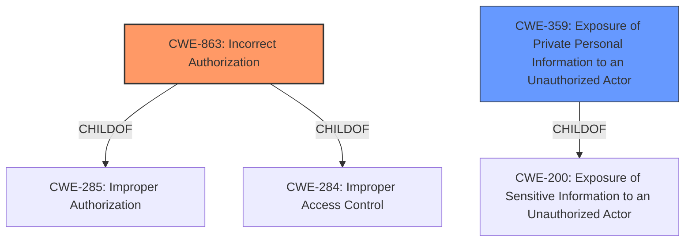

# Enhanced Analysis for CVE-2021-39888

# Summary
| CWE ID | CWE Name | Confidence | CWE Abstraction Level | CWE Vulnerability Mapping Label | CWE-Vulnerability Mapping Notes |
|---|---|---|---|---|---|
| CWE-863 | Incorrect Authorization | 0.9 | Class | Primary | Allowed-with-Review |
| CWE-359 | Exposure of Private Personal Information to an Unauthorized Actor | 0.7 | Base | Secondary | Allowed |

## Evidence and Confidence

*   **Confidence Score:** 0.8
*   **Evidence Strength:** HIGH

## Relationship Analysis
The primary CWE selected is CWE-863, "Incorrect Authorization," which is a Class-level CWE. It has child relationships to CWE-285 ("Improper Authorization") and CWE-284 (Improper Access Control), indicating a hierarchy of authorization-related weaknesses. CWE-359, "Exposure of Private Personal Information to an Unauthorized Actor," is a Base-level CWE and a child of CWE-200 ("Exposure of Sensitive Information to an Unauthorized Actor").



## Vulnerability Chain
The vulnerability chain starts with an **incorrect authorization** mechanism (CWE-863) in the Project API. This leads to the **exposure of details about a private group and other sensitive info** (CWE-359) such as issue and merge request templates, that should not be accessible to users with read permissions.
  - Initial Flaw: Incorrect Authorization (CWE-863)
  - Resulting Impact: Exposure of Sensitive Information (CWE-359)

## Summary of Analysis
The initial assessment identified the vulnerability as primarily an authorization issue, leading to information disclosure.

The "CVE Reference Links Content Summary" states: "The Project API **improperly discloses information** about projects with `Only Project Members` visibility to users with read permissions." and "The vulnerability occurs when a user with read permission in a project with the `Only Project Members` visibility can access the values of `shared_with_groups`, `issues_template`, and `merge_requests_template` through the Project API. The issue is that the API **does not enforce the visibility restriction** and returns this data." This supports the selection of CWE-863 because the API performs an authorization check (visibility restriction) but **does not correctly perform the check**.

CWE-863 is selected as the primary CWE because the root cause is an **incorrect authorization**. The "Retriever Results" also lists CWE-863 as the top combined result. The description of CVE-863 is "The product performs an authorization check when an actor attempts to access a resource or perform an action, but it does not correctly perform the check." The description of the vulnerability is a direct match.

CWE-359 is included as a secondary CWE because it captures the direct impact of the **incorrect authorization**, which is the exposure of private, personal information to unauthorized actors. "Vulnerability Description Key Phrases" indicate the **impact** is to "**reveal details about a private group and other sensitive info**". The "CVE Reference Links Content Summary" states that the impact is: "The `shared_with_groups` field discloses the ID and full path of private groups associated with the project. The `issues_template` and `merge_requests_template` fields disclose the content of templates, potentially containing sensitive information, internal links, or links to project uploads." The description of CVE-359 is "The product does not properly prevent a person's private, personal information from being accessed by actors who either (1) are not explicitly authorized to access the information or (2) do not have the implicit consent of the person about whom the information is collected."

The selected CWEs are at the optimal level of specificity because CWE-863 directly reflects the **incorrect authorization** root cause, and CWE-359 captures the specific type of information that is exposed as a result of that authorization failure.

Relevant CWE Information:

# Enhanced Context (25 CWEs)

## CWE-639: Authorization Bypass Through User-Controlled Key
**Abstraction Level**: Base
**Similarity Score**: 0.78
**Source**: dense

**Description**:
The system's authorization functionality does not prevent one user from gaining access to another user's data or record by modifying the key value identifying the data.

**Mapping Guidance**:
- Usage: Allowed
- Rationale: This CWE entry is at the Base level of abstraction, which is a preferred level of abstraction for mapping to the root causes of vulnerabilities.

**Why Not Selected:** While there is an authorization issue, the problem is not caused by modifying a key value.

## CWE-668: Exposure of Resource to Wrong Sphere
**Abstraction Level**: Class
**Similarity Score**: 0.78
**Source**: dense

**Description**:
The product exposes a resource to the wrong control sphere, providing unintended actors with inappropriate access to the resource.

**Mapping Guidance**:
- Usage: Discouraged
- Rationale: CWE-668 is high-level and is often misused as a catch-all when lower-level CWE IDs might be applicable. It is sometimes used for low-information vulnerability reports [REF-1287]. It is a level-1 Class (i.e., a child of a Pillar). It is not useful for trend analysis.

**Why Not Selected:** This is a high-level CWE and CWE-359 is a better fit.

## CWE-41: Improper Resolution of Path Equivalence
**Abstraction Level**: Base
**Similarity Score**: 0.77
**Source**: dense

**Description**:
The product is vulnerable to file system contents disclosure through path equivalence. Path equivalence involves the use of special characters in file and directory names. The associated manipulations are intended to generate multiple names for the same object.

**Mapping Guidance**:
- Usage: Allowed
- Rationale: This CWE entry is at the Base level of abstraction, which is a preferred level of abstraction for mapping to the root causes of vulnerabilities.

**Why Not Selected:** This vulnerability is not about file system path manipulation.

## CWE-425: Direct Request ('Forced Browsing')
**Abstraction Level**: Base
**Similarity Score**: 0.77
**Source**: dense

**Description**:
The web application does not adequately enforce appropriate authorization on all restricted URLs, scripts, or files.

**Mapping Guidance**:
- Usage: Allowed
- Rationale: This CWE entry is at the Base level of abstraction, which is a preferred level of abstraction for mapping to the root causes of vulnerabilities.

**Why Not Selected:** While related to authorization, CWE-863 is a better and more direct fit because the authorization check is being performed, but incorrectly.

## CWE-552: Files or Directories Accessible to External Parties
**Abstraction Level**: Base
**Similarity Score**: 0.77
**Source**: dense

**Description**:
The product makes files or directories accessible to unauthorized actors, even though they should not be.

**Mapping Guidance**:
- Usage: Allowed
- Rationale: This CWE entry is at the Base level of abstraction, which is a preferred level of abstraction for mapping to the root causes of vulnerabilities.

**Why Not Selected:** This is too general. While technically true, CWE-359 is a better fit because it specifies what type of resources are being exposed.

## CWE-472: External Control of Assumed-Immutable Web Parameter
**Abstraction Level**: Base
**Similarity Score**: 0.76
**Source**: dense

**Description**:
The web application does not sufficiently verify inputs that are assumed to be immutable but are actually externally controllable, such as hidden form fields.

**Mapping Guidance**:
- Usage: Allowed
- Rationale: This CWE entry is at the Base level of abstraction, which is a preferred level of abstraction for mapping to the root causes of vulnerabilities.

**Why Not Selected:** The vulnerability is not about externally controlled parameters.

## CWE-404: Improper Resource Shutdown or Release
**Abstraction Level**: Class
**Similarity Score**: 0.76
**Source**: dense

**Description**:
The product does not release or incorrectly releases a resource before it is made available for re-use.

**Mapping Guidance**:
- Usage: Allowed-with-Review
- Rationale: This CWE entry is a Class and might have Base-level children that would be more appropriate

**Why Not Selected:** This vulnerability is


## CWE Relationship Analysis

Current CWEs represent these abstraction levels: .


### Vulnerability Chain Analysis

**Chain starting from CWE-404:**
- 404 (Improper Resource Shutdown or Release) - ROOT


**Chain starting from CWE-284:**
- 284 (Improper Access Control) - ROOT


### CWE Relationship Diagram

```mermaid
graph TD
    classDef primary fill:#f96,stroke:#333,stroke-width:2px
    classDef secondary fill:#69f,stroke:#333
    classDef tertiary fill:#9e9,stroke:#333
```