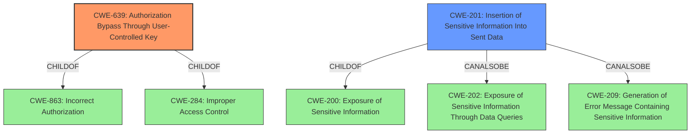

# Analysis Report for CVE-2021-39889

# Vulnerability Analysis Report: CVE-2021-39889

## Description


## Analysis (with Relationship Data)

# Summary
| CWE ID | CWE Name | Confidence | CWE Abstraction Level | CWE Vulnerability Mapping Label | CWE-Vulnerability Mapping Notes |
|---|---|---|---|---|---|
| CWE-639 | Authorization Bypass Through User-Controlled Key | 1.0 | Base | Allowed | Primary CWE |
| CWE-201 | Insertion of Sensitive Information Into Sent Data | 0.7 | Base | Allowed | Secondary Candidate |

## Evidence and Confidence

*   **Confidence Score:** 0.9
*   **Evidence Strength:** HIGH

## Relationship Analysis
The primary CWE is CWE-639, which is a base-level CWE, making it a good fit. It is a child of CWE-863 (Incorrect Authorization) and CWE-284 (Improper Access Control), highlighting the authorization context of the vulnerability. CWE-201 (Insertion of Sensitive Information Into Sent Data) is a child of CWE-200 (Exposure of Sensitive Information) and can also be related to CWE-202 and CWE-209, indicating the information leakage aspect.



## Vulnerability Chain
The vulnerability chain starts with the **insecure direct object reference**, which leads to an authorization bypass and ultimately results in the exposure of the protected branch name.
  - **Root Cause:** **Insecure Direct Object Reference** (CWE-639) due to **insufficient input validation**.
  - **Weakness:** Authorization bypass due to user-controlled key.
  - **Impact:** Reveal protected branch name (CWE-201).

## Summary of Analysis
The initial analysis identified the **insecure direct object reference** as the primary weakness, supported by the vulnerability description key phrases and the CVE reference content summary. The retriever results also highlighted CWE-639 as the top candidate.

The analysis of CWE relationships confirmed that CWE-639 is a base-level CWE related to authorization bypass, making it an appropriate fit. CWE-201 was considered as a secondary weakness because the ultimate impact is the disclosure of sensitive information.

The final decision is based on the evidence provided in the vulnerability description and the CVE reference. The selection of CWE-639 as the primary CWE is based on the root cause being an **insecure direct object reference**, allowing an attacker to bypass authorization checks.

Relevant CWE Information:

# Enhanced Context (25 CWEs)
The following CWEs were identified as potentially relevant to this vulnerability:

## CWE-639: Authorization Bypass Through User-Controlled Key
**Abstraction Level**: Base
**Similarity Score**: 0.78
**Source**: dense

**Description**:
The system's authorization functionality does not prevent one user from gaining access to another user's data or record by modifying the key value identifying the data.

**Mapping Guidance**:
- Usage: Allowed
- Rationale: This CWE entry is at the Base level of abstraction, which is a preferred level of abstraction for mapping to the root causes of vulnerabilities.

## CWE-201: Insertion of Sensitive Information Into Sent Data
**Abstraction Level**: Base
**Similarity Score**: 6362.60
**Source**: sparse

**Description**:
The code transmits data to another actor, but a portion of the data includes sensitive information that should not be accessible to that actor.

**Mapping Guidance**:
- Usage: Allowed
- Rationale: This CWE entry is at the Base level of abstraction, which is a preferred level of abstraction for mapping to the root causes of vulnerabilities.

**CWE-639 Authorization Bypass Through User-Controlled Key**
- **Technical Explanation:** The vulnerability stems from the application's failure to properly validate user-supplied input (`protected_branch_ids`) when setting up status checks for merge requests. This **lack of validation** allows an attacker to manipulate the `protected_branch_ids` parameter in the API request, specifying arbitrary branch IDs, even those belonging to private projects. The application then returns the branch name in the response, effectively bypassing authorization and disclosing the name of the protected branch.
- **Security Implications:** An attacker can obtain the names of protected branches from private projects that they do not have access to. This information disclosure can be used to further target those projects.
- **Relationship:** CWE-639 is a base-level CWE and a child of CWE-863 (Incorrect Authorization) and CWE-284 (Improper Access Control), placing it within the authorization context.
- **Mapping Guidance:** The MITRE mapping guidance allows the use of CWE-639, as it is at the base level of abstraction.
- **Usage:** Primary

**CWE-201 Insertion of Sensitive Information Into Sent Data**
- **Technical Explanation:** While the root cause is the authorization bypass, the ultimate impact is the exposure of sensitive information (the protected branch name) to an unauthorized actor. The application transmits the branch name in the API response, even though the user should not have access to it.
- **Security Implications:** The exposure of the protected branch name can aid an attacker in further targeting the private project.
- **Relationship:** CWE-201 is a base-level CWE and a child of CWE-200 (Exposure of Sensitive Information).
- **Mapping Guidance:** The MITRE mapping guidance allows the use of CWE-201, as it is at the base level of abstraction.
- **Usage:** Secondary

**CWEs Considered But Not Used:**
- CWE-863 (Incorrect Authorization) and CWE-285 (Improper Authorization): These are class-level CWEs and less specific than CWE-639, which directly addresses the **insecure direct object reference** aspect of the vulnerability.
- CWE-425 (Direct Request ('Forced Browsing')): While the attacker makes a crafted API call, the core issue is the authorization bypass via a user-controlled key, not a direct request to a restricted resource.
- CWE-451 (User Interface (UI) Misrepresentation of Critical Information): This CWE is not applicable as the vulnerability involves an API call and not a UI misrepresentation.


## CWE Relationship Analysis

Current CWEs represent these abstraction levels: .


### Vulnerability Chain Analysis

**Chain starting from CWE-284:**
- 284 (Improper Access Control) - ROOT


**Chain starting from CWE-201:**
- 201 (Insertion of Sensitive Information Into Sent Data) - ROOT


### CWE Relationship Diagram

```mermaid
graph TD
    classDef primary fill:#f96,stroke:#333,stroke-width:2px
    classDef secondary fill:#69f,stroke:#333
    classDef tertiary fill:#9e9,stroke:#333
```


*Report generated on 2025-04-02 03:42:38*
