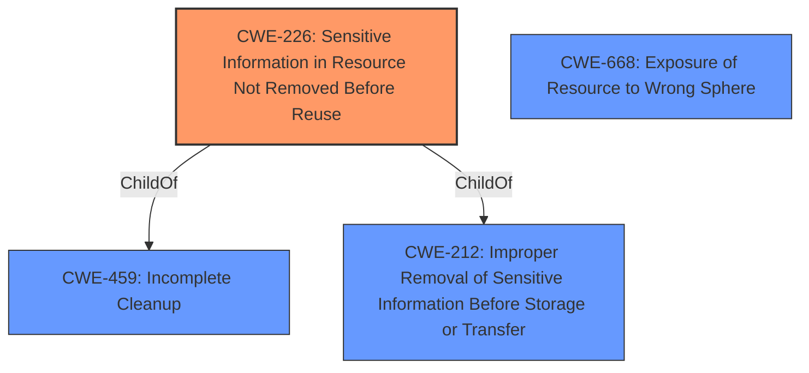

# Enhanced Analysis for CVE-2021-39891

# Summary
| CWE ID | CWE Name | Confidence | CWE Abstraction Level | CWE Vulnerability Mapping Label | CWE-Vulnerability Mapping Notes |
|---|---|---|---|---|---|
| CWE-226 | Sensitive Information in Resource Not Removed Before Reuse | 0.8 | Base | Allowed | Primary CWE. The access tokens are not cleared at the end of impersonation, which leads to sensitive information disclosure. |
| CWE-668 | Exposure of Resource to Wrong Sphere | 0.5 | Class | Discouraged | Secondary candidate. The access token created during impersonation is a resource that should be available only during the impersonation session.  |

## Evidence and Confidence

*   **Confidence Score:** 0.8
*   **Evidence Strength:** MEDIUM

## Relationship Analysis
The primary relationship influencing the CWE selection is the parent-child relationship.
  - CWE-226: Sensitive Information in Resource Not Removed Before Reuse, is a child of CWE-459: Incomplete Cleanup and CWE-212: Improper Removal of Sensitive Information Before Storage or Transfer.
  - CWE-668: Exposure of Resource to Wrong Sphere is a higher level Class CWE that can be used when lower-level CWEs are not available but is generally discouraged.


## Vulnerability Chain
The vulnerability chain involves the **failure to clear** access tokens after user impersonation, leading to the **exposure of sensitive information**.
  - Root Cause: **Failure to clear** access tokens (CWE-226)
  - Impact: Sensitive information disclosure

## Summary of Analysis
The initial analysis focused on identifying the root cause of the vulnerability. The description clearly states that access tokens are not cleared after impersonation, which leads to sensitive information disclosure. The Retriever Results suggested several CWEs, including CWE-226, CWE-285, and CWE-863.

CWE-226 (Sensitive Information in Resource Not Removed Before Reuse) was selected as the primary CWE because it directly addresses the **failure to clear** sensitive information (access tokens) after they are no longer needed. The description of CWE-226 aligns well with the vulnerability description: "The product releases a resource such as memory or a file so that it can be made available for reuse, but it does not clear or "zeroize" the information contained in the resource before the product performs a critical state transition or makes the resource available for reuse by other entities."

The "CVE Reference Links Content Summary" section doesn't have any rootcause or weakness information.
The "Vulnerability Description Key Phrases" section has "impact: unnecessary sensitive info disclosure" but does not have a rootcause or weakness listed, but the Vulnerability Description itself does have a rootcause: "access tokens created as part of admins impersonation of a user are **not cleared** at the end of impersonation which may lead to unnecessary sensitive info disclosure".

Other CWEs were considered but not selected as primary:
  - CWE-285 (Improper Authorization) and CWE-863 (Incorrect Authorization) were considered but deemed less relevant because the core issue is not about authorization, but about the **failure to properly manage** sensitive information.
  - CWE-668 (Exposure of Resource to Wrong Sphere) was considered as a higher-level abstraction but was not selected as the primary CWE because CWE-226 provides a more specific description of the weakness. The access token created during impersonation is a resource that should be available only during the impersonation session.

The final decision was based on a combination of the vulnerability description, the CWE descriptions, and the relationships between CWEs. CWE-226 was chosen because it accurately represents the root cause of the vulnerability and is at the appropriate level of specificity (Base). The confidence level is high (0.8) due to the clear alignment between the vulnerability description and the CWE description.


## CWE Relationship Analysis

Current CWEs represent these abstraction levels: .


### Vulnerability Chain Analysis

**Chain starting from CWE-285:**
- 285 (Improper Authorization) - ROOT


**Chain starting from CWE-668:**
- 668 (Exposure of Resource to Wrong Sphere) - ROOT


### CWE Relationship Diagram

```mermaid
graph TD
    classDef primary fill:#f96,stroke:#333,stroke-width:2px
    classDef secondary fill:#69f,stroke:#333
    classDef tertiary fill:#9e9,stroke:#333
```