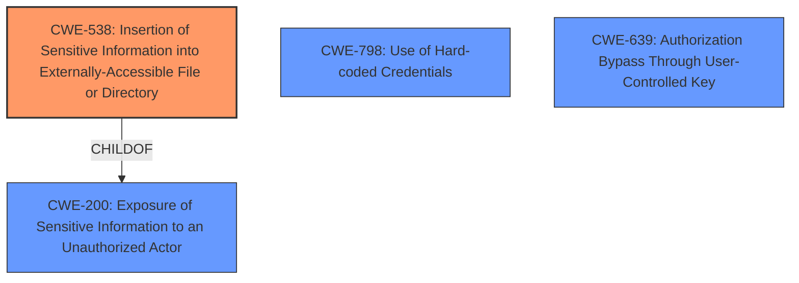

# Raw Analyzer Response for CVE-2021-39898

# Summary
| CWE ID | CWE Name | Confidence | CWE Abstraction Level | CWE Vulnerability Mapping Label | CWE-Vulnerability Mapping Notes |
|---|---|---|---|---|---|
| **CWE-538** | **Insertion of Sensitive Information into Externally-Accessible File or Directory** | 0.9 | Base | Primary | Allowed |
| CWE-798 | Use of Hard-coded Credentials | 0.6 | Base | Secondary | Allowed |
| CWE-639 | Authorization Bypass Through User-Controlled Key | 0.5 | Base | Secondary | Allowed |

## Evidence and Confidence

*   **Confidence Score:** 0.8
*   **Evidence Strength:** HIGH

## Relationship Analysis
The primary CWE selected is CWE-538, which is a Base level CWE. It has a direct parent relationship with CWE-200 (Exposure of Sensitive Information to an Unauthorized Actor). The secondary CWEs considered were CWE-798 (Use of Hard-coded Credentials) and CWE-639 (Authorization Bypass Through User-Controlled Key). These are Base level CWEs. CWE-798 and CWE-639 are not directly related to CWE-538 in terms of parent-child relationships, but they represent potential underlying causes or related weaknesses.

## Vulnerability Chain
The vulnerability chain starts with the **improper** inclusion of the `external_webhook_token` in the project export file. This leads to the exposure of sensitive data. An attacker who obtains this token can then forge requests and trigger unauthorized CI pipelines, potentially leading to a denial of service.
1.  **Root Cause:** Inclusion of `external_webhook_token` in project export.
2.  **Weakness:** CWE-538 Insertion of Sensitive Information into Externally-Accessible File or Directory
3.  **Impact:** Exposure of sensitive data allowing unauthorized CI pipeline triggering and potential DoS.

## Summary of Analysis
The analysis focused on identifying the root cause and the most accurate CWE representation of the vulnerability. The primary CWE, CWE-538, was chosen because it directly addresses the **insertion of sensitive information** (the `external_webhook_token`) into an externally accessible file (the project export). The evidence from the "CVE Reference Links Content Summary" clearly states that the vulnerability stems from including the `external_webhook_token` within project exports.

The retriever results and complete CWE specifications were analyzed to ensure the selected CWEs were the best fit. While other CWEs like CWE-798 and CWE-639 were considered, they represent potential underlying issues or consequences, not the direct cause of the vulnerability.

The selection of CWE-538 is based on the following evidence:

*   "The vulnerability stems from the inclusion of the `external_webhook_token` within project exports"
*   "The `external_webhook_token`, a secret key used to authenticate requests... is exposed within the project export file (`project.json`)."

CWE-538 is at the optimal level of specificity because it directly describes the **insertion of sensitive information** into an externally accessible file, which is the core issue. The relationship analysis confirms that it is a base-level CWE, providing the right level of detail. Other CWEs, such as CWE-200, are more general and do not capture the specific nature of the weakness.

**CWE Justification:**

*   **CWE-538: Insertion of Sensitive Information into Externally-Accessible File or Directory**
    *   **How it matches:** The `external_webhook_token` is sensitive information being placed into the project export file (`project.json`), which is accessible to users who download the project export.
    *   **Security Implications:** This allows unauthorized users to gain access to the token and potentially trigger CI pipelines or perform other malicious actions.
    *   **Relationship:** ChildOf CWE-200 (Exposure of Sensitive Information to an Unauthorized Actor).
    *   **Primary or Secondary:** Primary. This is the main weakness.
    *   **Mapping Guidance:** Allowed. It is at the Base level of abstraction.
*   **CWE-798: Use of Hard-coded Credentials**
    *   **How it matches:** While not explicitly hard-coded, the token's presence in the export file is akin to embedding it, making it readily available.
    *   **Security Implications:** Exposure of the token compromises authentication and authorization mechanisms.
    *   **Relationship:** ParentOf CWE-321 (Use of Hard-coded Cryptographic Key), CWE-259 (Use of Hard-coded Password).
    *   **Primary or Secondary:** Secondary. It describes a related aspect of the vulnerability.
    *   **Mapping Guidance:** Allowed. It is at the Base level of abstraction.
*   **CWE-639: Authorization Bypass Through User-Controlled Key**
    *   **How it matches:** The leaked token allows bypassing authorization checks, as an attacker can use it to forge requests.
    *   **Security Implications:** Allows unauthorized actions and access.
    *   **Relationship:** ChildOf CWE-863 (Incorrect Authorization).
    *   **Primary or Secondary:** Secondary. It is a consequence of the exposed token.
    *   **Mapping Guidance:** Allowed. It is at the Base level of abstraction.

**CWEs Considered But Not Used:**

*   **CWE-285: Improper Authorization:** This is a Class level CWE and is too general. The more specific CWE-639 is more appropriate if authorization is the main concern, but the **insertion of sensitive information** is the root cause.
*   **CWE-527: Exposure of Version-Control Repository to an Unauthorized Control Sphere:** This is specific to version control repositories, which isn't the primary focus here. The project export contains the token, not necessarily the entire repository.
*   **CWE-532: Insertion of Sensitive Information into Log File:** This is specific to log files, while the vulnerability involves an export file.
*   **CWE-400: Uncontrolled Resource Consumption:** This is a potential impact (DoS), but not the root cause.
*   **CWE-696: Incorrect Behavior Order:** This doesn't fit the description of the vulnerability.