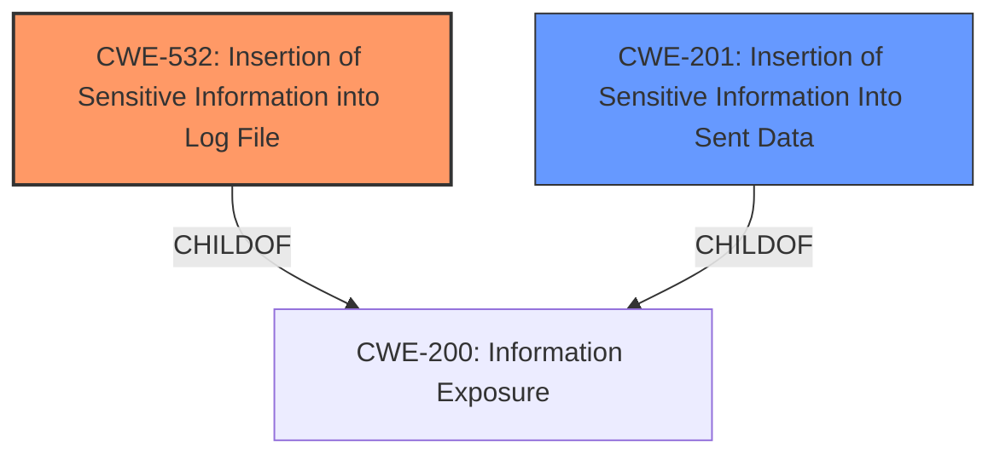

# Enhanced Analysis for CVE-2021-39900

# Summary
| CWE ID  | CWE Name | Confidence | CWE Abstraction Level | CWE Vulnerability Mapping Label | CWE-Vulnerability Mapping Notes |
|----------------|-------------------------------------------------------------------------------------------------------------------|------------|-------------------------|-----------------------------------|------------------------------------|
| CWE-532 | Insertion of Sensitive Information into Log File | 0.8  | Base  | Allowed | Primary CWE |
| CWE-201 | Insertion of Sensitive Information Into Sent Data | 0.6 | Base | Allowed | Secondary Candidate |

## Evidence and Confidence

*   **Confidence Score:** 0.7
*   **Evidence Strength:** MEDIUM

## Relationship Analysis
The primary relationship considered was the ChildOf relationship, specifically how CWE-532 is a child of CWE-200 (Information Exposure). Also, the close relationship between CWE-201 and CWE-200 helped to understand the potential flow of sensitive information. The base abstraction level was chosen for CWE-532 and CWE-201 as these offer more specific insights into the weakness.



## Vulnerability Chain
The vulnerability chain starts with the **improper** handling of sensitive information, followed by the **insertion** of that information into log files, which ultimately leads to information exposure.

## Summary of Analysis
The initial analysis focused on identifying the root cause and the flow of sensitive information. The vulnerability description states that the **impact** is information disclosure and that the exposure occurs through Rails logs. This points towards **CWE-532: Insertion of Sensitive Information into Log File**. The "Retriever Results" also lists CWE-532 as the top candidate.

The CVE description provides the following supporting evidence: "Information disclosure from SendEntry in GitLab starting with 10.8 allowed exposure of full URL of artifacts stored in object-storage with a temporary availability via Rails logs."

CWE-532 describes the scenario where "The product writes sensitive information to a log file." This aligns perfectly with the vulnerability description of sensitive URLs being written to Rails logs.

CWE-201 was considered as a secondary candidate, as the logs are sent data.

Relevant CWE Information:

# Enhanced Context (25 CWEs)
The following CWEs were identified as potentially relevant to this vulnerability:

## CWE-538: Insertion of Sensitive Information into Externally-Accessible File or Directory
**Abstraction Level**: Base
**Similarity Score**: 0.80
**Source**: dense

**Description**:
The product places sensitive information into files or directories that are accessible to actors who are allowed to have access to the files, but not to the sensitive information.

**Mapping Guidance**:
- Usage: Allowed
- Rationale: This CWE entry is at the Base level of abstraction, which is a preferred level of abstraction for mapping to the root causes of vulnerabilities.

## CWE Analysis and Selection:

**CWE-532: Insertion of Sensitive Information into Log File**

*   **Explanation:** The vulnerability involves the disclosure of sensitive URLs through Rails logs. This aligns directly with CWE-532, which describes the insertion of sensitive information into log files.
*   **Relationship:** CWE-532 is a child of CWE-200 (Information Exposure), indicating a clear flow of information leading to exposure.
*   **Justification:** The vulnerability description explicitly mentions "Rails logs," making CWE-532 the most appropriate choice.
*   **Confidence:** 0.8
*   **Usage:** Allowed

**CWE-201: Insertion of Sensitive Information Into Sent Data**

*   **Explanation:** This CWE addresses the inclusion of sensitive data in transmissions. The writing of logs could be considered sending of data.
*   **Relationship:** Child of CWE-200
*   **Justification:** The logs are sent data.
*   **Confidence:** 0.6
*   **Usage:** Allowed

**CWEs Considered but Not Used:**

*   **CWE-863, CWE-639, CWE-862, CWE-285:** These CWEs relate to authorization issues. However, the primary issue here is not a failure in authorization, but rather the exposure of sensitive information.
*   **CWE-116:** This CWE relates to improper encoding/escaping of output. While encoding issues might be present, the core problem is the presence of sensitive information in the logs.
*   **CWE-538:** Similar to CWE-532, but less specific. The information is logged, not just placed in an externally accessible file or directory.


## CWE Relationship Analysis

Current CWEs represent these abstraction levels: .


### Vulnerability Chain Analysis

**Chain starting from CWE-862:**
- 862 (Missing Authorization) - ROOT


**Chain starting from CWE-201:**
- 201 (Insertion of Sensitive Information Into Sent Data) - ROOT


### CWE Relationship Diagram

```mermaid
graph TD
    classDef primary fill:#f96,stroke:#333,stroke-width:2px
    classDef secondary fill:#69f,stroke:#333
    classDef tertiary fill:#9e9,stroke:#333
```