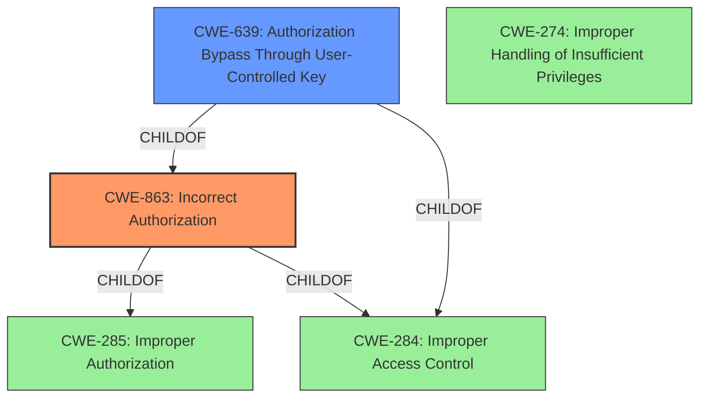

# Raw Analyzer Response for CVE-2021-39902

# Summary
| CWE ID    | CWE Name                         | Confidence | CWE Abstraction Level | CWE Vulnerability Mapping Label | CWE-Vulnerability Mapping Notes |
| :-------- | :------------------------------- | :--------- | :---------------------- | :------------------------------ | :------------------------------ |
| CWE-863   | Incorrect Authorization          | 1.0        | Class                   | Primary                         | Allowed-with-Review             |
| CWE-639   | Authorization Bypass Through User-Controlled Key | 0.7        | Base                   | Secondary                          | Allowed |
| CWE-274   | Improper Handling of Insufficient Privileges | 0.6        | Base                   | Secondary                          | Discouraged |

## Evidence and Confidence

*   **Confidence Score:** 0.9
*   **Evidence Strength:** HIGH

## Relationship Analysis
The primary CWE, CWE-863, is a child of CWE-285 (Improper Authorization) and CWE-284 (Improper Access Control). CWE-639 is a child of CWE-863 and CWE-284. This indicates a hierarchical structure where CWE-863 provides a more specific classification of the **incorrect authorization** issue than its parents. The relationship between CWE-863 and CWE-639 is also that of ChildOf indicating that CWE-639 is a specific type of **incorrect authorization**.

## Vulnerability Chain
The vulnerability chain starts with **incorrect authorization**, allowing a guest user to modify the severity of an incident, which they should not be able to do.

## Summary of Analysis
The initial analysis focused on the **incorrect authorization** aspect, leading to the selection of CWE-863. The "CVE Reference Links Content Summary" section confirms that the root cause is a privilege escalation issue due to the system's **failure to properly validate the user's current permissions**.

The vulnerability description states that a guest user can "modify the severity of an incident" in GitLab CE/EE 13.4 or above due to **incorrect authorization**. This aligns directly with the description of CWE-863, which states, "The product performs an authorization check when an actor attempts to access a resource or perform an action, but it does not correctly perform the check."

CWE-639 (Authorization Bypass Through User-Controlled Key) was considered because the attacker is modifying the severity of an incident, potentially by manipulating a key value associated with the incident. While this could be a contributing factor, the primary issue is the **incorrect authorization** check, making CWE-863 the more appropriate primary classification.

CWE-274 (Improper Handling of Insufficient Privileges) was considered because the guest user effectively gains elevated privileges. However, the core issue is not merely the handling of insufficient privileges, but the **failure to correctly authorize** the user's action, so CWE-863 is the better fit.

The decision to use CWE-863 is supported by the evidence and the MITRE mapping guidance, which allows for its use with review, given that more specific base-level children may exist. However, in this case, CWE-863 accurately captures the essence of the vulnerability.

The selected CWEs are at the optimal level of specificity, as they directly address the root cause (**incorrect authorization**) and a potential contributing factor (manipulation of a key value).

Relevant CWE Information:

# Enhanced Context (25 CWEs)
The following CWEs were identified as potentially relevant to this vulnerability:

## CWE-451: User Interface (UI) Misrepresentation of Critical Information
**Abstraction Level**: Class
**Similarity Score**: 0.76
**Source**: dense

**Description**:
The user interface (UI) does not properly represent critical information to the user, allowing the information - or its source - to be obscured or spoofed. This is often a component in phishing attacks.

**Mapping Guidance**:
- Usage: Allowed-with-Review
- Rationale: This CWE entry is a Class and might have Base-level children that would be more appropriate

## CWE-639: Authorization Bypass Through User-Controlled Key
**Abstraction Level**: Base
**Similarity Score**: 0.73
**Source**: dense

**Description**:
The system's authorization functionality does not prevent one user from gaining access to another user's data or record by modifying the key value identifying the data.

**Mapping Guidance**:
- Usage: Allowed
- Rationale: This CWE entry is at the Base level of abstraction, which is a preferred level of abstraction for mapping to the root causes of vulnerabilities.

## CWE-472: External Control of Assumed-Immutable Web Parameter
**Abstraction Level**: Base
**Similarity Score**: 0.72
**Source**: dense

**Description**:
The web application does not sufficiently verify inputs that are assumed to be immutable but are actually externally controllable, such as hidden form fields.

**Mapping Guidance**:
- Usage: Allowed
- Rationale: This CWE entry is at the Base level of abstraction, which is a preferred level of abstraction for mapping to the root causes of vulnerabilities.

## CWE-668: Exposure of Resource to Wrong Sphere
**Abstraction Level**: Class
**Similarity Score**: 0.72
**Source**: dense

**Description**:
The product exposes a resource to the wrong control sphere, providing unintended actors with inappropriate access to the resource.

**Mapping Guidance**:
- Usage: Discouraged
- Rationale: CWE-668 is high-level and is often misused as a catch-all when lower-level CWE IDs might be applicable. It is sometimes used for low-information vulnerability reports [REF-1287]. It is a level-1 Class (i.e., a child of a Pillar). It is not useful for trend analysis.

## CWE-274: Improper Handling of Insufficient Privileges
**Abstraction Level**: Base
**Similarity Score**: 0.72
**Source**: dense

**Description**:
The product does not handle or incorrectly handles when it has insufficient privileges to perform an operation, leading to resultant weaknesses.

**Mapping Guidance**:
- Usage: Discouraged
- Rationale: This CWE entry could be deprecated in a future version of CWE.

## CWE-807: Reliance on Untrusted Inputs in a Security Decision
**Abstraction Level**: Base
**Similarity Score**: 0.72
**Source**: dense

**Description**:
The product uses a protection mechanism that relies on the existence or values of an input, but the input can be modified by an untrusted actor in a way that bypasses the protection mechanism.

**Mapping Guidance**:
- Usage: Allowed
- Rationale: This CWE entry is at the Base level of abstraction, which is a preferred level of abstraction for mapping to the root causes of vulnerabilities.

## CWE-653: Improper Isolation or Compartmentalization
**Abstraction Level**: Class
**Similarity Score**: 0.72
**Source**: dense

**Description**:
The product does not properly compartmentalize or isolate functionality, processes, or resources that require different privilege levels, rights, or permissions.

**Mapping Guidance**:
- Usage: Allowed
- Rationale: This CWE entry is at the Base level of abstraction, which is a preferred level of abstraction for mapping to the root causes of vulnerabilities.

## CWE-404: Improper Resource Shutdown or Release
**Abstraction Level**: Class
**Similarity Score**: 0.72
**Source**: dense

**Description**:
The product does not release or incorrectly releases a resource before it is made available for re-use.

**Mapping Guidance**:
- Usage: Allowed-with-Review
- Rationale: This CWE entry is a Class and might have Base-level children that would be more appropriate

## CWE-1289: Improper Validation of Unsafe Equivalence in Input
**Abstraction Level**: Base
**Similarity Score**: 0.71
**Source**: dense

**Description**:
The product receives an input value that is used as a resource identifier or other type of reference, but it does not validate or incorrectly validates that the input is equivalent to a potentially-unsafe value.

**Mapping Guidance**:
- Usage: Allowed
- Rationale: This CWE entry is at the