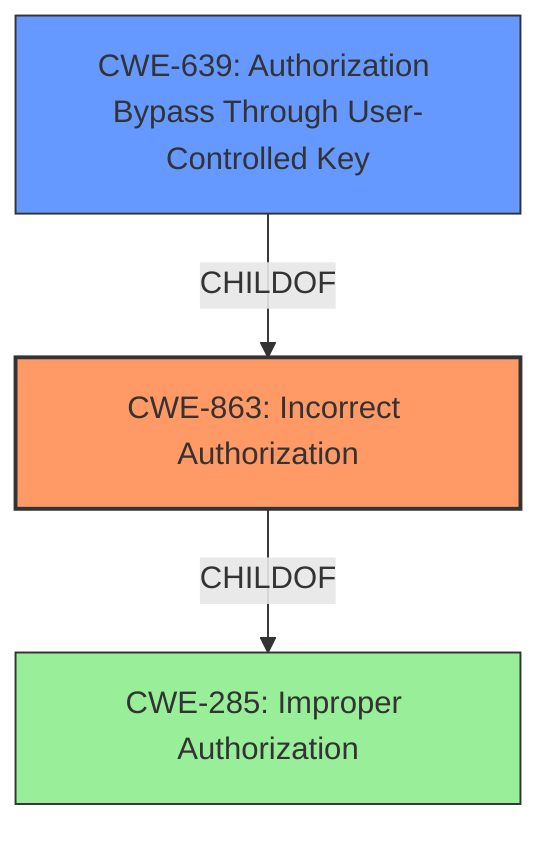

# Analysis for CVE-2021-39904

# Summary
| CWE ID | CWE Name | Confidence | CWE Abstraction Level | CWE Vulnerability Mapping Label | CWE-Vulnerability Mapping Notes |
|---|---|---|---|---|---|
| CWE-863 | Incorrect Authorization | 1.0 | Class | Allowed-with-Review | Primary CWE. The program performs an authorization check, but it does not correctly perform the check. |
| CWE-639 | Authorization Bypass Through User-Controlled Key | 0.8 | Base | Allowed | Secondary CWE. The system's authorization functionality does not prevent one user from gaining access to another user's data or record by modifying the key value identifying the data. |

## Evidence and Confidence

*   **Confidence Score:** 0.9
*   **Evidence Strength:** HIGH

## Relationship Analysis
The primary CWE is CWE-863 (Incorrect Authorization), which is a Class-level CWE. CWE-639 (Authorization Bypass Through User-Controlled Key) is a Base-level CWE and a child of CWE-863. This relationship indicates that CWE-639 could be a more specific manifestation of the authorization issue described by CWE-863. The vulnerability involves a Merge Request creator being able to bypass the locked status of a Merge Request, suggesting a user-controlled key aspect, making CWE-639 a relevant secondary CWE.

## Vulnerability Chain
The vulnerability chain begins with an **improper access control** in the GraphQL API, leading to an authorization bypass. The Merge Request creator can then resolve discussions and apply suggestions even after the project owner has locked the Merge Request. The root cause is the **improper access control**, and the impact is the unauthorized modification of the Merge Request.

## Summary of Analysis
The initial analysis identified **Improper Access Control** as the root cause based on the vulnerability description and CVE reference. The primary CWE, CWE-863 (Incorrect Authorization), aligns with the **incorrect** authorization check performed by the system. The secondary CWE, CWE-639 (Authorization Bypass Through User-Controlled Key), further specifies how the authorization is bypassed through a user-controlled key, in this case, the Merge Request creator's ability to modify discussion threads.

The evidence from the "CVE Reference Links Content Summary" states: "The vulnerability stems from a lack of proper access control in GraphQL mutations. Specifically, the `discussionToggleResolve` mutation allows users who created a Merge Request to modify the state of discussion threads (resolving or unresolving them) even after the Merge Request has been locked by the repository owner." This directly supports the selection of CWE-863 and CWE-639.

The selected CWEs are at the optimal level of specificity because CWE-863 captures the general **incorrect authorization** issue, while CWE-639 provides a more detailed explanation of how the bypass occurs.

CWE-285 (Improper Authorization) was considered but not used as the primary CWE because it is a more general Class-level CWE, and CWE-863 provides a more specific description of the authorization failure. CWE-284 (Improper Access Control) was also considered but rejected for the same reason: it's too high-level (Pillar) and doesn't accurately reflect the specific authorization flaw.