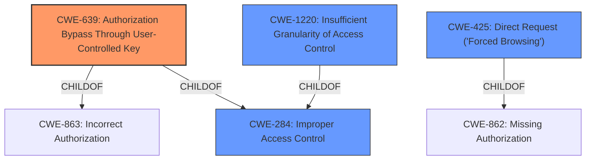

# Analysis for CVE-2021-3992

# Summary
| CWE ID | CWE Name | Confidence | CWE Abstraction Level | CWE Vulnerability Mapping Label | CWE-Vulnerability Mapping Notes |
|---|---|---|---|---|---|
| CWE-639 | Authorization Bypass Through User-Controlled Key | 0.9 | Base | Primary | Allowed |
| CWE-284 | Improper Access Control | 0.5 | Pillar | Secondary | Discouraged |
| CWE-425 | Direct Request ('Forced Browsing') | 0.6 | Base | Secondary | Allowed |
| CWE-1220 | Insufficient Granularity of Access Control | 0.5 | Base | Secondary | Allowed |

## Evidence and Confidence

*   **Confidence Score:** 0.8
*   **Evidence Strength:** HIGH

## Relationship Analysis
The primary CWE, CWE-639, is a child of CWE-863 (Incorrect Authorization) and CWE-284 (Improper Access Control). This hierarchical relationship indicates that CWE-639 is a more specific type of access control issue. The chain relationships are not directly applicable here but can provide insights into potential secondary weaknesses or related vulnerabilities. CWE-425 is a child of CWE-862 (Missing Authorization) which is related to improper access control. We are choosing CWE-639 since the vulnerability description calls out that a user can modify a key value to gain access to another user's data, which is the definition of CWE-639.

## Vulnerability Chain
The chain of events for this vulnerability is as follows:
1.  **Root Cause:** **Improper Access Control** where the system's authorization functionality does not prevent one user from gaining access to another user's data or record by modifying the key value identifying the data (CWE-639).
2.  An attacker manipulates the customer query by directly injecting customer IDs to bypass access restrictions.
3.  **Impact:** Unauthorized data access, information disclosure. An attacker could potentially gain access to customer data that they were not authorized to see.

## Summary of Analysis
The initial assessment focused on identifying the root cause of the vulnerability, which was determined to be **Improper Access Control**. The vulnerability description and CVE reference links content summary provided sufficient evidence to support this assessment. Specifically, the commit logs indicate that a user could manipulate the customer query to access customer data they should not have access to, which directly aligns with the description of CWE-639 (Authorization Bypass Through User-Controlled Key).

The retriever results also highlighted CWE-639 as a potential match, which further reinforced the initial assessment. Other CWEs, such as CWE-284 (Improper Access Control), CWE-425 (Direct Request ('Forced Browsing')), and CWE-1220 (Insufficient Granularity of Access Control), were considered as secondary candidates.

The final decision was based on the evidence that the vulnerability allows one user to gain access to another user's data by modifying the key value, which is precisely the definition of CWE-639. This CWE is at the Base level of abstraction, which is preferred for mapping to root causes. The hierarchical relationships, particularly the child-of relationship with CWE-863 and CWE-284, further solidified the selection of CWE-639 as the primary weakness.

Relevant CWE Information:

# Enhanced Context (25 CWEs)
The following CWEs were identified as potentially relevant to this vulnerability:

## CWE-639: Authorization Bypass Through User-Controlled Key
**Abstraction:** Base
**Similarity Score**: 0.76
**Source**: dense

**Description**:
The system's authorization functionality does not prevent one user from gaining access to another user's data or record by modifying the key value identifying the data.

**Mapping Guidance**:
- Usage: Allowed
- Rationale: This CWE entry is at the Base level of abstraction, which is a preferred level of abstraction for mapping to the root causes of vulnerabilities.

## CWE-284: Improper Access Control
**Abstraction:** Pillar
**Similarity Score**: 0.76
**Source**: dense

**Description**:
The product does not restrict or incorrectly restricts access to a resource from an unauthorized actor.

**Mapping Guidance**:
- Usage: Discouraged
- Rationale: CWE-284 is extremely high-level, a Pillar. Its name, "Improper Access Control," is often misused in low-information vulnerability reports [REF-1287] or by active use of the OWASP Top Ten, such as "A01:2021-Broken Access Control". It is not useful for trend analysis.

## CWE-425: Direct Request ('Forced Browsing')
**Abstraction:** Base
**Similarity Score**: 6786.16
**Source**: sparse

**Description**:
The web application does not adequately enforce appropriate authorization on all restricted URLs, scripts, or files.

**Mapping Guidance**:
- Usage: Allowed
- Rationale: This CWE entry is at the Base level of abstraction, which is a preferred level of abstraction for mapping to the root causes of vulnerabilities.

## CWE-1220: Insufficient Granularity of Access Control
**Abstraction:** Base
**Similarity Score**: 0.76
**Source**: dense

**Description**:
The product implements access controls via a policy or other feature with the intention to disable or restrict accesses (reads and/or writes) to assets in a system from untrusted agents. However, implemented access controls lack required granularity, which renders the control policy too broad because it allows accesses from unauthorized agents to the security-sensitive assets.

**Mapping Guidance**:
- Usage: Allowed
- Rationale: This CWE entry is at the Base level of abstraction, which is a preferred level of abstraction for mapping to the root causes of vulnerabilities.

I considered other CWEs such as CWE-285 (Improper Authorization) and CWE-287 (Improper Authentication), but they were not as specific to the vulnerability as CWE-639. CWE-285 is a Class-level CWE, and CWE-287 focuses on authentication issues, which are not the primary concern in this case. Therefore, they were not selected as the primary CWE.