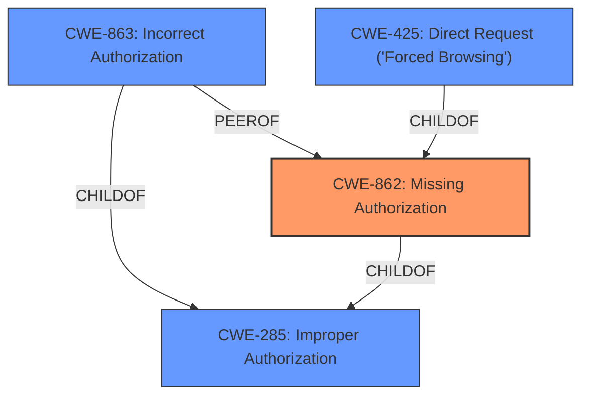

# Enhanced Analysis for CVE-2021-39930

# Summary
| CWE ID | CWE Name | Confidence | CWE Abstraction Level | CWE Vulnerability Mapping Label | CWE-Vulnerability Mapping Notes |
|---|---|---|---|---|---|
| CWE-862 | Missing Authorization | 1.0 | Class | Allowed-with-Review | Primary CWE |
| CWE-285 | Improper Authorization | 0.7 | Class | Discouraged | Secondary Candidate |
| CWE-863 | Incorrect Authorization | 0.7 | Class | Allowed-with-Review | Secondary Candidate |
| CWE-425 | Direct Request ('Forced Browsing') | 0.6 | Base | Allowed | Secondary Candidate |

## Evidence and Confidence

*   **Confidence Score:** 1.0
*   **Evidence Strength:** HIGH

## Relationship Analysis
The primary relationship is that CWE-862 **Missing Authorization** is a child of CWE-285 **Improper Authorization**. Also, CWE-863 **Incorrect Authorization** is a peer of CWE-862, and also a child of CWE-285. CWE-425 **Direct Request ('Forced Browsing')** is a child of CWE-862.
The selection of CWE-862 is favored because the vulnerability description explicitly mentions **missing authorization**. While CWE-285 is a parent, it is too general. CWE-863 would apply if there was an authorization check that was performed incorrectly. CWE-425 applies if the application does not adequately enforce authorization on restricted URLs. Since the vulnerability description states **missing authorization**, then CWE-862 is a better fit than CWE-425.



## Vulnerability Chain
The chain of events is:
1.  **Missing Authorization** (CWE-862) on the `available_group_templates` endpoint. This is the root cause.
2.  An attacker can access a users custom project and group templates.

## Summary of Analysis
The initial assessment and the retriever results pointed towards various authorization-related CWEs. The final decision hinged on the precise wording of the vulnerability description and the supporting evidence from the CVE Reference Links Content Summary. The key factor was the explicit mention of **missing authorization**, which directly aligns with CWE-862.

The vulnerability description states: "**Missing authorization** in GitLab EE versions between 12.4 and 14.3.6, between 14.4.0 and 14.4.4, and between 14.5.0 and 14.5.2 allowed an attacker to access a users custom project and group templates"

The CVE Reference Links Content Summary states: "The vulnerability stems from a lack of access control checks in the `available_group_templates` endpoint...The primary weakness is the absence of proper authorization checks on the `available_group_templates` endpoint. It allows unauthorized users to access sensitive data of private groups and projects."

Given this evidence, CWE-862 is the most accurate and specific classification. CWE-285 is too general, and CWE-863 would only be appropriate if there was an authorization check that was incorrectly performed, which isn't the case here. The abstraction level of Class for CWE-862 is appropriate, but we must examine the children of this entry to see if there is a better fit. There are no children of CWE-862 that are more specific.

CWE-425, Direct Request, is a child of CWE-862. This would apply if the application does not adequately enforce authorization on restricted URLs. Since the vulnerability description states **missing authorization**, then CWE-862 is a better fit than CWE-425.

All of this information leads to the conclusion that CWE-862 is the most appropriate and specific CWE for this vulnerability, with a confidence level of 1.0.

Relevant CWE Information:
* CWE-862: Missing Authorization
* CWE-285: Improper Authorization
* CWE-863: Incorrect Authorization
* CWE-425: Direct Request ('Forced Browsing')


## CWE Relationship Analysis

Current CWEs represent these abstraction levels: .


### Vulnerability Chain Analysis

**Chain starting from CWE-863:**
- 863 (Incorrect Authorization) - ROOT


**Chain starting from CWE-285:**
- 285 (Improper Authorization) - ROOT


### CWE Relationship Diagram

```mermaid
graph TD
    classDef primary fill:#f96,stroke:#333,stroke-width:2px
    classDef secondary fill:#69f,stroke:#333
    classDef tertiary fill:#9e9,stroke:#333
```