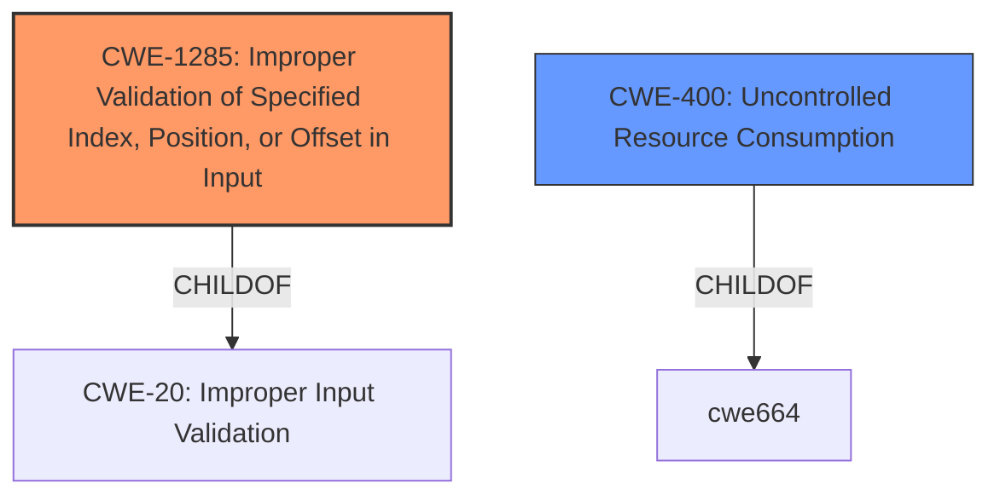

# Analysis Report for CVE-2021-39932

# Vulnerability Analysis Report: CVE-2021-39932

## Description


## Analysis (with Relationship Data)

# Summary
| CWE ID  | CWE Name                                                     | Confidence | CWE Abstraction Level | CWE Vulnerability Mapping Label | CWE-Vulnerability Mapping Notes |
| ------- | ------------------------------------------------------------ | ---------- | ----------------------- | ------------------------------- | ----------------------------- |
| CWE-1285 | Improper Validation of Specified Index, Position, or Offset in Input | 0.8        | Base                    | Primary                         | Allowed                       |
| CWE-400  | Uncontrolled Resource Consumption                            | 0.6        | Class                   | Secondary                       | Discouraged                   |

## Evidence and Confidence

*   **Confidence Score:** 0.7
*   **Evidence Strength:** MEDIUM

## Relationship Analysis
The primary CWE is CWE-1285, which focuses on the **improper validation** of specified indices, positions, or offsets in input. It is a child of CWE-20 (Improper Input Validation) and a base-level CWE, making it specific and relevant. CWE-400, while related to the impact of the vulnerability, is a class-level CWE that is discouraged, so it is secondary.



## Vulnerability Chain
The vulnerability chain begins with **insufficient input validation** in the `drafts controller` (CWE-1285), leading to the ability to store arbitrary data in the `position` field. This arbitrary data, especially when using large payloads, can then cause high load times due to **uncontrolled resource consumption** (CWE-400).

## Summary of Analysis
Initially, CWE-1285 was considered as the primary weakness, aligning with the root cause of **improper validation** of the `position` field. The "CVE Reference Links Content Summary" explicitly states, "The `drafts controller` does not validate the content of the `position` field" and mentions "**insufficient input validation**".

CWE-400 was considered due to the **impact** of high load times for users reviewing code changes when large payloads are used. However, the description for CWE-400 states that it is often misused when conflated with the "technical impact" of vulnerabilities. Since the provided evidence points to the **lack of validation** of the input as the root cause, CWE-1285 is the primary weakness.

The selection of CWE-1285 is based on its specificity as a base-level CWE and its direct relevance to the **root cause** identified in the "CVE Reference Links Content Summary." CWE-400 is a secondary consideration due to its role in describing the impact of the vulnerability, but the mapping guidance discourages using it when more precise mappings are available, which is the case with CWE-1285.

Relevant CWE Information:

# Enhanced Context (25 CWEs)

## CWE-1289: Improper Validation of Unsafe Equivalence in Input
**Abstraction Level**: Base
**Similarity Score**: 0.77
**Source**: dense

**Description**:
The product receives an input value that is used as a resource identifier or other type of reference, but it does not validate or incorrectly validates that the input is equivalent to a potentially-unsafe value.
**Rationale for not selecting**: While it involves input validation, it is more specific to resource identifiers, which isn't the primary issue here.

## CWE-807: Reliance on Untrusted Inputs in a Security Decision
**Abstraction Level**: Base
**Similarity Score**: 0.75
**Source**: dense

**Description**:
The product uses a protection mechanism that relies on the existence or values of an input, but the input can be modified by an untrusted actor in a way that bypasses the protection mechanism.
**Rationale for not selecting**: This is not about bypassing a protection mechanism.

## CWE-274: Improper Handling of Insufficient Privileges
**Abstraction Level**: Base
**Similarity Score**: 0.75
**Source**: dense

**Description**:
The product does not handle or incorrectly handles when it has insufficient privileges to perform an operation, leading to resultant weaknesses.
**Rationale for not selecting**: This is not about privileges.

## CWE-639: Authorization Bypass Through User-Controlled Key
**Abstraction Level**: Base
**Similarity Score**: 0.75
**Source**: dense

**Description**:
The system's authorization functionality does not prevent one user from gaining access to another user's data or record by modifying the key value identifying the data.
**Rationale for not selecting**: This is not about authorization bypass.

## CWE-653: Improper Isolation or Compartmentalization
**Abstraction Level**: Class
**Similarity Score**: 0.74
**Source**: dense

**Description**:
The product does not properly compartmentalize or isolate functionality, processes, or resources that require different privilege levels, rights, or permissions.
**Rationale for not selecting**: This is not about isolation or compartmentalization.

## CWE-1390: Weak Authentication
**Abstraction Level**: Class
**Similarity Score**: 0.74
**Source**: dense

**Description**:
The product uses an authentication mechanism to restrict access to specific users or identities, but the mechanism does not sufficiently prove that the claimed identity is correct.
**Rationale for not selecting**: This is not about authentication.

## CWE-1220: Insufficient Granularity of Access Control
**Abstraction Level**: Base
**Similarity Score**: 0.74
**Source**: dense

**Description**:
The product implements access controls via a policy or other feature with the intention to disable or restrict accesses (reads and/or writes) to assets in a system from untrusted agents. However, implemented access controls lack required granularity, which renders the control policy too broad because it allows accesses from unauthorized agents to the security-sensitive assets.
**Rationale for not selecting**: This is not about access control granularity.

## CWE-303: Incorrect Implementation of Authentication Algorithm
**Abstraction Level**: Base
**Similarity Score**: 0.74
**Source**: dense

**Description**:
The requirements for the product dictate the use of an established authentication algorithm, but the implementation of the algorithm is incorrect.
**Rationale for not selecting**: This is not about authentication algorithms.

## CWE-183: Permissive List of Allowed Inputs
**Abstraction Level**: Base
**Similarity Score**: 0.74
**Source**: dense

**Description**:
The product implements a protection mechanism that relies on a list of inputs (or properties of inputs) that are explicitly allowed by policy because the inputs are assumed to be safe, but the list is too permissive - that is, it allows an input that is unsafe, leading to resultant weaknesses.
**Rationale for not selecting**: This is not about a permissive list of inputs.

## CWE-280: Improper Handling of Insufficient Permissions or Privileges
**Abstraction Level**: Base
**Similarity Score**: 0.74
**Source**: dense

**Description**:
The product does not handle or incorrectly handles when it has insufficient privileges to access resources or functionality as specified by their permissions. This may cause it to follow unexpected code paths that may leave the product in an invalid state.
**Rationale for not selecting**: This is not about permissions.

## CWE-116: Improper Encoding or Escaping of Output
**Abstraction Level**: Class
**Similarity Score**: 5991.51
**Source**: sparse

**Description**:
The product prepares a structured message for communication with another component, but encoding or escaping of the data is either missing or done incorrectly. As a result, the intended structure of the message is not preserved.
**Rationale for not selecting**: This is about input, not output.

## CWE-863: Incorrect Authorization
**Abstraction Level**: Class
**Similarity Score**: 5962.27
**Source**: sparse

**Description**:
The product performs an authorization check when an actor attempts to access a resource or perform an action, but it does not correctly perform the check.
**Rationale for not selecting**: This is not about authorization.

## CWE-1333: Inefficient Regular Expression Complexity
**Abstraction Level**: Base
**Similarity Score**: 5925.85
**Source**: sparse

**Description**:
The product uses a regular expression with an inefficient, possibly exponential worst-case computational complexity that consumes excessive CPU cycles.
**Rationale for not selecting**: While potentially relevant to the impact, the root cause is the **lack of input validation**, not the regex complexity itself.

## CWE-770: Allocation of Resources Without Limits or Throttling
**Abstraction Level**: Base
**Similarity Score**: 5802.97
**Source**: sparse

**Description**:
The product allocates a reusable resource or group of resources on behalf of an actor without


## CWE Relationship Analysis

Current CWEs represent these abstraction levels: .


### Vulnerability Chain Analysis

**Chain starting from CWE-303:**
- 303 (Incorrect Implementation of Authentication Algorithm) - ROOT


**Chain starting from CWE-653:**
- 653 (Improper Isolation or Compartmentalization) - ROOT


### CWE Relationship Diagram

```mermaid
graph TD
    classDef primary fill:#f96,stroke:#333,stroke-width:2px
    classDef secondary fill:#69f,stroke:#333
    classDef tertiary fill:#9e9,stroke:#333
```


*Report generated on 2025-04-02 05:30:29*
