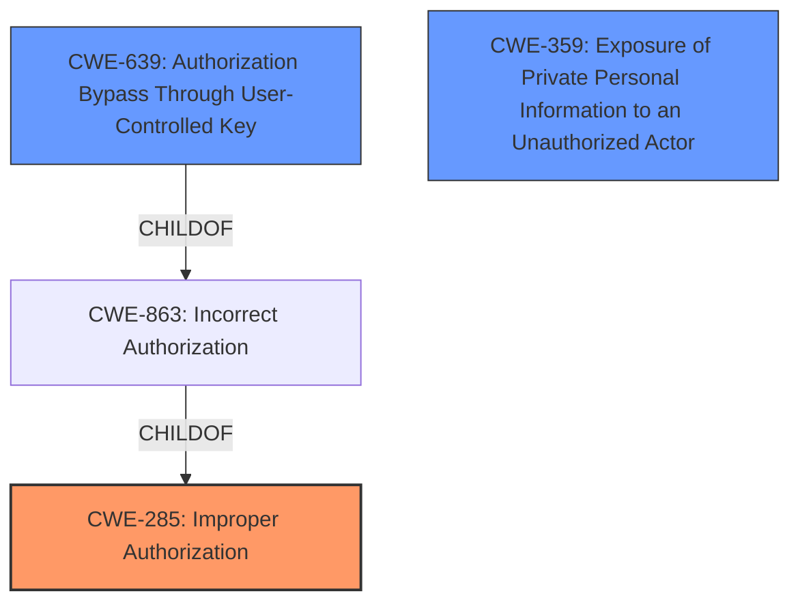

# Analysis Report for CVE-2021-39934

# Vulnerability Analysis Report: CVE-2021-39934

## Description


## Analysis (with Relationship Data)

# Summary
| CWE ID | CWE Name | Confidence | CWE Abstraction Level | CWE Vulnerability Mapping Label | CWE-Vulnerability Mapping Notes |
|---|---|---|---|---|---|
| CWE-285 | Improper Authorization | 0.8 | Class | Primary | Allowed-with-Review |
| CWE-639 | Authorization Bypass Through User-Controlled Key | 0.7 | Base | Secondary | Allowed |
| CWE-359 | Exposure of Private Personal Information to an Unauthorized Actor | 0.6 | Base | Secondary | Allowed |

## Evidence and Confidence

*   **Confidence Score:** 0.7
*   **Evidence Strength:** HIGH

## Relationship Analysis
The primary CWE selected is CWE-285, **Improper Authorization**, which is a Class-level CWE. While a more specific CWE would be ideal, the available information does not pinpoint the exact mechanism of the authorization failure, so the Class level is appropriate. CWE-639, **Authorization Bypass Through User-Controlled Key**, is a potential Base-level CWE, and is related to CWE-863, **Incorrect Authorization**, which is a child of CWE-285. However, CWE-639 implies that the key is user-controlled, which is not explicitly stated in the vulnerability description, but is plausible given that the user is a member of the project. CWE-359, **Exposure of Private Personal Information to an Unauthorized Actor**, captures the impact of information disclosure.



## Vulnerability Chain
The vulnerability chain starts with **improper access control** (CWE-285), leading to the exposure of the service desk email address (CWE-359).

## Summary of Analysis
The initial assessment focuses on the **improper access control** as the root cause, resulting in the ability to retrieve the service desk email address by any project member. The evidence strongly supports this, particularly the "CVE Reference Links Content Summary" which describes how the API endpoint exposes the service desk email address even to users without the "Maintainer" role.

The selection of CWE-285 is based on the fact that the product "does not perform or incorrectly performs an authorization check." The "CVE Reference Links Content Summary" states: "The vulnerability stems from an API endpoint (`https://gitlab.com/api/v4/projects/[PROJECT_ID]`) exposing the service desk email address, even to users who do not have the required "Maintainer" role in the project." This directly supports the **improper authorization** weakness.

CWE-639 is considered a secondary CWE because the attacker is able to gain access to another user's data or record by modifying the key value identifying the data. The "CVE Reference Links Content Summary" states that "The attacker needs to be a member of the project (even with the lowest level 'Guest' role is sufficient)."

CWE-359 is included as a secondary CWE because it captures the **exposure of private personal information to an unauthorized actor**. The "CVE Reference Links Content Summary" states that the vulnerability leads to "unauthorized disclosure of the service desk email address".

The graph relationships influenced the decision by highlighting the connection between **improper authorization** and potential bypass techniques.

The selected CWEs are at the optimal level of specificity based on the available evidence. While a more specific CWE under CWE-285 might exist, the provided information does not allow for a more precise classification.


## CWE Relationship Analysis

Current CWEs represent these abstraction levels: .


### Vulnerability Chain Analysis

**Chain starting from CWE-285:**
- 285 (Improper Authorization) - ROOT


**Chain starting from CWE-359:**
- 359 (Exposure of Private Personal Information to an Unauthorized Actor) - ROOT


### CWE Relationship Diagram

```mermaid
graph TD
    classDef primary fill:#f96,stroke:#333,stroke-width:2px
    classDef secondary fill:#69f,stroke:#333
    classDef tertiary fill:#9e9,stroke:#333
```


*Report generated on 2025-04-02 08:03:35*
