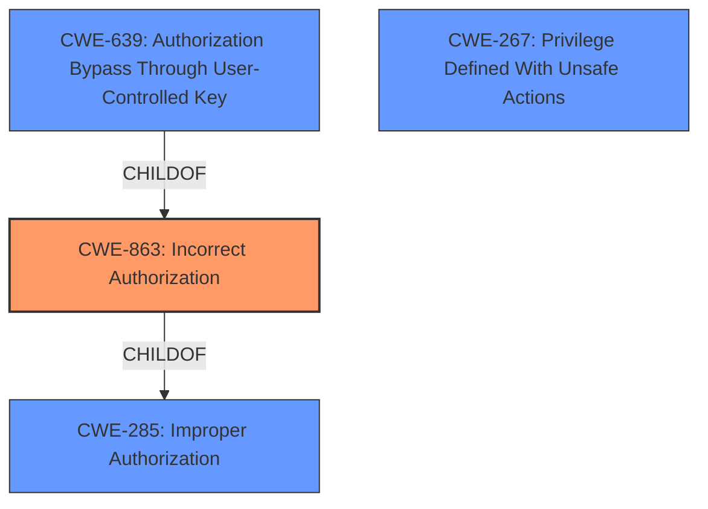

# Analysis for CVE-2021-39936

# Summary
| CWE ID | CWE Name | Confidence | CWE Abstraction Level | CWE Vulnerability Mapping Label | CWE-Vulnerability Mapping Notes |
|---|---|---|---|---|---|
| CWE-863 | Incorrect Authorization | 0.9 | Class | Primary | Allowed-with-Review |
| CWE-267 | Privilege Defined With Unsafe Actions | 0.6 | Base | Secondary | Allowed |

## Evidence and Confidence

*   **Confidence Score:** 0.9
*   **Evidence Strength:** HIGH

## Relationship Analysis
The primary CWE is CWE-863, Incorrect Authorization (Class), which is a child of CWE-285, Improper Authorization (Class). CWE-639, Authorization Bypass Through User-Controlled Key (Base), is also a child of CWE-863, but it's too specific. CWE-267 is related, as an unsafe action is allowed due to the incorrect authorization scheme. The chosen CWE is a Class because there isn't enough detail to be more specific, but there is definitely an authorization issue.

## Vulnerability Chain
The chain of events is: **Improper access control** leads to an attacker being able to access a project's disabled wiki with a deploy token. The root cause is **incorrect permission enforcement** and **lack of proper scope validation**, leading to **unauthorized access**.

## Summary of Analysis
The analysis indicates a primary weakness of CWE-863 Incorrect Authorization. The evidence from the "Vulnerability Description" states "**Improper access control**" which aligns directly with the description of CWE-863: "The product performs an authorization check when an actor attempts to access a resource or perform an action, but it does not correctly perform the check." The CVE Reference Links Content Summary states the "root_cause" as "Deploy tokens with `read_repository` scope could access project or group wikis even when wikis were disabled, and despite the absence of a `read_wiki` scope," further supports that the system did not correctly authorize the action. The level of specificity is optimal because while there are child CWEs like CWE-639 (Authorization Bypass Through User-Controlled Key), the provided information does not give enough detail to make a more precise determination of the specific mechanism of the bypass. The confidence is high as the evidence directly maps to the CWE description.

CWE-267 Privilege Defined With Unsafe Actions was also considered: A particular privilege, role, capability, or right can be used to perform unsafe actions that were not intended, even when it is assigned to the correct entity. The deploy token had `read_repository` scope, but that scope should not have given access to the disabled wiki, which means that the privilege was defined with unsafe actions.
CWE-285 Improper Authorization was considered but not used because it is discouraged and too high level.
CWE-639 Authorization Bypass Through User-Controlled Key was considered but not used because it requires that the attacker be able to modify the key value identifying the data. The vulnerability description doesn't provide enough information to determine if this is the case.
CWE-1390 Weak Authentication was considered but not used because the authentication itself is not necessarily weak, but the authorization after authentication is flawed.
CWE-116 Improper Encoding or Escaping of Output was considered but not used because there is no mention of encoding or escaping in the vulnerability description.
CWE-1286 Improper Validation of Syntactic Correctness of Input was considered but not used because the vulnerability is not about the syntactic correctness of the input.
CWE-400 Uncontrolled Resource Consumption was considered but not used because the vulnerability is not about resource consumption.
CWE-1333 Inefficient Regular Expression Complexity was considered but not used because there is no mention of regular expressions in the vulnerability description.
CWE-532 Insertion of Sensitive Information into Log File was considered but not used because the vulnerability is not about logging sensitive information.

Relevant CWE Information: