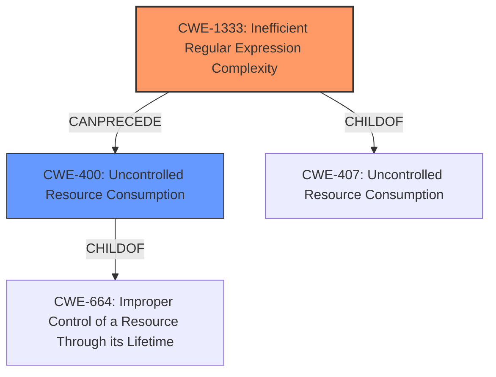

# Raw Analyzer Response for CVE-2021-39938

# Summary
| CWE ID  | CWE Name  | Confidence | CWE Abstraction Level | CWE Vulnerability Mapping Label | CWE-Vulnerability Mapping Notes |
|---|---|---|---|---|---|
| CWE-1333 | Inefficient Regular Expression Complexity | 1.0 | Base | Allowed | Primary CWE. The product uses a regular expression with an inefficient, possibly exponential worst-case computational complexity that consumes excessive CPU cycles. |
| CWE-400 | Uncontrolled Resource Consumption | 0.7 | Class | Discouraged | Secondary CWE. The product does not properly control the allocation and maintenance of a limited resource, thereby enabling an actor to influence the amount of resources consumed, eventually leading to the exhaustion of available resources. |

## Evidence and Confidence

*   **Confidence Score:** 0.9
*   **Evidence Strength:** HIGH

## Relationship Analysis
The primary CWE is CWE-1333 (Base), which is a child of CWE-407 (Class). CWE-400 (Class) is also related, as the uncontrolled resource consumption is a consequence of the inefficient regular expression.

## Vulnerability Chain
The vulnerability chain starts with the **vulnerable regular expression pattern** (CWE-1333), which leads to uncontrolled resource consumption (CWE-400), ultimately resulting in a Denial of Service.

## Summary of Analysis
The primary weakness is the **vulnerable regular expression pattern**, which is best described by CWE-1333. The vulnerability description states: "A **vulnerable regular expression pattern** in GitLab CE/EE since version 8.15 before 14.3.6, all versions starting from 14.4 before 14.4.4, all versions starting from 14.5 before 14.5.2, allows an attacker to cause uncontrolled resource consumption leading to Denial of Service via specially crafted deploy Slash commands". The "CVE Reference Links Content Summary" section confirms this by stating: "The regular expression used in the deploy slash command is vulnerable to a regular expression denial of service (ReDoS) attack." The impact of this vulnerability is "uncontrolled resource consumption leading to Denial of Service", which aligns with CWE-400. However, CWE-400 is a Class-level CWE, and the root cause is more accurately described by the Base-level CWE-1333.

CWE-185 (Incorrect Regular Expression) was considered but is less specific than CWE-1333. CWE-185 describes a general problem of an incorrectly written regular expression, while CWE-1333 specifically addresses the inefficiency aspect that leads to excessive resource consumption and DoS.

Other CWEs such as CWE-863, CWE-285, and CWE-1286 were also considered based on the retriever results, but they are not directly relevant to the **root cause** of this vulnerability, which stems from the inefficient regular expression.

The selection of CWE-1333 is at the optimal level of specificity as it directly addresses the root cause (**vulnerable regular expression pattern**) and is a Base-level CWE, which is preferred for mapping to the root causes of vulnerabilities.