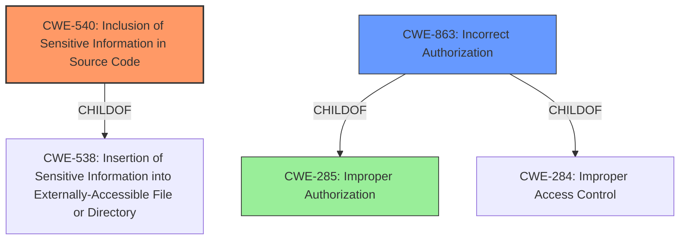

# Enhanced Analysis for CVE-2021-39941

# Summary
| CWE ID  | CWE Name                                                        | Confidence | CWE Abstraction Level | CWE Vulnerability Mapping Label | CWE-Vulnerability Mapping Notes |
| :------- | :-------------------------------------------------------------- | :--------- | :-------------------- | :------------------------------ | :------------------------------ |
| CWE-540  | Inclusion of Sensitive Information in Source Code             | 0.9        | Base                  | Allowed                         | Primary CWE                     |
| CWE-863  | Incorrect Authorization                                         | 0.7        | Class                 | Allowed-with-Review             | Secondary Candidate             |
| CWE-285  | Improper Authorization                                          | 0.6        | Class                 | Discouraged                      | Secondary Candidate             |

## Evidence and Confidence

*   **Confidence Score:** 0.8
*   **Evidence Strength:** HIGH

## Relationship Analysis

The primary relationship influencing the decision is the ChildOf relationship between CWE-863 and CWE-285, and the alternative relationship between CWE-540 and CWE-538. CWE-540 captures the root cause of sensitive information being present in the source code, while CWE-863 and CWE-285 represent different levels of authorization issues. Choosing CWE-540 as primary emphasizes the root cause, while the authorization CWEs are considered as secondary factors contributing to the impact. The abstraction levels were considered, with a preference for the Base level CWE-540.



## Vulnerability Chain

The vulnerability chain starts with the **inclusion of sensitive information (default branch name) in the HTML source code**. This information is then accessible to non-project members due to **inadequate access control**, leading to **information disclosure**.

## Summary of Analysis

The initial assessment considered several authorization-related CWEs. However, the root cause is the **inclusion of the default branch name in the HTML source code**, making it accessible even without proper authorization.

The primary CWE, CWE-540, accurately reflects the root cause: the **inclusion of sensitive information in the source code**. The vulnerability description explicitly states that the default branch name is exposed in the HTML source, which aligns perfectly with CWE-540's description: "Source code on a web server or repository often contains sensitive information and should generally not be accessible to users." The supporting evidence is "The root cause of the vulnerability is the exposure of the default branch name within the HTML source code of a GitLab project page".

CWE-863 (Incorrect Authorization) and CWE-285 (Improper Authorization) were considered as secondary CWEs because the system **fails to properly restrict access to repository-related information**. However, the primary issue is the presence of sensitive data in the source code itself.

The selected CWEs are at the optimal level of specificity. CWE-540 is a Base level CWE, directly addressing the root cause. The other CWEs considered were higher-level Classes or Pillars.

Relevant CWE Information:

# Enhanced Context (25 CWEs)

## CWE-540: Inclusion of Sensitive Information in Source Code
**Abstraction Level**: Base
**Similarity Score**: 0.142 (sparse)

**Description**:
Source code on a web server or repository often contains sensitive information and should generally not be accessible to users.

**Mapping Guidance**:
- Usage: Allowed
- Rationale: This CWE entry is at the Base level of abstraction, which is a preferred level of abstraction for mapping to the root causes of vulnerabilities.

## CWE-285: Improper Authorization
**Abstraction Level**: Class
**Similarity Score**: 0.125 (sparse)

**Description**:
The product does not perform or incorrectly performs an authorization check when an actor attempts to access a resource or perform an action.

**Mapping Guidance**:
- Usage: Discouraged
- Rationale: CWE-285 is high-level and lower-level CWEs can frequently be used instead. It is a level-1 Class (i.e., a child of a Pillar).

## CWE-863: Incorrect Authorization
**Abstraction Level**: Class
**Similarity Score**: 0.120 (sparse)

**Description**:
The product performs an authorization check when an actor attempts to access a resource or perform an action, but it does not correctly perform the check.

**Mapping Guidance**:
- Usage: Allowed-with-Review
- Rationale: This CWE entry is a Class and might have Base-level children that would be more appropriate

CWEs considered but not used:

*   CWE-639: Authorization Bypass Through User-Controlled Key - While authorization is involved, the core issue isn't directly related to user-controlled keys.
*   CWE-527: Exposure of Version-Control Repository to an Unauthorized Control Sphere - This is too specific, as the issue isn't the exposure of the entire repository, but just the default branch name.
*   CWE-425: Direct Request ('Forced Browsing') - The issue is not about bypassing authorization checks on specific URLs.

CWE-284 (Improper Access Control) was also considered but ultimately deemed too high-level, as more specific CWEs like CWE-863 and CWE-540 provide a better representation of the **incorrect authorization** and the **inclusion of sensitive information** respectively.


## CWE Relationship Analysis

Current CWEs represent these abstraction levels: .


### Vulnerability Chain Analysis

**Chain starting from CWE-284:**
- 284 (Improper Access Control) - ROOT


**Chain starting from CWE-285:**
- 285 (Improper Authorization) - ROOT


### CWE Relationship Diagram

```mermaid
graph TD
    classDef primary fill:#f96,stroke:#333,stroke-width:2px
    classDef secondary fill:#69f,stroke:#333
    classDef tertiary fill:#9e9,stroke:#333
```