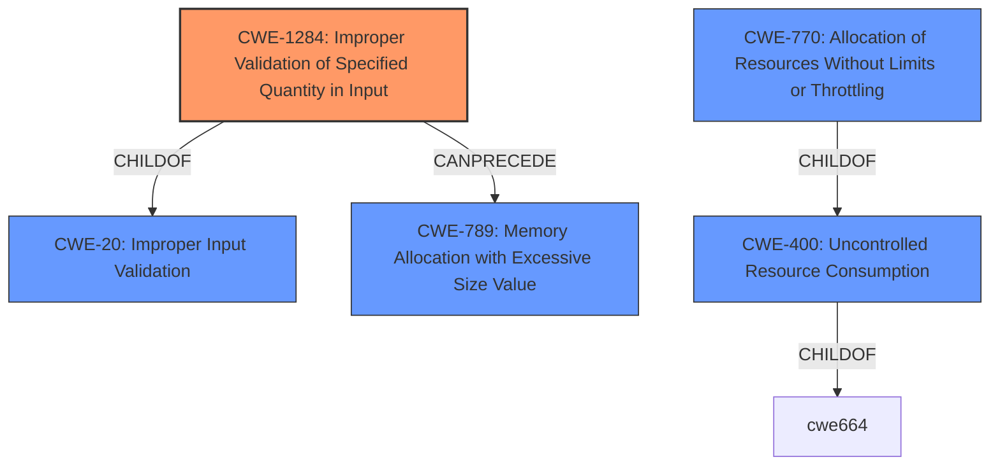

# Raw Analyzer Response for CVE-2021-39942

# Summary
| CWE ID | CWE Name | Confidence | CWE Abstraction Level | CWE Vulnerability Mapping Label | CWE-Vulnerability Mapping Notes |
|---|---|---|---|---|---|
| **CWE-1284** | **Improper Validation of Specified Quantity in Input** | 0.9 | Base | Primary | Allowed |
| CWE-400 | Uncontrolled Resource Consumption | 0.6 | Class | Secondary | Discouraged |

## Evidence and Confidence

*   **Confidence Score:** 0.8
*   **Evidence Strength:** HIGH

## Relationship Analysis
The primary CWE, CWE-1284, is a child of CWE-20 (Improper Input Validation) and can precede CWE-789 (Memory Allocation with Excessive Size Value). CWE-400 is a parent of CWE-770 (Allocation of Resources Without Limits or Throttling), and they are related in that uncontrolled resource consumption can be a consequence of improper input validation. The abstraction levels influenced the selection by favoring the more specific Base level CWE-1284 over the broader Class level CWE-400.

## Vulnerability Chain
The vulnerability chain starts with **improper validation** of the file size (CWE-1284) due to the application relying on the user-provided `length` parameter. This leads to the ability to bypass file size limits, ultimately resulting in potential uncontrolled resource consumption (CWE-400) such as disk space exhaustion and denial of service. The chain is: CWE-1284 -> CWE-400.

## Summary of Analysis
Initially, CWE-400 (Uncontrolled Resource Consumption) seemed like a potential fit, given the denial of service vulnerability. However, after analyzing the **root cause** more closely, it became clear that the vulnerability stemmed from the **improper validation** of the file size, as the application relies on a user-provided `length` parameter instead of the actual file size. This led to selecting CWE-1284 (Improper Validation of Specified Quantity in Input) as the primary CWE.

The "CVE Reference Links Content Summary" section provides strong evidence: "The vulnerability stems from **incorrect file size validation** in `Packages::Npm::CreatePackageService` when creating an NPM package. The service uses the `length` parameter from the user's request to validate the file size, rather than the actual size of the uploaded data. This allows an attacker to bypass the configured file size limits by manipulating the `length` parameter." This directly supports the selection of CWE-1284.

CWE-400 is a less direct fit, representing the potential impact (denial of service) rather than the root cause. The relationship analysis confirms that CWE-1284 can precede CWE-789 (Memory Allocation with Excessive Size Value), which is a child of CWE-400. This indicates a potential chain where improper input validation leads to excessive resource allocation.

The choice of CWE-1284 is at the optimal level of specificity because it directly addresses the coding error (improper input validation), whereas CWE-400 describes the resulting impact.

Relevant CWE Information:

# Enhanced Context (25 CWEs)
The following CWEs were identified as potentially relevant to this vulnerability:

## CWE-1284: Improper Validation of Specified Quantity in Input
**Abstraction Level**: base
**Similarity Score**: 4.33
**Source**: graph

**Description**:
CWE-1284: Improper Validation of Specified Quantity in Input

**Mapping Guidance**:
- Usage: Allowed
- Rationale: This CWE entry is at the Base level of abstraction, which is a preferred level of abstraction for mapping to the root causes of vulnerabilities.

**Relationships**:
- PARENTOF -> CWE-606
- CANPRECEDE -> CWE-789
- CHILDOF -> CWE-20
- CHILDOF -> CWE-20
- CANFOLLOW -> CWE-1284

## CWE-1284: Improper Validation of Specified Quantity in Input
**CWE-1284 (Improper Validation of Specified Quantity in Input)**: The vulnerability arises because the application **fails to properly validate** the size of the uploaded file, relying instead on the user-provided `length` parameter. This allows attackers to bypass file size limits by manipulating this parameter. This aligns perfectly with the CWE's description, which highlights the **improper validation** of a specified quantity in input. The security implication is that attackers can upload excessively large files, leading to potential denial of service. This is the primary weakness. Confidence: 0.9

## CWE-400: Uncontrolled Resource Consumption
**CWE-400 (Uncontrolled Resource Consumption)**: While the ultimate impact of the vulnerability is a denial of service through resource exhaustion, this CWE is more of a consequence than the **root cause**. The **root cause** is the **improper validation** of the file size (CWE-1284). CWE-400 is a Class-level CWE and the mapping guidance discourages its use when more specific mappings are available. Confidence: 0.6