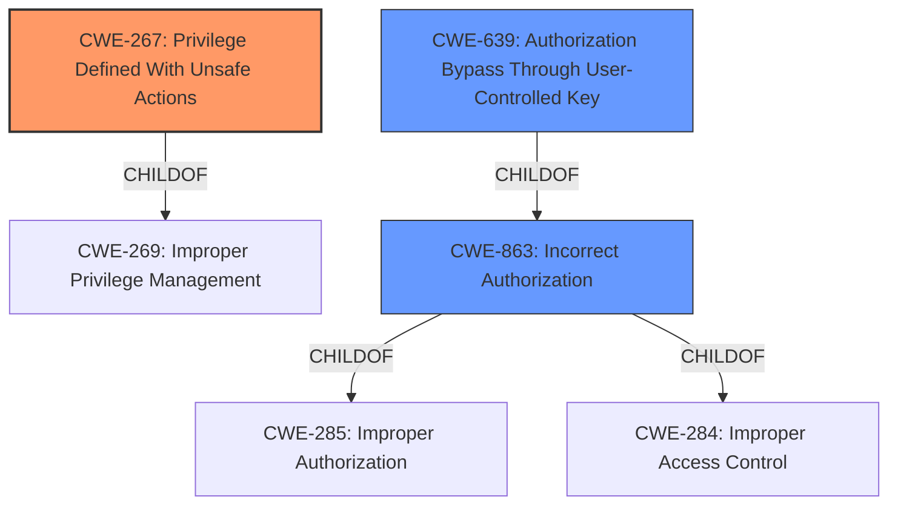

# Analysis Report for CVE-2021-39944

# Vulnerability Analysis Report: CVE-2021-39944

## Description


## Analysis (with Relationship Data)

# Summary
| CWE ID | CWE Name | Confidence | CWE Abstraction Level | CWE Vulnerability Mapping Label | CWE-Vulnerability Mapping Notes |
|---|---|---|---|---|---|
| CWE-267 | Privilege Defined With Unsafe Actions | 0.8 | Base | Allowed | Primary CWE. The Developer role has unsafe actions on projects that are imported |
| CWE-639 | Authorization Bypass Through User-Controlled Key | 0.6 | Base | Allowed | Secondary CWE. Modifying the access_level in project_members.ndjson is a user controlled key |
| CWE-863 | Incorrect Authorization | 0.5 | Class | Allowed-with-Review | Secondary CWE. The authorization check performed is incorrect, allowing developers to become maintainers |

## Evidence and Confidence

*   **Confidence Score:** 0.7
*   **Evidence Strength:** HIGH

## Relationship Analysis
The primary CWE is CWE-267, which is a base level weakness and a child of CWE-269. CWE-639 is a child of CWE-863, which is a child of CWE-285 and CWE-284. CWE-863 is a class level weakness.



## Vulnerability Chain
The chain of root cause and weaknesses that followed for the Vulnerability Description:
  - The project import functionality **does not properly validate the access level specified in the `project_members.ndjson` file**.
  - A user with developer role can modify the access_level in this file to 'maintainer' before importing the project.
  - A developer can gain maintainer privileges on a project that they import, even if they were initially only a developer in the group where the project is imported.
  - This allows the attacker to perform actions they are not supposed to, including adding deploy keys/tokens and modifying project settings.

## Summary of Analysis
The vulnerability is due to a **permissions validation flaw** that allows a developer to elevate their privilege to maintainer on projects they import. The project import functionality **does not properly validate the access level specified in the `project_members.ndjson` file**. A user with developer role can modify the access_level in this file to 'maintainer' before importing the project.

CWE-267 Privilege Defined With Unsafe Actions: The Developer role has unsafe actions on projects that are imported. The description matches "A particular privilege, role, capability, or right can be used to perform unsafe actions that were not intended, even when it is assigned to the correct entity." The attacker elevates their privilege to a maintainer, which allows them to perform unsafe actions.

CWE-639 Authorization Bypass Through User-Controlled Key: Modifying the access_level in project_members.ndjson is a user controlled key. The description matches "The system's authorization functionality does not prevent one user from gaining access to another user's data or record by modifying the key value identifying the data."

CWE-863 Incorrect Authorization: The authorization check performed is incorrect, allowing developers to become maintainers. The description matches "The product performs an authorization check when an actor attempts to access a resource or perform an action, but it does not correctly perform the check."

CWE-285 Improper Authorization was considered because CWE-863 is a child of it, but CWE-863 is more specific.

CWE-1286 Improper Validation of Syntactic Correctness of Input was considered because the project import functionality **does not properly validate the access level specified in the `project_members.ndjson` file**, but the input itself is syntactically correct, so this CWE does not fit.

CWE-22 Improper Limitation of a Pathname to a Restricted Directory ('Path Traversal') was not considered because this is not a path traversal vulnerability.

CWE-770 Allocation of Resources Without Limits or Throttling was not considered because this is not a resource allocation vulnerability.

CWE-789 Memory Allocation with Excessive Size Value was not considered because this is not a memory allocation vulnerability.

CWE-252 Unchecked Return Value was not considered because there is no mention of an unchecked return value in the vulnerability description.

CWE-1325 Improperly Controlled Sequential Memory Allocation was not considered because this is not a memory allocation vulnerability.


## CWE Relationship Analysis

Current CWEs represent these abstraction levels: .


### Vulnerability Chain Analysis

**Chain starting from CWE-284:**
- 284 (Improper Access Control) - ROOT


**Chain starting from CWE-770:**
- 770 (Allocation of Resources Without Limits or Throttling) - ROOT


### CWE Relationship Diagram

```mermaid
graph TD
    classDef primary fill:#f96,stroke:#333,stroke-width:2px
    classDef secondary fill:#69f,stroke:#333
    classDef tertiary fill:#9e9,stroke:#333
```


*Report generated on 2025-04-02 15:06:53*
