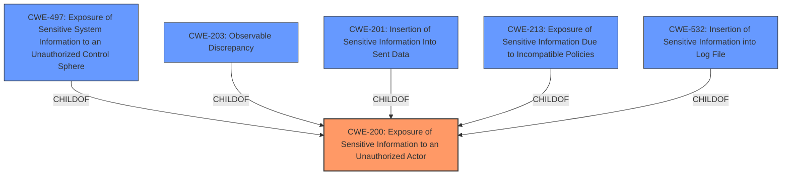

# Raw Analyzer Response for CVE-2021-39980

# Summary
| CWE ID | CWE Name | Confidence | CWE Abstraction Level | CWE Vulnerability Mapping Label | CWE-Vulnerability Mapping Notes |
|---|---|---|---|---|---|
| CWE-200 | Exposure of Sensitive Information to an Unauthorized Actor | 0.9 | Class | Primary | Discouraged |

## Evidence and Confidence

*   **Confidence Score:** 0.9
*   **Evidence Strength:** MEDIUM

## Relationship Analysis
The primary CWE selected is CWE-200 which is a Class level CWE. There are other Base level CWEs to consider that are children of CWE-200. Due to lack of specific information in the description, the Class level CWE-200 is the best fit.

## Vulnerability Chain
The vulnerability chain starts with the **Exposure of Sensitive Information** leading to **sensitive information disclosure**.

## Summary of Analysis
The initial assessment was based on the provided evidence, primarily the **Vulnerability Description**, which explicitly states an "Exposure of Sensitive Information to an Unauthorized Actor vulnerability" leading to "sensitive information disclosure."

The graph relationships influenced the final selection by highlighting the parent-child relationships between CWE-200 and more specific CWEs. However, due to the lack of detailed information in the vulnerability description, the higher-level CWE-200 was chosen as the best fit.

The selected CWE, CWE-200, is at the appropriate level of specificity given the available evidence. While more specific child CWEs exist, there isn't sufficient information to justify their use.

The vulnerability description indicates that the Telephony application has a "**Exposure of Sensitive Information to an Unauthorized Actor vulnerability**". This directly corresponds to CWE-200. The description further states that successful exploitation could lead to "**sensitive information disclosure**". This aligns with the potential impact described in CWE-200.

CWE-200 is a Class-level CWE that describes a product exposing sensitive information to an actor not explicitly authorized to have access to that information.

The mapping guidance for CWE-200 is "Discouraged" because it is often misused to represent the loss of confidentiality, which is a technical impact, not a root cause error. However, in this case, the vulnerability is explicitly described as an "**Exposure of Sensitive Information to an Unauthorized Actor vulnerability**," making CWE-200 the most appropriate choice despite the discouraged usage.

The other CWEs listed were considered but not used:
*   CWE-497: Exposure of Sensitive System Information to an Unauthorized Control Sphere - This is more specific than CWE-200 and requires the exposure of system-level information. The vulnerability description does not provide enough information to determine if system-level information is being exposed.
*   CWE-862: Missing Authorization - This CWE relates to missing authorization checks, which is not explicitly mentioned in the vulnerability description.
*   CWE-15: External Control of System or Configuration Setting - This CWE relates to external control of system settings, which is not related to the vulnerability description.
*   CWE-201: Insertion of Sensitive Information Into Sent Data - This CWE is more specific, dealing with the insertion of sensitive information into sent data. There is no evidence in the description that the sensitive information was sent to another actor.
*   CWE-213: Exposure of Sensitive Information Due to Incompatible Policies - This CWE focuses on exposure due to incompatible policies, which is not explicitly mentioned in the vulnerability description.
*   CWE-226: Sensitive Information in Resource Not Removed Before Reuse - This CWE is related to resources not being cleared before reuse, which is not the case here.
*   CWE-532: Insertion of Sensitive Information into Log File - This CWE is related to writing sensitive information to log files, which is not the case here.
*   CWE-704: Incorrect Type Conversion or Cast - This CWE is related to type conversions, which is not mentioned in the description.
*   CWE-203: Observable Discrepancy - This CWE is related to behavioral differences that expose information. It is not applicable in this case.